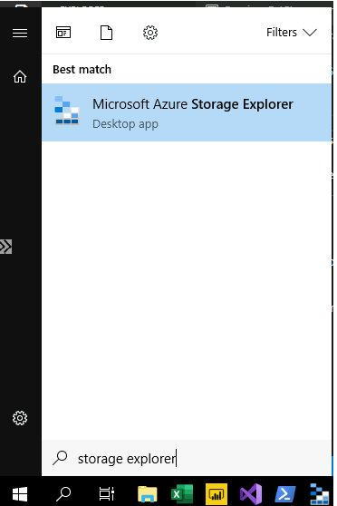
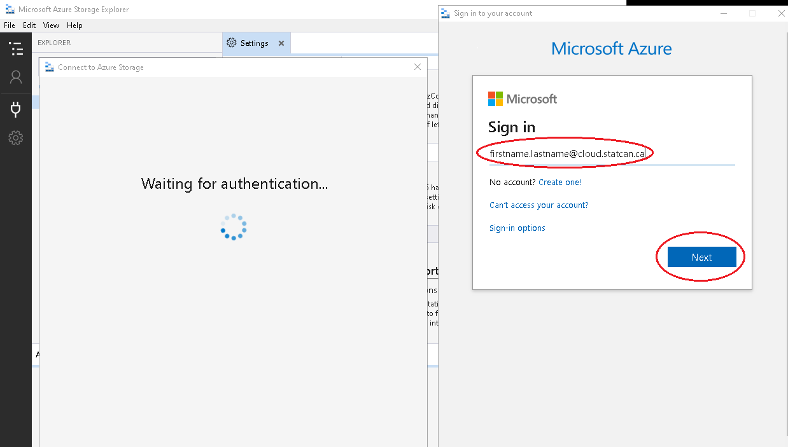

### Azure Storage - Internal User

Data can be uploaded to the platform via the Azure Portal or the Azure Storage Explorer application. Once data uploaded to an external **Blob storage** account, it is automatically ingested into an internal **Azure Data Lake Storage (ADLS)** account.  Once data is in the data lake, users have their choice of tools for transformation and integration. They can use Web based tools such as Databricks and Data Factory to do their transformations or they can use desktop tools on a virtual machine (VM) to tansform & analyse the data. Cleansed and transformed data can be placed into different folders (containing higher quality / processed datasets) or loaded into a database. Users can once again connect to this data with the tools they would like to use, either from their VMs or other platform services such as Databricks and Data Factory.

## Storage Explorer - AVD

Using your [Azure Virtual Desktop](AVD.md), you can have access to the azure storage explorer

1. If you don't have it in the Azure Virtual Desktop with Azure Storage Explorer installed, you can request it in the [Service Request Management Portal] (SRM)(https://srm.statcan.ca/). Select the following:
-  Request Type: "Desktop Support"
-  Topic: "Virtual Desktop (AVD, VDI)"
-  Sub-topic: "Azure Virutal Desktop (Create, Modify)"
-  Description: "I would like to request an Azure Virtual Desktop with Azure Storage Explorer installed"

2. On your Azure Virtual Desktop, you will be able to access your storage account using [Azure Storage Explorer](AzureStorageExplorer.md)

<!-- 2. Launch Azure Storage Explorer from the Start menu.

      

3. Login with your Azure Account.  

     

4. Enter your credentials

     
 -->

## Microsoft Documentation
- [Azure Storage Explorer Download](https://azure.microsoft.com/en-us/features/storage-explorer/)  
- [Quickstart: Upload, download, and list blobs with the Azure portal](https://docs.microsoft.com/en-us/azure/storage/blobs/storage-quickstart-blobs-portal)

<!-- ## Storage Explorer - Network B VDI
_This section is for Statistics Canada employees who need to upload data from Network B._  
1. Download the [Azure Storage Explorer](https://azure.microsoft.com/en-us/features/storage-explorer/) application, and install it on your Network B VDI. 
2. Launch Azure Storage Explorer from the Start menu.  
3. On a Network B VDI, you can only access your storage account with a temporary SAS token. Please contact the support team through the Slack channel to obtain one.  

**Note:** See the [FAQ](FAQ.md) for information on configuring Network B proxy settings.

## Microsoft Documentation
- [Azure Storage Explorer Download](https://azure.microsoft.com/en-us/features/storage-explorer/)  
- [Quickstart: Upload, download, and list blobs with the Azure portal](https://docs.microsoft.com/en-us/azure/storage/blobs/storage-quickstart-blobs-portal)  -->
