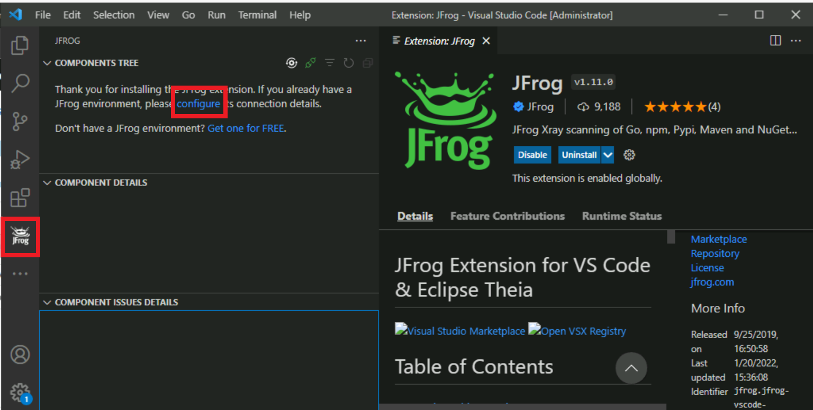
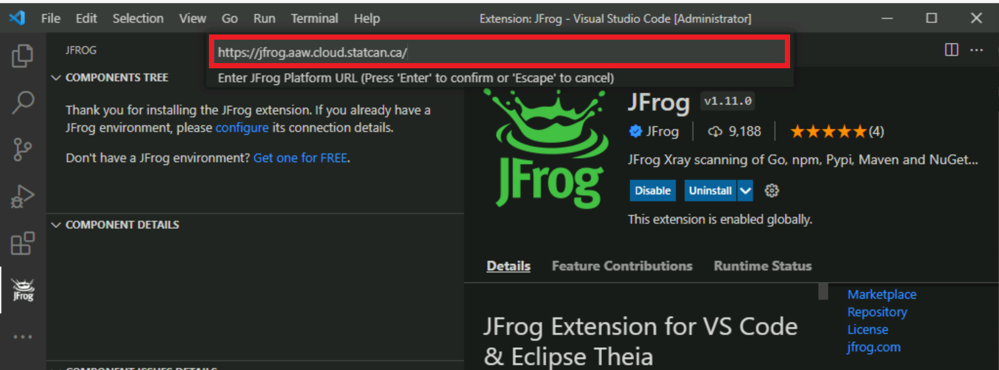
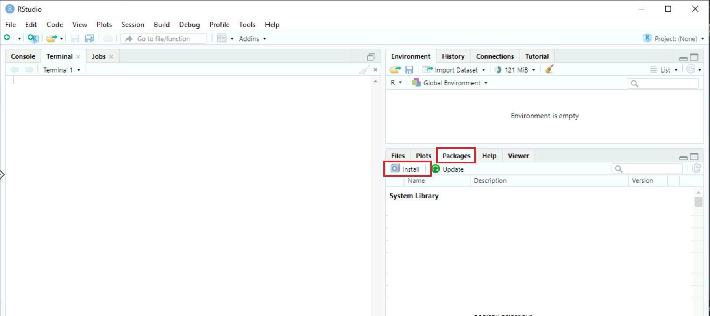

# Artifactory

The CAE environment uses the Artifiactory for package & Library management.


## Included packages

Below are the URLs that Artifactory pulls from currently. As long as the package is available on these repositories, it can be downloaded. You can get the name and URL of the package by searching through the repositories.

  - [Conda-forge](https://conda.anaconda.org/conda-forge)
  - [CRAN](https://cran.r-project.org)
  
      In the left menu, click **Packages** under **Software**, then click **Table of available packages**
  - [Python](https://pypi.org/)

**Note**: For any other packages, please contact the **Collaborative Analytics Environment** team.


## Azure DataBricks

The packages can be installed from the Databricks workspace or a cluster.

### From Databricks workspace

1.From the main page, click **Import Library**.


2. Under Library Source, choose either **PyPI** or **CRAN**.

3. Paste the name of the library under **Package** and the URL under **Repository**.


4. Click **Create**.
**Note**: Select **Install automatically on all cluster** under **Admin settings** if you wish to install the package on all the available clusters of the workspace.

### From a cluster

1.From the cluster main page, click **Install new** under **Libraries**.


2. Under **Library Source**, choose either **PyPI** or **CRAN**.

3. Paste the name of the library under **Package** and the URL under **Repository**.


4. Click **Install**. You should see the installed libraries under **Libraries**.


## Azure Machine Learning

To install packages on a compute instance, you can use the **Curl** command in the Azure Machine Learning terminal as following:

```curl -O "https://jfrog.aaw.cloud.statcan.ca/artifactory/cae-generic-test/<PackageName>"```


## Azure Synapse

Please the **Collaborative Analytics Environment** team to install custom packages in your Azure Synapse environment.

## Azure Cloud VM

### Visual Studio Code
1.On the Extensions tab, search for **JFrog**.


2.Install the extension.

3.Click the **JFrog** tab, then click **Configure**.



4. Paste your JFrog platform URL (e.g. https://jfrog.aaw.cloud.statcan.ca/).


5. You will need to provide a username and password.

### R-Shiny

1.	On the Packages tab, click **Install**.





2.	Paste the link to your CRAN file, then click **Install**


3.	The packages should now be listed in your System Library.


