# Artifactory

The CAE environment uses the Artifiactory for package & library management.


## Included packages

Below are the URLs that Artifactory pulls from currently. As long as the package is available on these repositories, it can be downloaded. You can get the name of the package by searching through the repositories.

  - [Conda-forge](https://conda.anaconda.org/conda-forge)
  - [CRAN](https://cran.r-project.org) (In the left menu, click **Packages** under **Software**, then click **Table of available packages**)
  - [Python](https://pypi.org/)
  
The respective artifactory URLs to use are:
  - https://jfrog.aaw.cloud.statcan.ca/artifactory/conda-forge-remote/
  - https://jfrog.aaw.cloud.statcan.ca/artifactory/dev-cran-remote/
  - https://jfrog.aaw.cloud.statcan.ca/artifactory/pypi-remote/
  
**Note**: For any other packages, please contact the **Collaborative Analytics Environment** team.


## Azure DataBricks

The packages can be installed from the Databricks workspace, a Databricks cluster or Databricks notebooks.

 **Note**: 
 - The library sources available in Databricks are **PyPI** for Python packages and **CRAN** for CRAN packages.
 - The artifactory URLs to use depending on the selected library source are:
    - https://jfrog.aaw.cloud.statcan.ca/artifactory/pypi-remote/ for **PyPI**
    - https://jfrog.aaw.cloud.statcan.ca/artifactory/dev-cran-remote/  for **CRAN**
    
    

### From Databricks workspace

1.From the main page, click **Import Library**.

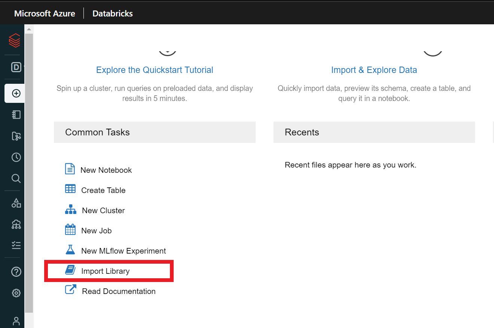

2. Under **Library Source**, choose either **PyPI** or **CRAN** depending of the package.

3. Paste the name of the library under **Package** and the associated Artifactory URL (See Note above) under **Repository**.

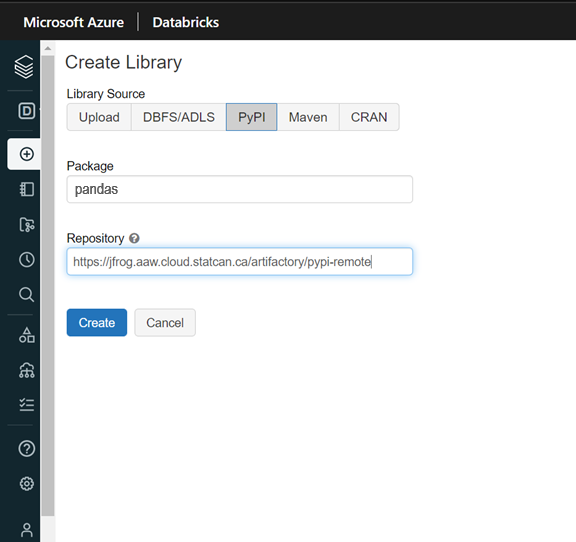

4. Click **Create**.

**Note**: Select **Install automatically on all cluster** under **Admin settings** if you wish to install the package on all the available clusters of the workspace.

### From a Databricks cluster

1.From the cluster main page, click **Install new** under **Libraries**.

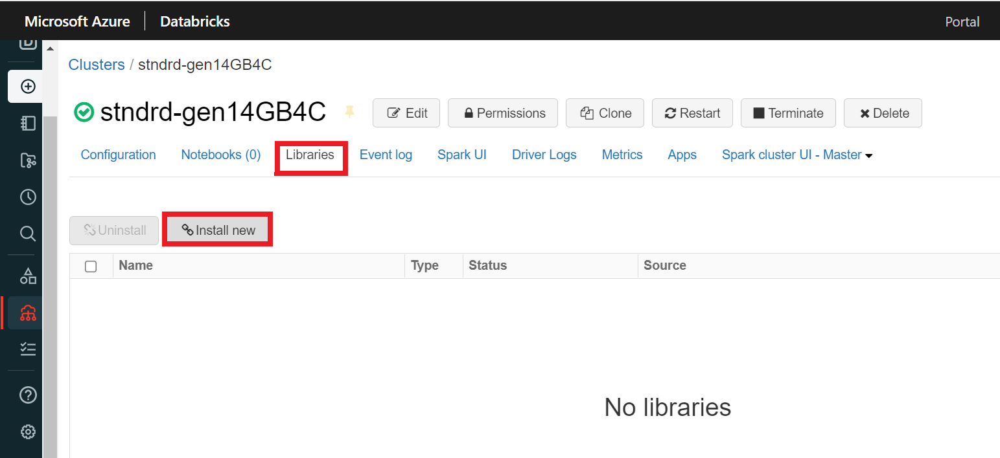

2. Under **Library Source**, choose either **PyPI** or **CRAN** depending of the package.

3. Paste the name of the library under **Package** and the associated Artifactory URL (See Note above) under **Repository**.

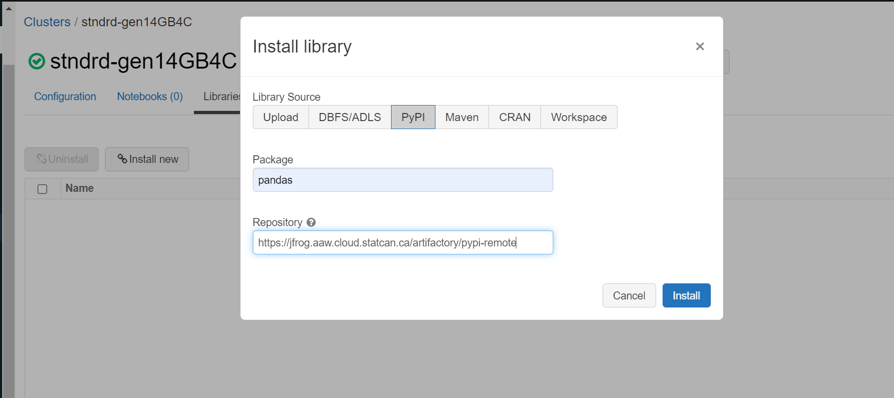

4. Click **Install**. You should see the newly installed library under **Libraries**.

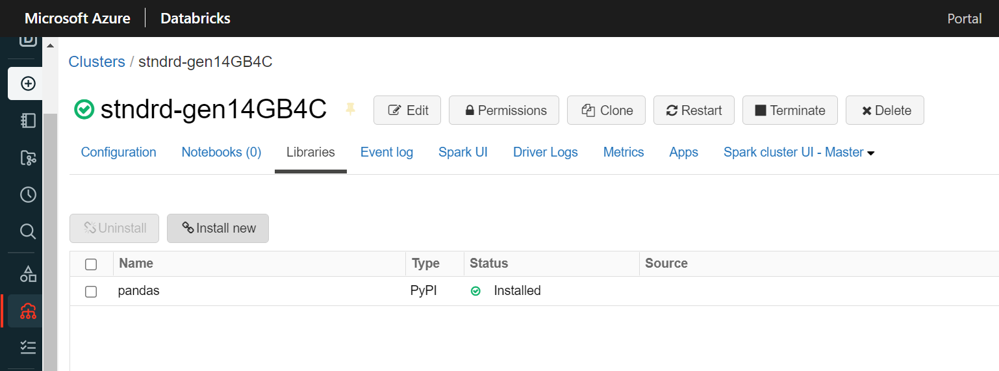

**Note** : If you don't have permission to install libraries from the workspace or cluster, please contact the **Collaborative Analytics Environment** team.

### From Databricks Notebooks
### Python notebook
1. From your Python notebook, run the following code to setup pip to download packages from Artifactory repositories.

```
%sh
pip config --user set global.index-url https://jfrog.aaw.cloud.statcan.ca/artifactory/api/pypi/pypi-remote/simple
```

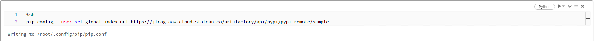

2. You can now use **pip3** or **pip** command to install packages as following:

```
%sh
pip3 install <PackageName>
```
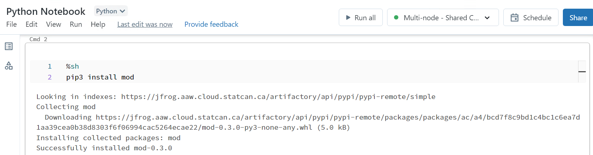

### R notebook
1. From your R notebook, run the following code to download packages from Artifactory repositories.

```
install.packages('<PackageName>', repos='https://jfrog.aaw.cloud.statcan.ca/artifactory/dev-cran-remote', dependencies=TRUE)
```
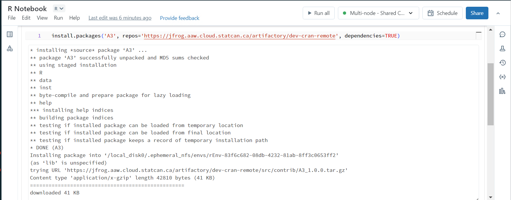

## Azure Machine Learning

The packages can be installed from the terminal using Python commands.

1. From the main page, click **Notebooks**, then click **Open Terminal** under **Files**.
 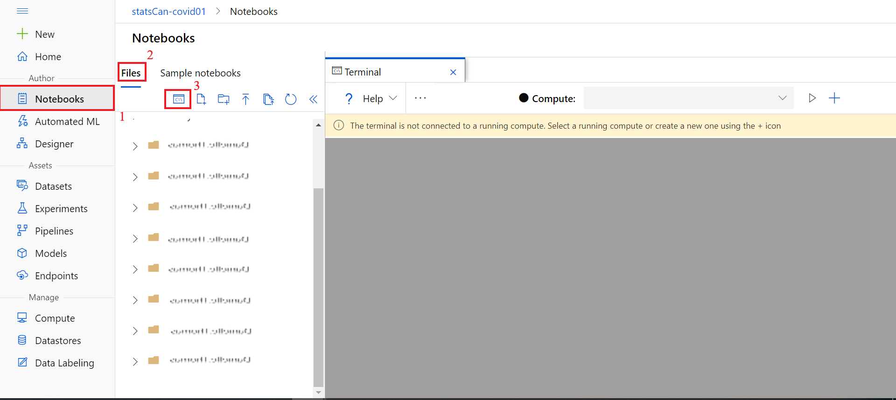  
 
2. Select the **compute instance** assigned to you from the drop-down next to Compute.

   *If a compute instance has not been created for you, please contact the  **Collaborative Analytics Environment** team.*
 
3. Run the following code to setup pip to download packages from Artifactory repositories.

```
pip config --user set global.index-url https://jfrog.aaw.cloud.statcan.ca/artifactory/api/pypi/pypi-remote/simple
```

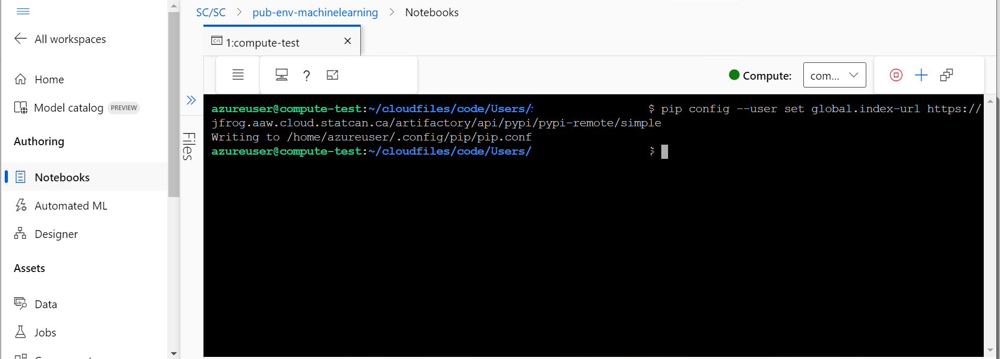

4. You can now use **pip3** or **pip** command to install packages as following:

```
pip3 install <PackageName>
```
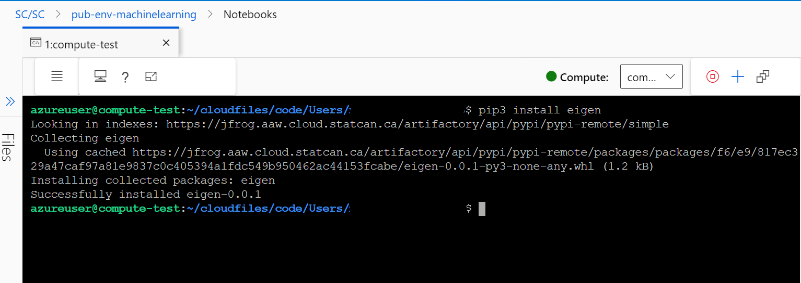


## Azure Synapse

Please contact the **Collaborative Analytics Environment** team to install custom packages in your Azure Synapse environment.

## Visual Studio Code
1.From the **Extensions** tab, click **Terminal**, then click **New Terminal**.
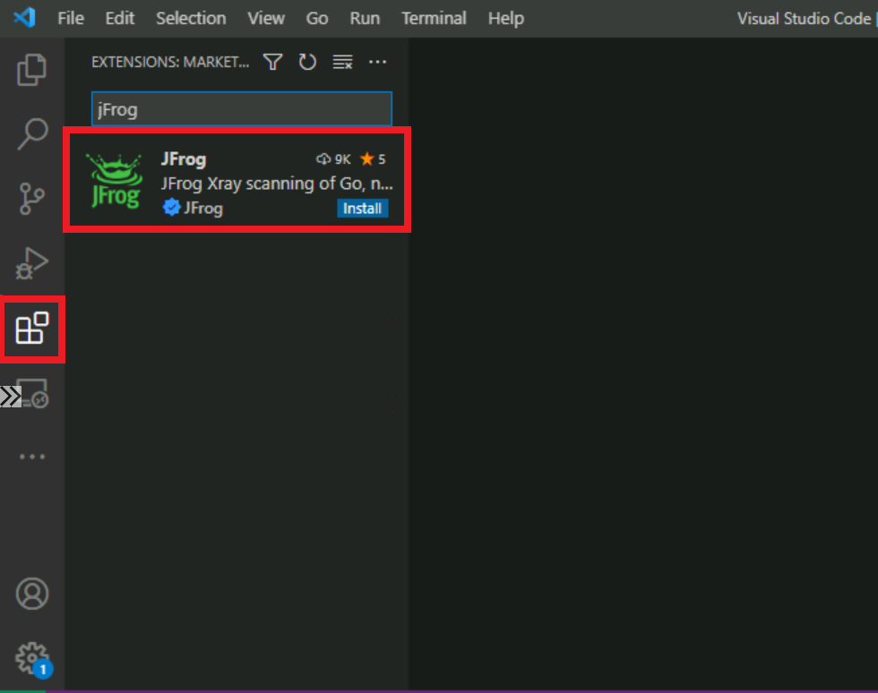

2. Run the following code to setup pip to download packages from Artifactory repositories.

```pip config --user set global.index-url https://jfrog.aaw.cloud.statcan.ca/artifactory/api/pypi/pypi-remote/simple```

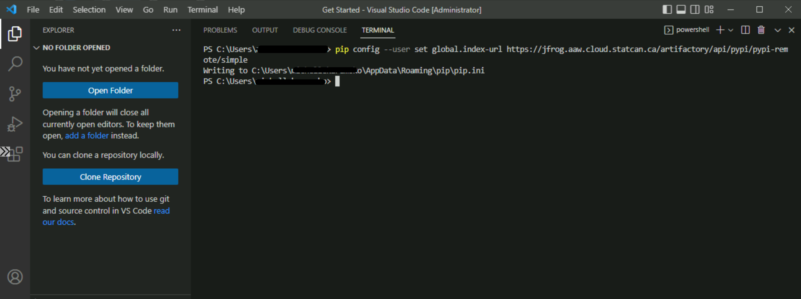

3. You can now use **pip3* or **pip** command to install packages as following:

```pip3 install <PackageName>```

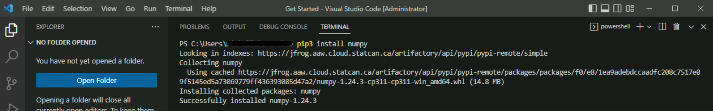


## RStudio
1. From the RStudio console, run the following code to configure the *Rprofile.site* file to use the Artifactory repositories.

``` 
options(repos = c(artifactory = "https://jfrog.aaw.cloud.statcan.ca/artifactory/dev-cran-remote/"))
```

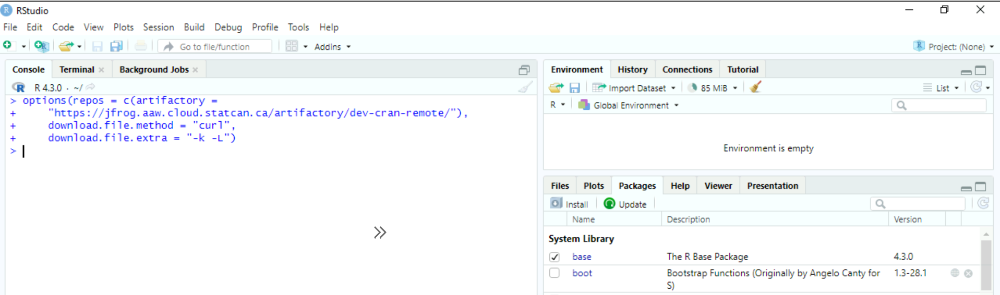

2. Under **Packages**, click "Install". Choose the new repository that you added in step 1 and enter the package name to install.

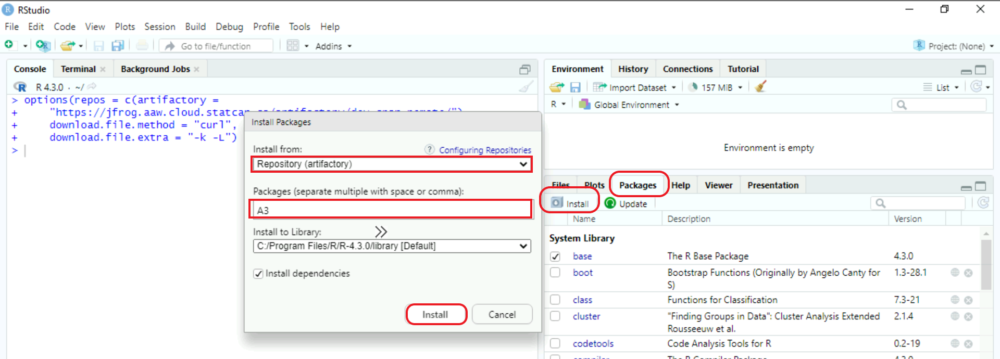

OR

Run the following command to avoid the steps 1 and 2.
```
install.packages('<PackageName>', repos='https://jfrog.aaw.cloud.statcan.ca/artifactory/dev-cran-remote', dependencies=TRUE)
```

3. You should see the installed package in the **System Library list**.

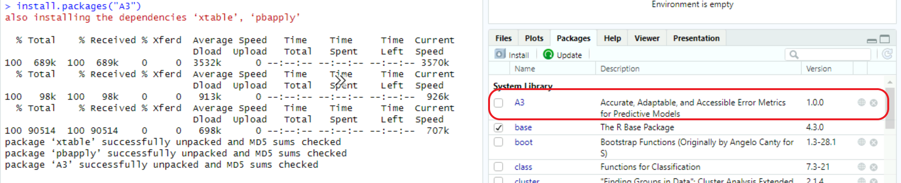

### R Console
1. Run the following code to configure the *Rprofile.site* file to use the Artifactory repositories.

```
options(repos = c(artifactory = "https://jfrog.aaw.cloud.statcan.ca/artifactory/dev-cran-remote/"))
```

2. Under **Packages**, click **Install Package**, choose the package you want to install, then click **Install**

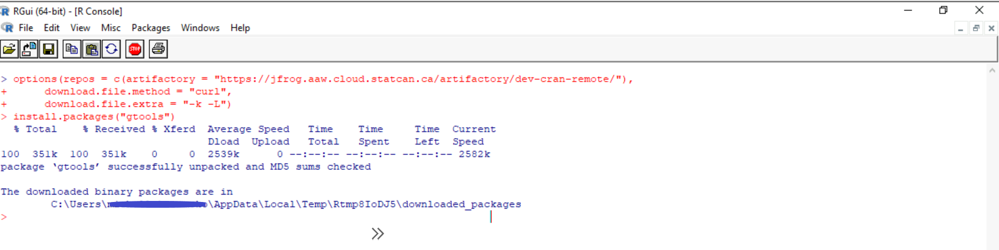

OR
Run the following code command to install packages.
```
install.packages('<PackageName>', repos='https://jfrog.aaw.cloud.statcan.ca/artifactory/dev-cran-remote', dependencies=TRUE)
```
### Warning
The configuration of the *Rprofile.site* file is temporary and only last your session. Once you close RStudio or the R Console, the settings reset to the default ones, so you have to run the code of the step 1 again.


## Azure Cloud Virtual Machine

### Miniforge Prompt
1. Run the following code to setup pip to download packages from Artifactory repositories.

```
pip config --user set global.index-url https://jfrog.aaw.cloud.statcan.ca/artifactory/api/pypi/pypi-remote/simple
```

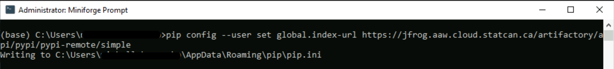

2. You can now use **pip3** or **pip** command to install packages as following:

```
pip3 install <PackageName>
```


### Command Prompt
1. Run the following code to setup pip to download packages from Artifactory repositories.

```
pip config --user set global.index-url https://jfrog.aaw.cloud.statcan.ca/artifactory/api/pypi/pypi-remote/simple
```

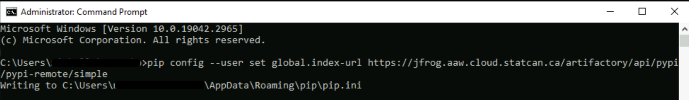

2. You can now use **pip3** or **pip** command to install packages as following:

```
pip3 install <PackageName>
```

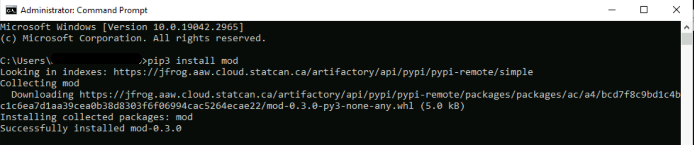

### Python application
You can use the Command Prompt to install packages, then import them into the Python notebooks as the following scenario:

1. Let's try to access this non-installed module’s contents with the **import** statement.


2. Now let's install it from the **Command Prompt**.
 *See Command Prompt section of this document if the pip.ini file hasn't been configured before*
 


3. The module can now be imported.

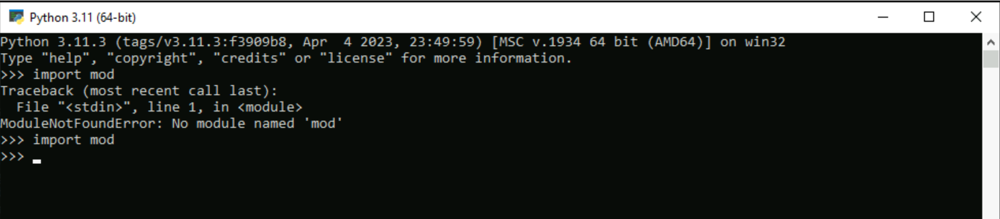

### Warning
The configuration of the *pip.ini* file is temporary. Once you Virtual Machine, the settings reset to the default ones, so you have to run the code of the step 1 again.

## Download Packages locally

To download packages locally, you can use the **Curl** or **pip download** commands as following:

```
curl -O "https://jfrog.aaw.cloud.statcan.ca/artifactory/cae-generic-test/<PackageName>"
```

```
pip download <package_url>
```
