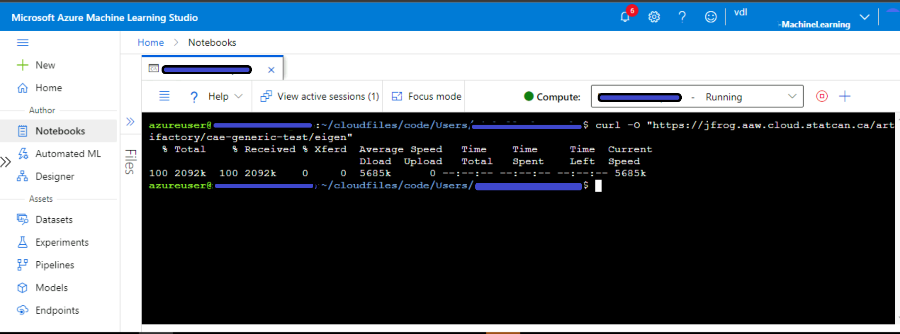
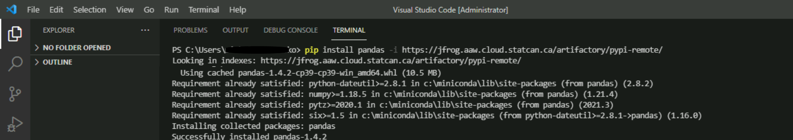

# Artifactory

The CAE environment uses the Artifiactory for package & Library management.


## Included packages

Below are the URLs that Artifactory pulls from currently. As long as the package is available on these repositories, it can be downloaded. You can get the name of the package by searching through the repositories.

  - [Conda-forge](https://conda.anaconda.org/conda-forge)
  - [CRAN](https://cran.r-project.org) (In the left menu, click **Packages** under **Software**, then click **Table of available packages**)
  - [Python](https://pypi.org/)
  
The respective artifactory URLs to use are:
  - https://jfrog.aaw.cloud.statcan.ca/artifactory/conda-forge-remote/
  - https://jfrog.aaw.cloud.statcan.ca/artifactory/dev-cran-remote/
  - https://jfrog.aaw.cloud.statcan.ca/artifactory/pypi-remote/
  
**Note**: For any other packages, please contact the **Collaborative Analytics Environment** team.


## Azure DataBricks

The packages can be installed from the Databricks workspace or a cluster.

### From Databricks workspace

1.From the main page, click **Import Library**.


2. Under Library Source, choose either **PyPI** or **CRAN**.

3. Paste the name of the library under **Package** and the Artifactory URL under **Repository**.


4. Click **Create**.

**Note**: Select **Install automatically on all cluster** under **Admin settings** if you wish to install the package on all the available clusters of the workspace.

### From a cluster

1.From the cluster main page, click **Install new** under **Libraries**.


2. Under **Library Source**, choose either **PyPI** or **CRAN**.

3. Paste the name of the library under **Package** and the Artifactory URL under **Repository**.


4. Click **Install**. You should see the installed librarie under **Libraries**.


## Azure Machine Learning

To install packages on a compute instance, you can use the **Curl** command in the Azure Machine Learning terminal as following:

```curl -O "https://jfrog.aaw.cloud.statcan.ca/artifactory/cae-generic-test/<PackageName>"```



## Azure Synapse

Please contact the **Collaborative Analytics Environment** team to install custom packages in your Azure Synapse environment.

## Azure Cloud VM

### Visual Studio Code
1.On the Extensions tab, click **Terminal**, then click **New Terminal**.


2.To install the package, use the **pip install** command in the  terminal as following:

```pip install <PackageName> -i https://jfrog.aaw.cloud.statcan.ca/artifactory/pypi-remote/```



