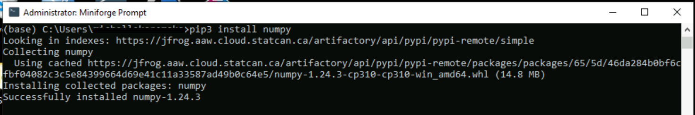
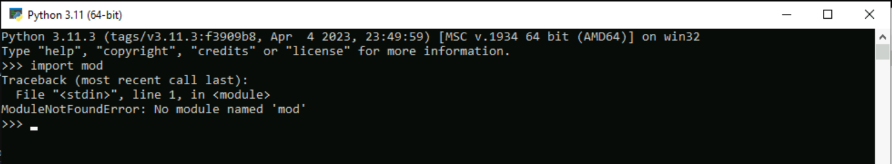

# Artifactory

The CAE environment uses the Artifiactory for package & library management.


## Included packages

Below are the URLs that Artifactory pulls from currently. As long as the package is available on these repositories, it can be downloaded. You can get the name of the package by searching through the repositories.

  - [Conda-forge](https://conda.anaconda.org/conda-forge)
  - [CRAN](https://cran.r-project.org) (In the left menu, click **Packages** under **Software**, then click **Table of available packages**)
  - [Python](https://pypi.org/)
  
The respective artifactory URLs to use are:
  - https://jfrog.aaw.cloud.statcan.ca/artifactory/conda-forge-remote/
  - https://jfrog.aaw.cloud.statcan.ca/artifactory/dev-cran-remote/
  - https://jfrog.aaw.cloud.statcan.ca/artifactory/pypi-remote/
  
**Note**: For any other packages, please contact the **Collaborative Analytics Environment** team.


## Azure DataBricks

The packages can be installed from the Databricks workspace or a cluster.

 **Note**: 
 - The library sources available in Databricks are **PyPI** for Python packages and **CRAN** for CRAN packages.
 - The artifactory URLs to use depending on the selected library source are:
    - https://jfrog.aaw.cloud.statcan.ca/artifactory/pypi-remote/ for **PyPI**
    - https://jfrog.aaw.cloud.statcan.ca/artifactory/dev-cran-remote/  for **CRAN**
    
    

### From Databricks workspace

1.From the main page, click **Import Library**.


2. Under **Library Source**, choose either **PyPI** or **CRAN** depending of the package.

3. Paste the name of the library under **Package** and the associated Artifactory URL (See Note above) under **Repository**.


4. Click **Create**.

**Note**: Select **Install automatically on all cluster** under **Admin settings** if you wish to install the package on all the available clusters of the workspace.

### From a cluster

1.From the cluster main page, click **Install new** under **Libraries**.


2. Under **Library Source**, choose either **PyPI** or **CRAN** depending of the package.

3. Paste the name of the library under **Package** and the associated Artifactory URL (See Note above) under **Repository**.


4. Click **Install**. You should see the newly installed library under **Libraries**.


## Azure Machine Learning

The packages can be installed from the terminal using Python commands.

1. From the main page, click **Notebooks**, then click **Open Terminal** under **Files**.
   
 
2. Select the **compute instance** assigned to you from the drop-down next to Compute.

 *If a compute instance has not been created for you, please contact the  **Collaborative Analytics Environment** team.*
 
3. Run this code **once** to setup pip to download packages from Artifactory repositories by default:

```pip config --user set global.index-url https://jfrog.aaw.cloud.statcan.ca/artifactory/api/pypi/pypi-remote/simple```


4. You can now use **pip3** or **pip** command to install packages as following:

```pip3 install <PackageName>```


## Azure Synapse

Please contact the **Collaborative Analytics Environment** team to install custom packages in your Azure Synapse environment.

## Visual Studio Code
1.From the **Extensions** tab, click **Terminal**, then click **New Terminal**.


2. Run this code **once** to setup pip to download packages from Artifactory repositories by default:

```pip config --user set global.index-url https://jfrog.aaw.cloud.statcan.ca/artifactory/api/pypi/pypi-remote/simple```


3. You can now use **pip3* or **pip** command to install packages as following:

```pip3 install <PackageName>```


## RStudio
1. Run this code **once** to configure the Rhistory file to use the Artifactory repository by default:

```options(repos = c("dev-cran-remote" = "https://jfrog.aaw.cloud.statcan.ca/artifactory/dev-cran-remote/"))```


2. Click "Install", choose the new repository that you added in step 1, then enter the package name to install.


Note: You can directly use the **install.packages(PackageName)** command to install packages

3. You should see the installed package in the **System Library list**.


## Azure Cloud Virtual Machine

### Miniforge Prompt
1. Run this code **once** to setup pip to download packages from Artifactory repositories by default:

```pip config --user set global.index-url https://jfrog.aaw.cloud.statcan.ca/artifactory/api/pypi/pypi-remote/simple```


2. You can now use **pip3** or **pip** command to install packages as following:

```pip3 install <PackageName>```



### Command Prompt
1. Run this code **once** to setup pip to download packages from Artifactory repositories by default:

```pip config --user set global.index-url https://jfrog.aaw.cloud.statcan.ca/artifactory/api/pypi/pypi-remote/simple```


2. You can now use **pip3* or **pip** command to install packages as following:

```pip3 install <PackageName>```


### Python application
You can use the Command Prompt to install packages, then import them into the Python notebooks as the following scenario:

1. Let's try to access the module’s contents with the **import** statement.



2. Now let's install it using the **Command Prompt**.
 *See Command Prompt section of this document if the pip.ini file hasn't been configured before*
 


3. The module can now be imported.


## Download Packages locally

To download packages locally, you can use the **Curl** or **pip download** commands as following:

```curl -O "https://jfrog.aaw.cloud.statcan.ca/artifactory/cae-generic-test/<PackageName>"```

``` pip download <package_url> ```
