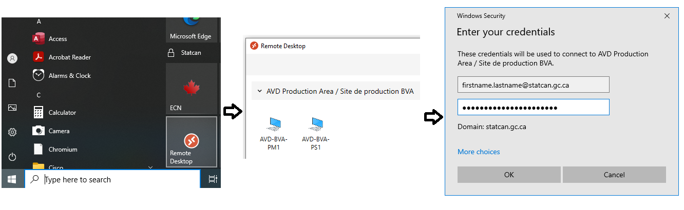
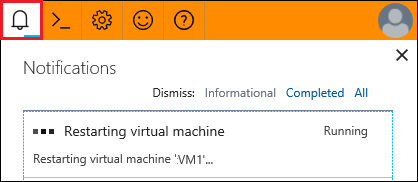

## Azure Virtual Desktop
Statistics Canada employees have access to Azure Virtual Desktop on their Statistics Canada device.  Statistics Canada employees can use their statcan.gc.ca credentials to login to Azure Virtual Desktop.

1. To be able to access Azure Virtual Desktop, you will need your statcan account: **firstname.lastname@statcan.gc.ca**

2. You will have to connect to your environment through the Azure Virtual Desktop (AVD).
From the Windows Search bar, you will have to access the Remote Desktop app then select your AVD and enter your NetA credential as shown below.

     
    
3. Once you are logged into your Azure Virtual Desktop,  you can access services with the [CAS Azure Dashboard](Dashboard.md) 

<!-- 2. Select the DevTest Lab that was assigned.
 
## Create Your Virtual Machine
**Note:** In some instances a Virtual Machine will be pre-created for you and you will not have permission to create a virtual machine. See the [FAQ](FAQ.md) if you need to make changes to your virtual machine.  

1. From the DevTest Lab **Overview** page, click on the **+ Add** button.  

2. Choose an appropriate base for your VM (e.g., Data Science Virtual Machine - Windows Server 2019). For more details on the software included with the Data Science Virtual Machines, please [click here](https://docs.microsoft.com/en-us/azure/machine-learning/data-science-virtual-machine/tools-included).  

3. Enter a name for your VM and a User name and password that you will use to login to the VM. Be sure to deselect the *Use a saved secret* and *Save as default password* checkboxes.

4. You may click the **Change Size Link** to change your VM size if you wish to do so.

5. Leave the rest as defaults and click on the **Create** button.    

      

## Find Your Virtual Machine

1. From the DevTest Lab **Overview** page, scroll down until you see your VM under **My virtual machines**. Click on your VM to access its **Overview** page.  

## Start Your Virtual Machine

1. From the **Overview** page for your VM, click on the **Start** button.  

      

2. It takes a few minutes for your VM to start up. Monitor its startup progress by selecting the Notifications icon at the top right of the window.   

      

## Connect To Your Virtual Machine

1. From the **Overview** page for your VM, click on the **Browser connect** button (if you do not see a **Browser connect** button you might have to click on the **Connect** button and then choose **Bastion** from the dropdown menu).

        

2. Ensure the *Open in new window* checkbox is selected, enter the Username and Password that you used when you created your VM, and click on the **Connect** button. Your VM should open in a new browser tab.

    **Note** : By default, the **Ubuntu** virtual machine opens in Terminal mode. You can access the GUI of your Ubuntu machine from a Windows machine using [X2Go](https://docs.microsoft.com/en-us/azure/machine-learning/data-science-virtual-machine/dsvm-ubuntu-intro#x2go).

    **Note** : After attempting to login for the first time, an error may appear that a popup blocker is preventing a new window to open. To disable it, an icon will pop up on the browser's search bar, select the button and click **always allow**. 

    

   
## Stop Your Virtual Machine

Virtual machines only incur costs while they are running. You should shut down your virtual machine when not in use to prevent unneccessary charges.

1. From the **Overview** page for your VM, click on the **Stop** button.  

      
 -->
