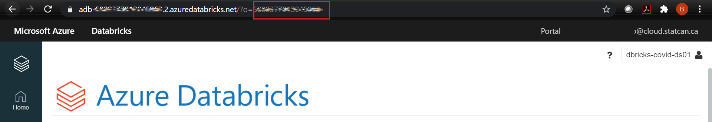
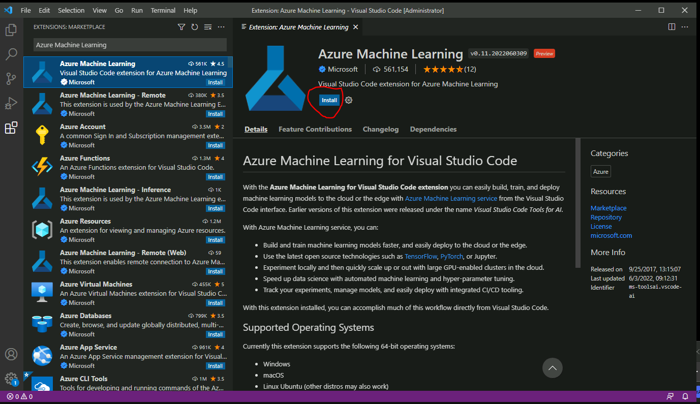
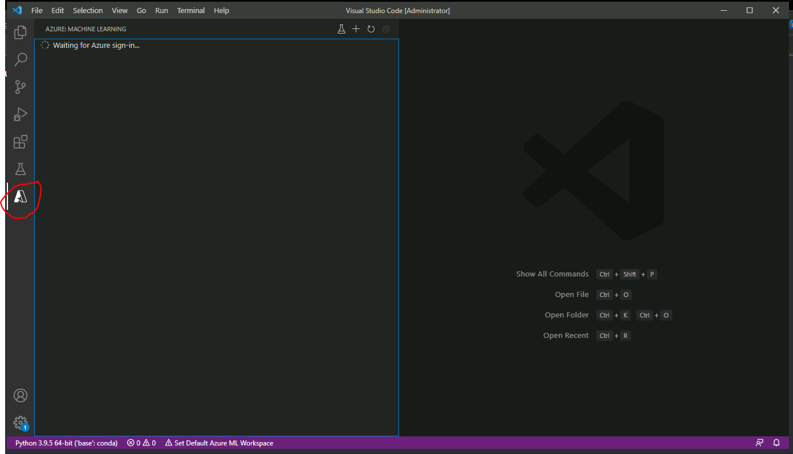

*New:* Please access Azure ML form your CAE [Virtual Machine](VirtualMarchine.md).

## Accessing Azure Machine Learning
### Dashboard

See the [Dashboard section](Dashboards.md) of this documentation from more information.  

1. Click on the **Dashboard** menu from the Azure Portal. Your default view might already be set to dashboard.  

    

2. Under **Machine Learning** , select the Machine Learning workspace that was created for you. If the workspace you want to open isn't listed, click on **See more** to access the complete list.

    

### Azure Portal

1.	In the Azure Portal Search box, search for **Machine Learning**.

      

2.	You should see the list of the Machine Learning workspaces you were given permission to access. Select the **Machine Learning workspace** you want to access.

    

### Machine Learning URL
1. Navigate to https://ml.azure.com/, sign in with your cloud account credentials, and select **vdl** subscription and the **Machine Learning workspace** that was created for you.  

    


## Getting Started

1.	On the machine learning **Overview** page, click **Launch studio**.

      

2.	Use the drop-down to select **vdl** subscription and the **Machine Learning workspace** you want to access, then click **Get started**.

    

3. Once inside your Machine Learning workspace, you can train, deploy and manage machine learning models, use AutoML, and run pipelines. See [Getting started quickly]( https://docs.microsoft.com/en-us/azure/machine-learning/) for more information.

      

## Using Azure ML Notebook standalone
### Requirements

A compute instance in Azure ML. You should see it under **Compute --> Compute instances**.

**Note**: If a compute instance has not been created for you, please contact the support team via [Slack](https://cae-eac.slack.com).

### Steps

1.	Under **Notebooks**, create a new notebook in your user directory. You can then enter the code to execute.

      

2.	Select the **Compute instance** assigned to you.

    

3.	Click the **run all cells button** to execute your code.

    


## Using Databricks Connect as Remote Compute

**Disclaimer:** Please note that the Databricks connect configuration shown below is under revision and will likely change in the near future.

### Requirements

A compute instance in Azure ML. You should see it under **Compute --> Compute instances**.

**Note**: If a compute instance has not been created for you, please contact the support team via [Slack](https://cae-eac.slack.com).

### Steps

1.	Under **Notebooks**, open **Terminal**.

      

2. Select your **Compute instance** from the drop-down next to **Compute**.

3.  Execute the code from [Databricks Connect Setup](https://github.com/StatCan/cae-eac/blob/master/Examples/AzureML/Databricks-Connect-Setup.txt) in the terminal, while following the prompts to continue as needed. This code installs Python 3.7 and sets up a new kernel for Azure ML notebooks.

    When prompted, enter the following values to configure Databricks connect:

    **Host:** the **URL** from the **Overview** page for your Databricks workspace.

    

    **Token:** the [personal access token](https://docs.microsoft.com/en-us/azure/databricks/dev-tools/api/latest/authentication#--generate-a-personal-access-token) generated in your Databricks Workspace User Settings.

    **Cluster ID:** the value found under **Cluster --> Advanced Options --> Tags** in your Databricks workspace.
    
    

    **Org ID:** the part of the Databricks URL found after **.net/?o=**
    
    

    **Port:** keep the existing value

4.	Execute the following code in terminal to test the connectivity to Azure Databricks.
    ```
    databricks-connect test
    ```

5.	Create a new notebook with Azure ML and select the **Python 3 kernel**. It should now display Python 3.7.9

      

6.	Databricks connect should be setup now! Try the [Databricks connect example code](https://github.com/StatCan/cae-eac/blob/master/Examples/AzureML/Databricks-Connect-Example.txt) in a notebook, replacing **public-data/incoming/1test.txt** with the path to a file in your data lake container.

## Request compute
Please contact the support team through the [slack](https://cae-eac.slack.com) channel to request Azure ML compute. You will receive the following error when creating it yourself:


## Set Up VS Code Extension for Machine Learning

### Install VS Code's azure machine learning extension

    1- Open Visual Studio Code.
    2- Select Extensions icon from the Activity Bar to open the Extensions view.
    3- In the Extensions view search bar, type "Azure Machine Learning" and select the first extension.
    4- Select Install.



### Sign in to your Azure Account

To sign into you Azure account, select the Azure: Sign In button in the left side bar of Visual Studio Code status to start the sign in process.



Once you are signed in, you will see all azure subscriptions you have access to.

### Choose your default workspace

To choose your default workspace, select the Set Default Azure ML Workspace button on the Visual Studio Code status bar and follow the prompts to set your workspace.


