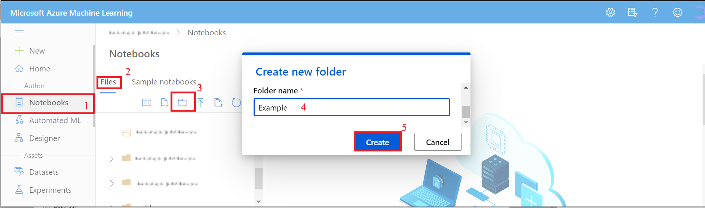
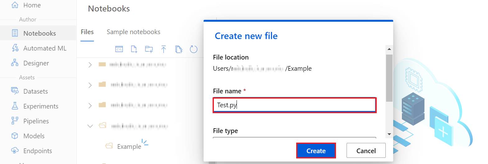
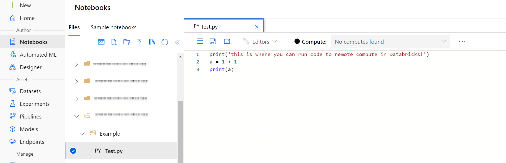
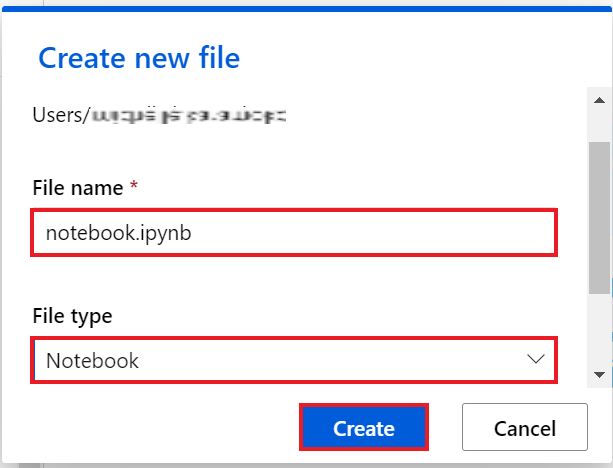
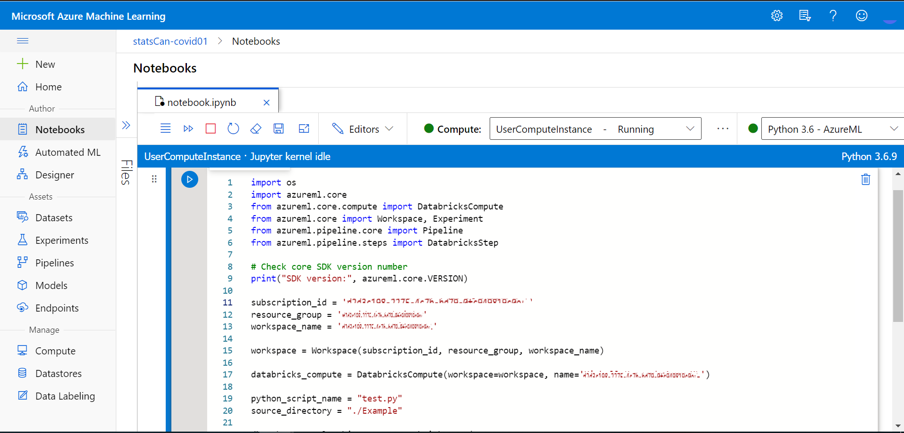
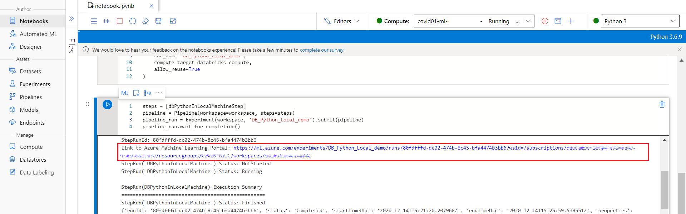
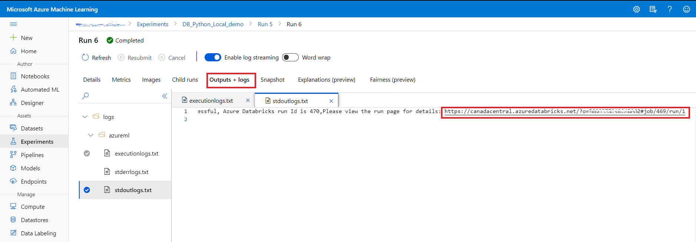
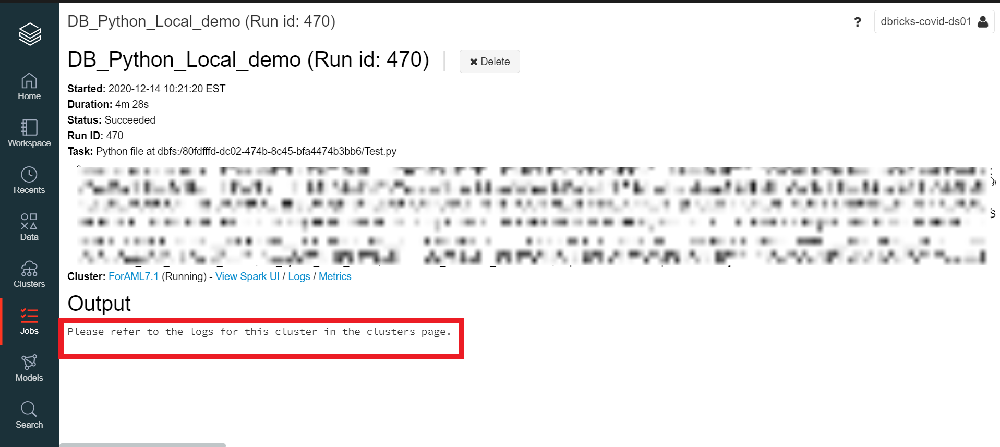
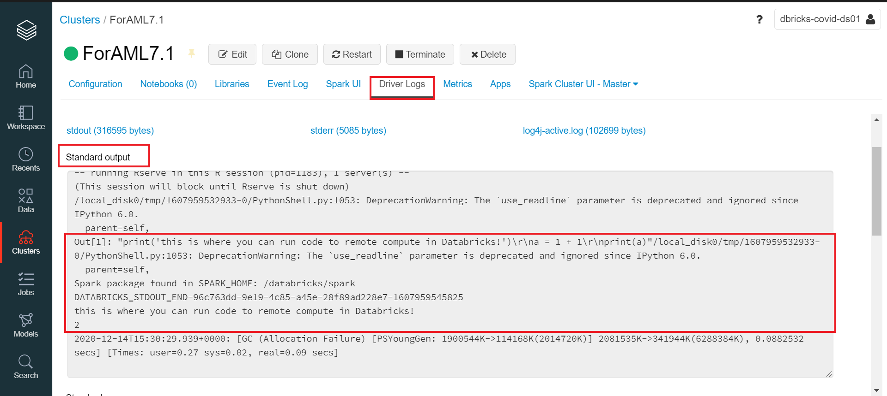

<!--## Using Attach Databricks as Remote Compute

<!--### Requirements

<!--•	An attached compute in Azure ML. You should see it under **Compute > Attached compute**.

<!--•	A compute instance in Azure ML. You should see it under **Compute > Compute instances**. 

<!--**Note**: If a compute instance or/and attached compute have not been created for you, please contact the support team via [Slack](https://cae-eac.slack.com).

<!--### Steps

<!--1.	Under **Notebooks**, create a new folder in your user directory.

<!--  
 
<!--2.	Create a sample **.py** file in the newly created folder, and select **Text** as the **File type**. 

<!--  
 
<!--This file should contain your Python code to execute with Databricks. 
<!--  

<!--3.	In your user root directory, create a new **notebook**.

<!--  
 
<!--4.	Copy and paste the [Attach-Databricks-Notebook](https://github.com/StatCan/cae-eac/blob/master/Examples/AzureML/Attach-Databricks-Notebook.txt) code in the new notebook. Update the code with the missing values. It should run as validated with Azure ML SDK version 1.18.0.

<!--  

<!--5.	You can see the results with the following steps:

    <!--a.  Click on the **PipelineRun link**.

     

    b.  Click on the **Databricks run page link** under **Outputs + logs**.

      

    c.  You should be redirected to the Databricks run page.

    
      
    d. Under **Driver Logs**, see the result in the **Standart output** tab.

        
 

<!--**References**: 

<!--•	[Using Databricks Connect](https://github.com/hudua/azureml-databricks/blob/main/guides/azure-ml-databricks-connect.md)

<!--•	[Using attach Databricks as remote compute](https://github.com/hudua/azureml-databricks/blob/main/guides/azure-ml-attach-databricks.md)

