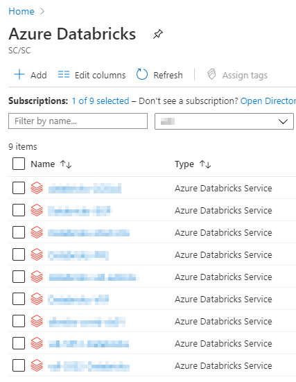

### Dashboard

See the [Dashboard section](Dashboards.md) of this documentation from more information.  
1. Click on the Dashboard menu from the Azure Portal.  

      

### Azure Portal

1. In the Azure Portal Search box, search for **Databricks**.  

      

2. You should then see a list of the Databricks workspaces you were given permission to access.  

    

### Access Azure Synapse- Internal Users
It is recommanded for internal user to access the cloud service through their AVD (Azure Virtual Desktop) 
1. Make sure that you are in your cloud virtual machine to access Azure Synapse. See [Virtual Machines](VirtualMachines.md) for information on how to create one if needed.

2. Inside your virtual machine, open a web browser and navigate to the [Azure Portal](https://portal.azure.com). Sign in with your cloud account credentials.

3. 
    a. Click on the **Azure Synapse Analytics** icon under **Azure services**. If you do not see this icon, follow step 3b instead.

    

    b. Start typing "synapse" into the search bar to find **Azure Synapse Analytics**.

     

4. Find your Synapse workspace in the list and click on it. Then click **Open Synapse Studio**.

    

Note: You can also acccess Synapse workspaces from the **Collaborative Analytics Environment** dashboard.

<!-- *New:* Please access Azure ML form your CAE [Virtual Machine](VirtualMarchine.md). -->

## Accessing Azure Machine Learning- Internal Users
It is recommanded for internal user to access the cloud service through their AVD (Azure Virtual Desktop)
### Dashboard

See the [Dashboard section](Dashboards.md) of this documentation from more information.  

1. Click on the **Dashboard** menu from the Azure Portal. Your default view might already be set to dashboard.  

    

2. Under **Machine Learning** , select the Machine Learning workspace that was created for you. If the workspace you want to open isn't listed, click on **See more** to access the complete list.

    

### Azure Portal

1.	In the Azure Portal Search box, search for **Machine Learning**.

      

2.	You should see the list of the Machine Learning workspaces you were given permission to access. Select the **Machine Learning workspace** you want to access.

    

### Machine Learning URL
1. Navigate to https://ml.azure.com/, sign in with your cloud account credentials, and select **vdl** subscription and the **Machine Learning workspace** that was created for you.  

    

