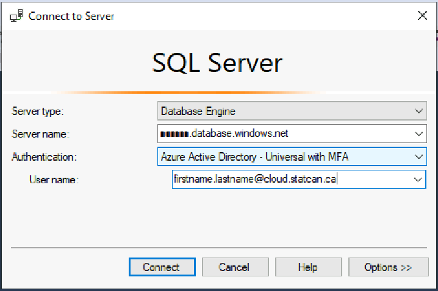

_[Français](../../fr/AzureSQL)_
# Azure SQL Database
An Azure SQL Database can be setup in advance if your project requires one.

**Reminder**: The CAE Azure SQL Databases are only accessible from inside the CAE cloud environment. They are not accessible from any of the Government of Canada Data Centres.

## Accessing Azure SQL Database

### Azure Data Factory
A linked service can be setup inside Azure Data Factory. Configure the linked service to connect via the self-hosted integration runtime and use **Managed Identity** as the **Authentication type**. Please contact the support team through the https://cae-eac.slack.com channel if you need assistance.

### Databricks
Databricks notebooks can be configured to connect to the database. Because additional setup is required, please contact the the support team through the https://cae-eac.slack.com channel to request this configuration as well as example notebooks.

### Virtual Machine

You can access an Azure SQL database from your cloud virtual machine, using various applications including:  
1. SQL Server Management Studio 
2. Power BI Desktop
3. Azure Data Studio
4. Visual Studio or Visual Studio Code

#### Prerequisites

1. A **virtual machine** in the Collaborative Analytics Environment (CAE). See the [VM page](VirtualMachines.md) for more information.

2. **SQL Server Management Studio** or another tool such as **Power BI Desktop**. These tools are available by default in the **Windows Data Science Virtual Machine** images.

#### Steps

1. Login to your **CAE virtual machine**.  

2. Launch a tool such as **SQL Server Management Studio**. 

3. Choose **Azure Active Directory - Universal with MFA** as the Authentication type.

4. Enter your **Azure SQL server name** and your **cloud account** username as User name.

     
5. Click on **Options**.

6. In the **Connection Properties** tab, enter your database name next to the **Connect to database** label and click on **Connect**.  
    
   
7. Sign in with your cloud account credentials.

# Change Display Language

See [Language](Language.md) page to find out how to change the display language.
