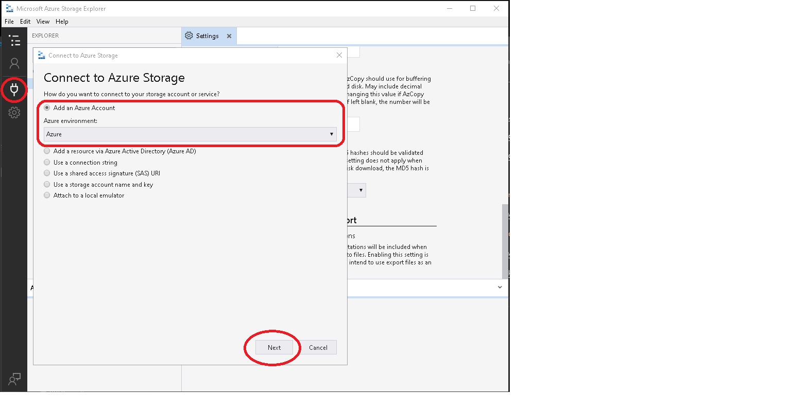

Data can be uploaded to the platform via the Azure Portal or the Azure Storage Explorer application. Once data uploaded to an external **Blob storage** account, it is automatically ingested into an internal **Azure Data Lake Storage (ADLS)** account.  Once data is in the data lake, users have their choice of tools for transformation and integration. They can use Web based tools such as Databricks and Data Factory to do their transformations or they can use desktop tools on a virtual machine (VM) to tansform & analyse the data. Cleansed and transformed data can be placed into different folders (containing higher quality / processed datasets) or loaded into a database. Users can once again connect to this data with the tools they would like to use, either from their VMs or other platform services such as Databricks and Data Factory.

**Reminder:** Internal Storage Accounts can only be accessed from a VM in the Collaborative Analytics Environment (CAE) - See the [FAQ](FAQ.md) 

## Storage Explorer - Azure Portal 

1. Navigate to the Storage Account (Preview) from the Azure Portal. 

     

2. Select your subscription, then navigate the storage account.   

     

## Storage Explorer - Personal Workstation or Cloud Virtual Machine
1. Download the [Azure Storage Explorer](https://azure.microsoft.com/en-us/features/storage-explorer/) application, and install it on your workstation or VM.

2. Launch Azure Storage Explorer from the Start menu.

3. Login with your Azure Account.  

     

4. Enter your Cloud credentials

     

## Storage Explorer - Network B VDI
_This section is for Statistics Canada employees who need to upload data from Network B._  
1. Download the [Azure Storage Explorer](https://azure.microsoft.com/en-us/features/storage-explorer/) application, and install it on your Network B VDI. 

2. Launch Azure Storage Explorer from the Start menu.  

3. On a Network B VDI, you can only access your storage account with a temporary SAS token. Please contact the support team through the Slack channel to obtain one.  

**Note:** See the [FAQ](FAQ.md) for information on configuring Network B proxy settings.

## Microsoft Documentation
- [Azure Storage Explorer Download](https://azure.microsoft.com/en-us/features/storage-explorer/)  
- [Quickstart: Upload, download, and list blobs with the Azure portal](https://docs.microsoft.com/en-us/azure/storage/blobs/storage-quickstart-blobs-portal) 
