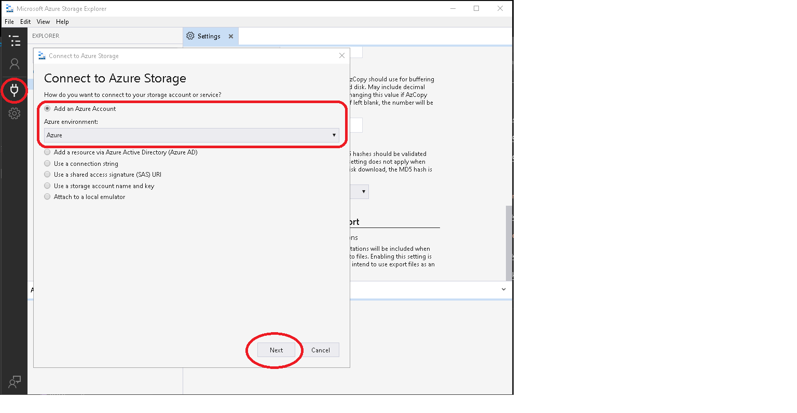
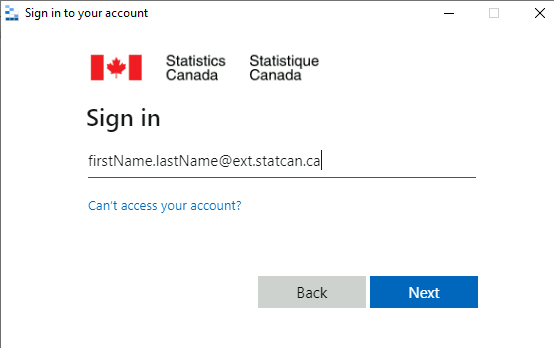
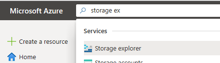
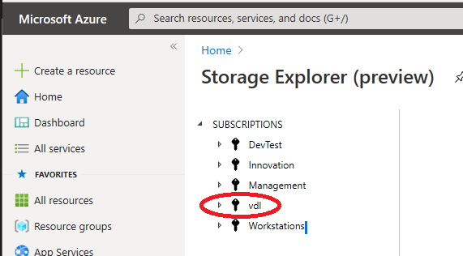

## Storage Explorer - AVD
1. If you don't have it in the AVD, you can download the [Azure Storage Explorer](https://azure.microsoft.com/en-us/features/storage-explorer/) application, and install it on your AVD.

2. Launch Azure Storage Explorer from the Start menu.

    

3. Login with your Azure Account.  (note use uuser account)

     

4. Enter your credentials

     

## Storage Explorer - Azure Portal 

1. Navigate to the Storage Account (Preview) from the Azure Portal. 

     

2. Select your subscription, then navigate the storage account.   

     
