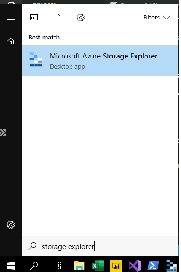
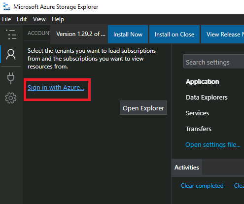
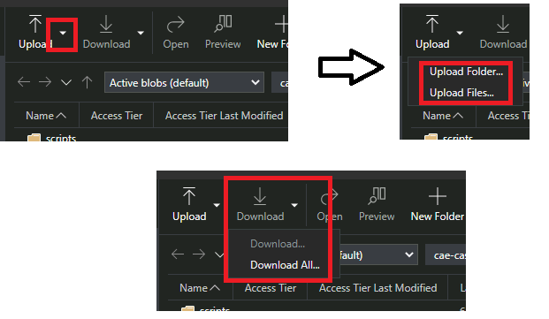

## Storage Explorer 

1. To access any of the services, you must first login to your virtual machine. See [Login](ExtVirtualMachines.md)

2. On your virtual machines, launch Azure Storage Explorer from the Start menu.

   

3. The first time you launch the Storage explorer, you need to click the connect button 

   

   or click the ***Sign in with Azure*** Button

   

3. You then have to select your environment.  

     

4. and login with your Azure Account by entering your credentials

    
   
5. Once you login, your storage account and containers will be visible to you.

6. Files can be download and uploaded to\from your virtual machine using your respective container 

    

7. You must download data files to your local virtual machines so that it can be used by installed software. Storage accounts can not be mapped to virtual machines.
8. You can create a personal folder in your container, to organize your personal files.

Note:
9. Best practice is to always upload or store data to your storage account.  Virtual machines and their data are not backed up.

## Microsoft Documentation
- [Azure Storage Explorer Download](https://azure.microsoft.com/en-us/features/storage-explorer/)  
- [Quickstart: Upload, download, and list blobs with the Azure portal](https://docs.microsoft.com/en-us/azure/storage/blobs/storage-quickstart-blobs-portal)
