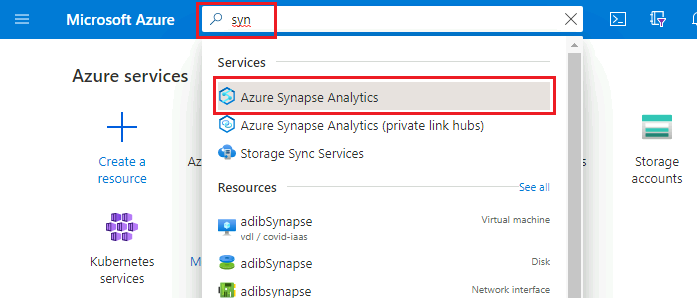
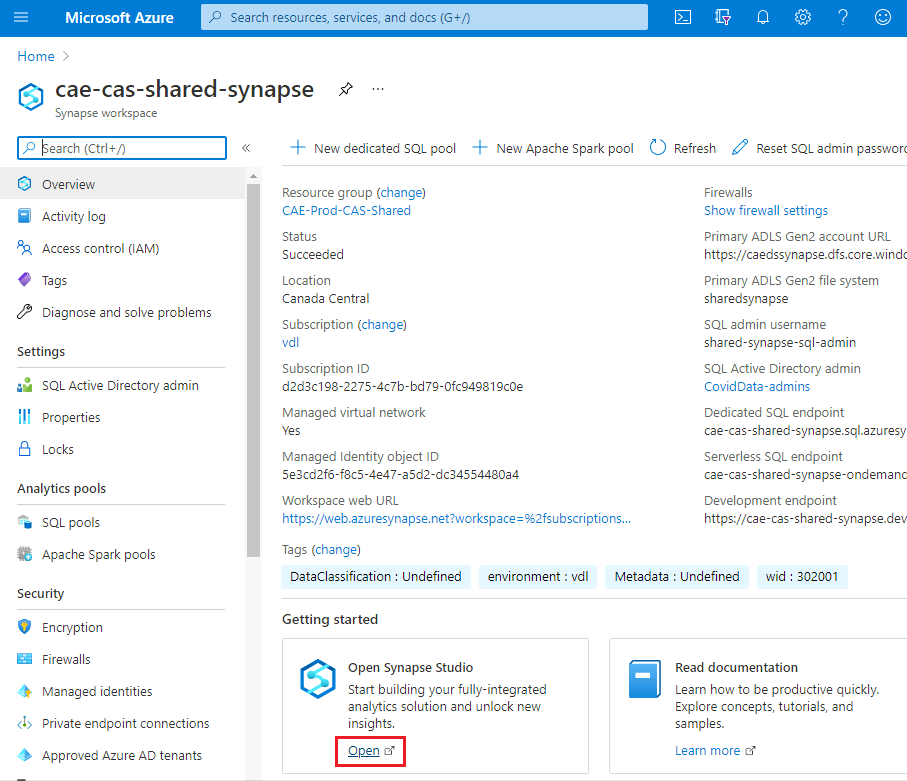

_[Français](../../fr/AzureSynapse)_

# Azure Synapse

## Access Azure Synapse

1. Make sure you are in your cloud VM in order to access Azure Synapse. See [Virtual Machines](VirtualMachines.md) for information on how to create one if needed.

2. Inside your virtual machine, open a web browser and navigate to the Azure Portal (https://portal.azure.com). Sign in with your cloud account credentials.

3. Start typing "synapse" into the search bar to find **Azure Synapse Analytics**.
 

4. Find your Synapse Workspace in the list and click on it. Then click **Open Synapse Studio**.

## Home

## Data

## Develop

## Integrate

## Monitor

## Manage

# Change Display Language
See [Language](Language.md) page to find out how to change the display language.

---
### Rough Notes (to be deleted later)
How to access the data lake from azure synapse

All components:
- home
- data 
- develop
- integrate 
- manage

How to  create power bi reports?
Please contact the CEA support team to validate that a linked service is setup 
