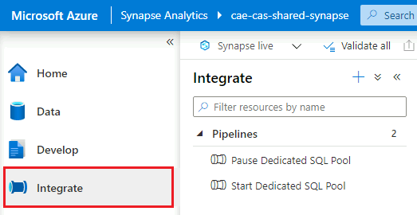
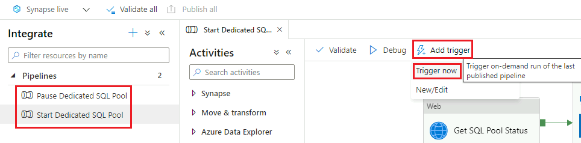
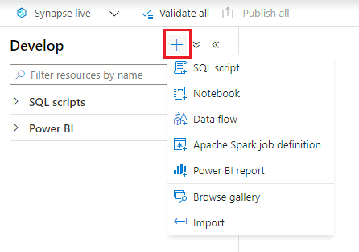

_[Français](../../fr/AzureSynapse)_

# Azure Synapse

## Getting Started

### Access Azure Synapse

1. Make sure you are in your cloud VM in order to access Azure Synapse. See [Virtual Machines](VirtualMachines.md) for information on how to create one if needed.

2. Inside your virtual machine, open a web browser and navigate to the Azure Portal (https://portal.azure.com). Sign in with your cloud account credentials.

3. Start typing "synapse" into the search bar to find **Azure Synapse Analytics**.
 

4. Find your Synapse Workspace in the list and click on it. Then click **Open Synapse Studio**.

### Start and Stop SQL Pool

1. Click on the **Manage** tab.

2. Find your dedicated SQL pool in the list and hover over it. You should see a pause button if the pool is currently running, or a start button if it is not. Click the button to start or stop your SQL pool.

Note: SQL pools automatically stop running after one hour of inactivity.

## Home

The **Home** tab is where you start when you first open Azure Synapse Studio. 

From here, you can access shortcuts for common tasks such as creating SQL scripts or notebooks by clicking the **New** dropdown menu button. Recently opened resources are also displayed.

## Data

(rough notes)

This is where you can:
- explore everything in your database
- explore linked datasets
- read data from CSV files
- bring data in from linked services

## Develop

From here, you can create and save resources such as SQL scripts, notebooks, and Power BI reports.

To add a new resource, click the plus button. A drop-down menu will open.

## Integrate

(rough notes)

This is where you create pipelines, much like Data Factory. Show how to do a copy data.

Also transformations on data.

## Monitor

(rough notes)

Can see things like pipeline runs, trigger runs, and SQL requests.

## Manage

(rough notes)

- start and stop SQL and Apache Spark pools
- access control to grant access to different groups of users
- set up git integration

## Microsoft Documentation

- [What is Azure Synapse Analytics?](https://docs.microsoft.com/en-us/azure/synapse-analytics/overview-what-is) 
- [Analyse Data with Dedicated SQL Pools](https://docs.microsoft.com/en-us/azure/synapse-analytics/get-started-analyze-sql-pool)
- [Integrate with Pipelines](https://docs.microsoft.com/en-us/azure/synapse-analytics/get-started-pipelines)
- [Visualize Data with Power BI](https://docs.microsoft.com/en-us/azure/synapse-analytics/get-started-visualize-power-bi)
- [Monitor Your Synapse Workspace](https://docs.microsoft.com/en-us/azure/synapse-analytics/get-started-monitor)

# Change Display Language
See [Language](Language.md) page to find out how to change the display language.

---
### Rough Notes (to be deleted later)
How to access the data lake from azure synapse

How to  create power bi reports?
Please contact the CEA support team to validate that a linked service is setup
