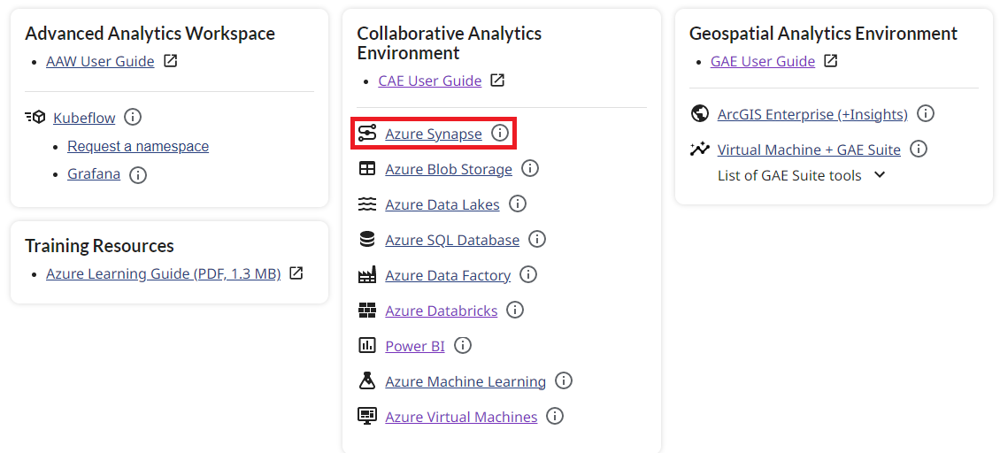
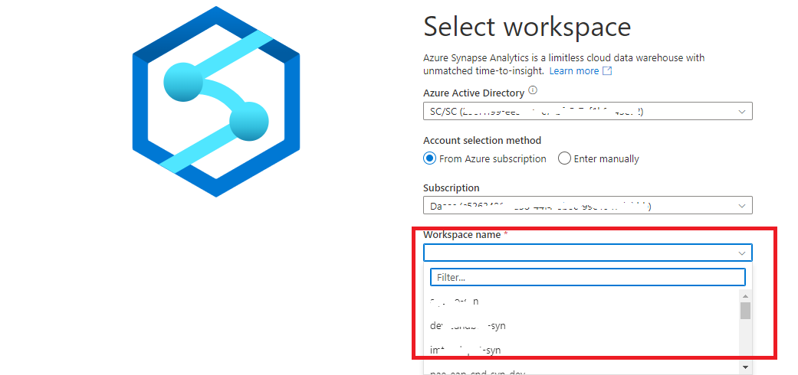
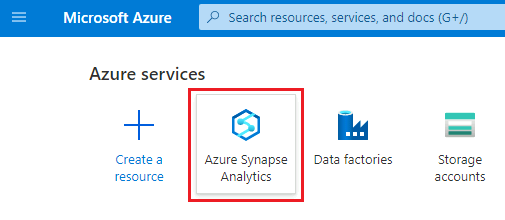
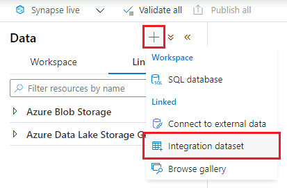
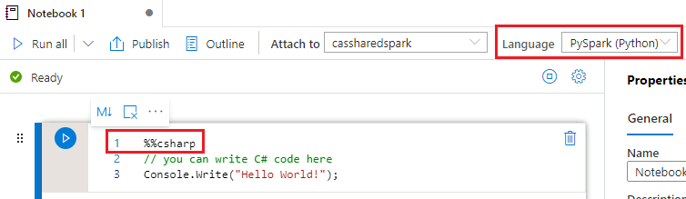

## Getting Started

### Access Azure Synapse- External Users
1. To access any of the services, you must first login to your virtual machine. See [Login](LoginDAS.md)
2.  On your virtual machine, using your web browser, login to the DAS portal.
3. In side the DaaaS portal, you can click on the synapse URL.  (show image)
 
4. This can can also be used to access Synapse from your virtual machine: https://web.azuresynapse.net/, sign in with your cloud account credentials, and select the Synapse workspace that was created for you.  
 

 
    

### Access Azure Synapse- Internal Users

1. Make sure that you are in your cloud virtual machine to access Azure Synapse. See [Virtual Machines](VirtualMachines.md) for information on how to create one if needed.

2. Inside your virtual machine, open a web browser and navigate to the [Azure Portal](https://portal.azure.com). Sign in with your cloud account credentials.

3. 
    a. Click on the **Azure Synapse Analytics** icon under **Azure services**. If you do not see this icon, follow step 3b instead.

    

    b. Start typing "synapse" into the search bar to find **Azure Synapse Analytics**.

     

4. Find your Synapse workspace in the list and click on it. Then click **Open Synapse Studio**.

    

Note: You can also acccess Synapse workspaces from the **Collaborative Analytics Environment** dashboard.

### Start and Stop Dedicated SQL Pool

1. Click the **Integrate** tab.

    

2. Under **Pipelines**, click either **Start Dedicated SQL Pool** or **Pause Dedicated SQL Pool**. Then click the trigger button to open a menu, and select **Trigger now**. On the next screen, click **OK**.
    
    

##  Home

The **Home** tab is where you start when you first open Azure Synapse Studio. 

From here, you can access shortcuts for common tasks such as creating SQL scripts or notebooks by clicking the **New** dropdown menu button. Recently opened resources are also displayed.

##  Data

The Data tab is where you can explore everything in your database and linked datasets.

Under the **Workspace** tab, you can explore the dedicated SQL pool database and any Spark databases.

Under the **Linked** tab, you can explore external objects (e.g. Data Lake accounts) and explore and create any integration datasets from external linked data (e.g. Data Lake, Blob Storage, web service, etc) to be used in pipelines.

### How to Bring in Data from Linked Services

**Note**: This example shows how to get data from Data Lake, although there are many source types available.

1. Click the « **+** » button the add a new resource, then click **Integration Dataset**.
    
    

2. Select **Azure Data Lake Storage Gen2** (you may need to search for this), then click **Continue**.
    
    

3. Select the format type, then click **Continue**.

4. Enter a name, then click the drop-down menu under **Linked service** and select your data lake.

    
    

5. Under **Connect via integration runtime**, ensure that interactive authoring is enabled. If it is not, click the edit button to enable it, then click **Apply**.
    

    

6. Set additional properties as appropriate, then click **OK**.

### How to Explore Data in the Data Lake

Browse to find your dataset file (CSV, Parquet, JSON, Avro, etc) and right click it. A menu will open with options to preview the data, or create resources such as SQL scripts and notebooks.
    
   

### How to Explore the Dedicated SQL Pool
Under the **Workspace** tab, you can explore databases similarly to SQL Server Management Studio. Right click any table, highlight **New SQL script**, and click **Select TOP 100 rows** to create a new query. You can then view the results as either a table or a chart.
    
   

### Importing Data to the Dedicated SQL Pool

To import data to the dedicated SQL pool, you can either:
- create a pipeline with a **Copy data** activity (most efficient for large datasets)
- use the [Bulk Load Wizard](https://docs.microsoft.com/en-us/azure/synapse-analytics/quickstart-load-studio-sql-pool).

##  Develop

From here, you can create and save resources such as SQL scripts, notebooks, and Power BI reports.

To add a new resource, click the « **+** » button. A dropdown menu will open.
    
   

To make your changes visible to others, you need to click the **Publish** button.

### SQL Scripts

Be sure to connect to your dedicated SQL pool to run SQL scripts.
    
   

### Notebooks

To run notebook cells, you first need to select your Apache Spark pool.
    
   

To change languages for a single cell, you can use the following magic commands: %%pyspark, %%spark, %%csharp, %%sql. You can also change the default language using the **Language** dropdown menu.
    
   

### Dataflows

To add a source to a dataflow, click the « **+** » button under **Source Settings**, then select **Azure Data Lake Storage Gen2** (you may need to search for this). Click **Continue**, select the data format, then on the next page, select your Linked Service.
    
   

### Power BI Reports

You can view and create Power BI reports directly in Azure Synapse. Please contact the Collabotative Analytics Environment support team to validate that a linked service is set up.

##  Integrate

This is where you can create pipelines for ingesting, preparing and transforming all of your data, like in [Azure Data Factory](DataFactory.md). 

### Example: Copy Data from External Blob to Data Lake

1. Click the « **+** » button to add a new resource, then click **Pipeline**.
    
   

2. Under **Move & transform**, drag and drop **Copy data** into the window.
    
   

3. Click on the **Source** tab, then click **New** to add the source dataset (where you want to copy the data from).
    
   

4. Select **Azure Blob Storage**, then select the format type (CSV, Parquet, JSON, etc). Set any additional properties if relevant, then click **OK**.

5. Click **Sink**, then click **New** to set the sink dataset (where you want the data to be copied to). Choose **Azure Data Lake Storage Gen2**, then select the format type. Under **Linked service**, choose your data lake and ensure that interactive authoring is enabled (see **How to Bring in Data from Linked Services** under **Data** for more information).

### Debugging and Running Pipelines

To run a pipeline in debug mode, click the **Debug** button at the top of the pipeline window. Results will appear in the **Output** tab.

   

To run a pipeline without debugging, click the **Add trigger** button, then **Trigger now**.

When you are ready to publish your pipelines, click the **Validate all** button, then click the **Publish all** button. Note that this will publish for all users to see everything that you currently have open (pipelines, SQL scripts, notebooks, etc).

    
   

##  Monitor

From the Monitor tab, you can monitor live pipeline runs (the inputs and outputs of each activity and any errors) and view historical pipeline runs, trigger runs, SQL requests, etc.

##  Manage

This is where you can:
- Add new SQL or Apache Spark pools
- Add new linked services
- Grant others access to the workspace
- Set up git integration

## Microsoft Documentation

- [Azure Synapse Analytics](https://docs.microsoft.com/en-us/azure/synapse-analytics/)
- [What is Azure Synapse Analytics?](https://docs.microsoft.com/en-us/azure/synapse-analytics/overview-what-is) 
- [Analyse Data with Dedicated SQL Pools](https://docs.microsoft.com/en-us/azure/synapse-analytics/get-started-analyze-sql-pool)
- [Integrate with Pipelines](https://docs.microsoft.com/en-us/azure/synapse-analytics/get-started-pipelines)
- [Visualize Data with Power BI](https://docs.microsoft.com/en-us/azure/synapse-analytics/get-started-visualize-power-bi)
- [Monitor Your Synapse Workspace](https://docs.microsoft.com/en-us/azure/synapse-analytics/get-started-monitor)
