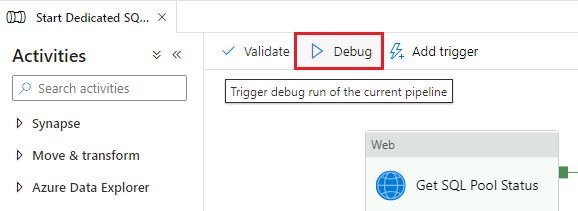

_[Français](../../fr/AzureSynapse)_

# Azure Synapse

## Getting Started

### Access Azure Synapse

1. Make sure you are in your cloud VM in order to access Azure Synapse. See [Virtual Machines](VirtualMachines.md) for information on how to create one if needed.

2. Inside your virtual machine, open a web browser and navigate to the Azure Portal (https://portal.azure.com). Sign in with your cloud account credentials.

3. Start typing "synapse" into the search bar to find **Azure Synapse Analytics**.
 

4. Find your Synapse Workspace in the list and click on it. Then click **Open Synapse Studio**.

### Start and Stop SQL Pool

1. Click on the **Manage** tab.

2. Find your dedicated SQL pool in the list and hover over it. You should see a pause button if the pool is currently running, or a start button if it is not. Click the button to start or stop your SQL pool.

Note: SQL pools automatically stop running after one hour of inactivity.

## Home

The **Home** tab is where you start when you first open Azure Synapse Studio. 

From here, you can access shortcuts for common tasks such as creating SQL scripts or notebooks by clicking the **New** dropdown menu button. Recently opened resources are also displayed.

## Data

The Data tab is where you can explore everything in your database and linked datasets.

### How to Bring in Data from Linked Services

1. Click the plus button the add a new resource, then click **Integration Dataset**.

2. Select **Azure Data Lake Storage Gen2** (you may need to search for this), then click **Continue**.

3. Select the format type, then click **Continue**.
4. Enter a name, then click the drop-down menu under **Linked service** and select your data lake. Set additional properties as appropriate, then click **OK**.

### How to Read Data from a CSV File

Find your dataset in the list and click on it. Then right click the CSV file. A menu will open with options to preview the data, or create resources such as SQL scripts and notebooks.

## Develop

From here, you can create and save resources such as SQL scripts, notebooks, and Power BI reports.

To add a new resource, click the plus button. A drop-down menu will open.

To make your changes visible to others, you need to click the **Publish** button.

### SQL Scripts

Be sure to connect to your dedicated SQL pool in order to run SQL scripts.

### Notebooks

In order to run notebook cells, you first need to select your Apache Spark pool.

See [Databricks](Databricks.md) page for more info on notebooks, including how to change the default language and use multiple languages.

### Dataflows

To add a source to a dataflow, under **Source Settings**, click the plus button, then select **Azure Data Lake Storage Gen2** (you may need to search for this). Click **Continue**, select the data format, then on the next page, select your Linked Service.

### Power BI Reports

You can view and create Power BI reports directly in Azure Synapse. Please contact the CAE support team to validate that a linked service is setup.

## Integrate

This is where you can create pipelines and perform transformations on data, like in [Azure Data Factory](DataFactory.md). 

### Example: Copy Data
1. Click the plus button to add a new resource, then click on **Pipeline**.

2. Under **Move & transform**, drag and drop **Copy data** into the window.

3. Click on the **Source** tab, then click **New** to add your source dataset (where you want to copy the data from).

4. Select **Azure Data Lake Storage Gen2**. Select the format type. Under **Linked service**, choose your data lake. Set any additional properties if relevant, then click **OK**.
5. Drag and drop a second **Copy data**, then set the sink dataset as you did for the source.

6. Click and drag the green square to create a connection from the source to the sink.

## Monitor

From the Monitor tab, you can view usuage statistics such as pipeline runs, trigger runs, and SQL requests.

## Manage

This is where you can:
- Add new SQL or Apache Spark pools
- Start and stop your SQL pool (see **Getting Started** section)
- Add new linked services
- Grant others access to the workspace
- Set up git integration

## Microsoft Documentation

- [What is Azure Synapse Analytics?](https://docs.microsoft.com/en-us/azure/synapse-analytics/overview-what-is) 
- [Analyse Data with Dedicated SQL Pools](https://docs.microsoft.com/en-us/azure/synapse-analytics/get-started-analyze-sql-pool)
- [Integrate with Pipelines](https://docs.microsoft.com/en-us/azure/synapse-analytics/get-started-pipelines)
- [Visualize Data with Power BI](https://docs.microsoft.com/en-us/azure/synapse-analytics/get-started-visualize-power-bi)
- [Monitor Your Synapse Workspace](https://docs.microsoft.com/en-us/azure/synapse-analytics/get-started-monitor)

# Change Display Language
See [Language](Language.md) page to find out how to change the display language.