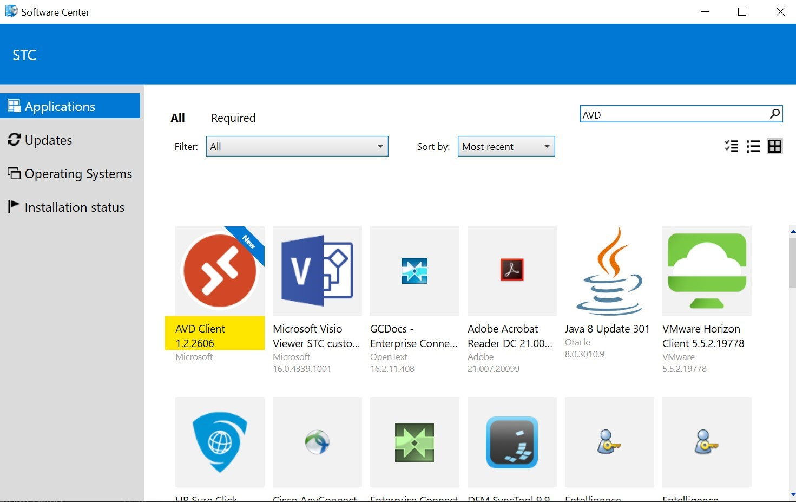
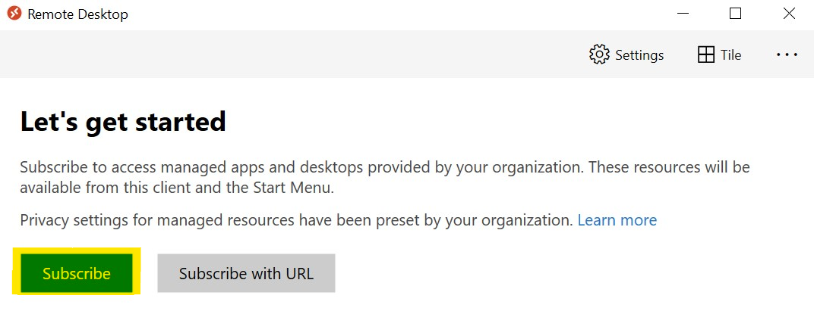

_[Français](../../fr/AzureVirtualDesktop)_
# Azure Virtual Desktop

The CAE Environment will soon be moving away from DevTest Labs to Azure Virtual Desktop.

## Desktop will contain the following software

- Visual Studio Code
- Azure Storage Explorer
- R-Studio
- SQL Server Management Studio
- Power Shell
- Git
- Anaconda\Jupyter Lab

## Prerequiste

For Statcan employees, please use the Software Centre to request the AVD Software.

1. On your OZ laptop, go into the Software Center.

2. Search for a program called **Remote Desktop** and install the program.

 

## How To Login

1. Open the **Remote Desktop** program.

2. Select subscribe and login with your cloud account (just as logging into Azure).

 

3. A Dashboard will then pop-up with options on which Virtual Desktop to select.

## FAQ

1. Can I copy and paste from the OZ Laptop to my virtual machine?

    Yes, you are able to copy from the OZ laptop to the virtual desktop.

2. Can I take screenshots?

    Yes, you are able to take screenshots.

3. Do I have admin privilege?

    No, you do not have admin privilege.

4. How do I request new software?

    Please Contact Us (https://statcan.github.io/cae-eac/en/ContactUs/) if you need additional software installed on your VM.

5. Do I have a roaming profile?

    Yes, users using AVD will have a roaming profile.

6. How do I copy data from the CAE environment to my virtual machine?

    You are able to copy data from the CAE environment, but only from external storage, not from any internal storage.

7. How do I get support if my machine is too slow or if I have any other issues with my machine?

    Please Contact Us (https://statcan.github.io/cae-eac/en/ContactUs/) if you have any issues with your VM.

8. Can external users use Azure Virtual Desktop?

    At this time AVD is only available for users with a Cloud account (@cloud.statcan.ca). 

# Change Display Language
See [Language](Language.md) page to find out how to change the display language.