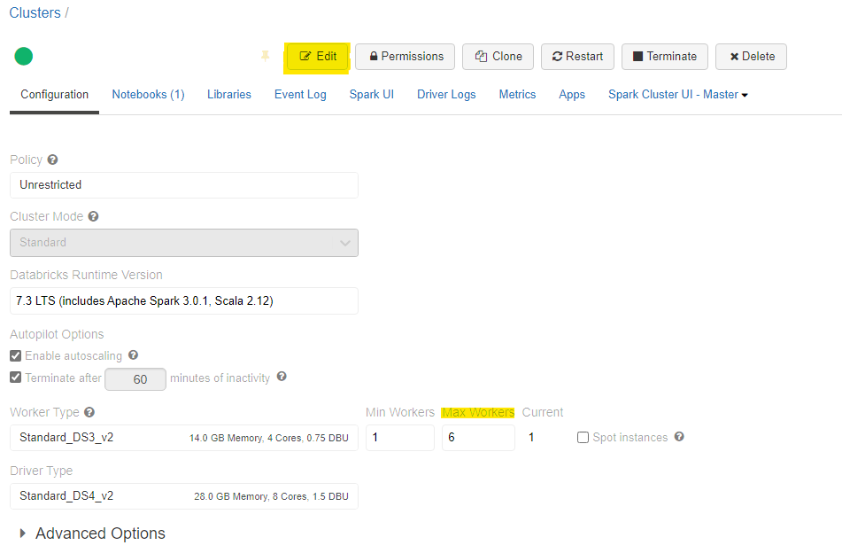
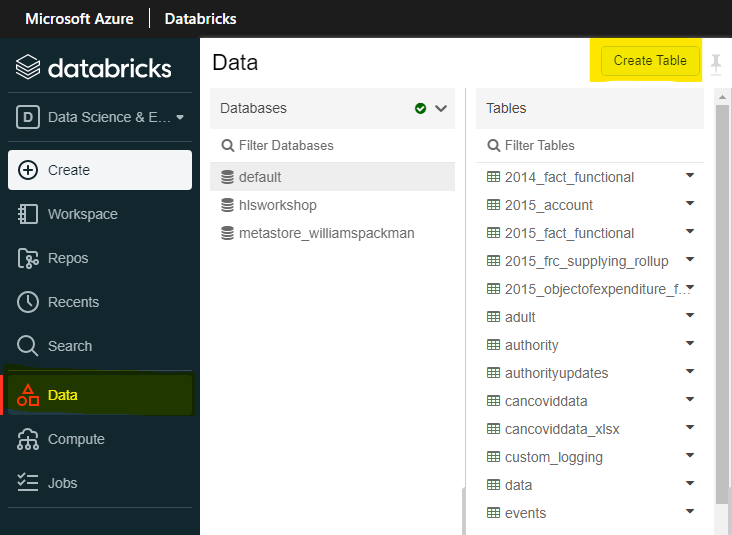

_[Français](../../fr/BestPracticesFAQ)_

# Best Practices FAQ

## What is the best file format to use for large data files?
Recommend using newer format like Parquet because it does save larger datesets in a smaller file in comparison to a CSV file. If only accessing certain sections of the dataset, it is also faster using Parquet as it uses columnar storage format.

## Do I need a SQL database?
In many cases a SQL database is not needed, data can be saved in files to the datalake.

## Do I need a SQL database when using Power BI?
It is not needed to have an SQL datbase when using Power BI. You are able to read files from the Azure Storage. A database is only needed when you are using a more complex star-schema like system. 

To connect to the internal data lake with Power BI desktop, please refer to this link:
https://statcan.github.io/cae-eac/en/FAQ/#how-do-i-connect-to-the-internal-data-lake-with-power-bi-desktop

## How should we structure our projects data lake container?
There are 3 parts in which to structure your data lake container:

### **Bronze/Raw Zone**
This zone stores the original format of any files or files/data that is immutable. The data contained in this zone is usually locked and are only accessible to certain members or is read-only. This zone is also organised in different folders per source system, with each ingestion process having a write access to only their associated folder.

### **Silver/Cleansed Zone**
This zone is where parts of data removes unnecessary columns from the data, validates, standarizes and harmonises that data within this zone. This zone is mainly a folder per project. Any data that must be accessed within this zone is usually granted read-only access.

### **Gold/Curated Zone**
This zone is mainly for analytics rather than data ingestion or processing. The data in the curated zone is stored in star schemas. The dimensional modelling is usually done using Spark or Data Factory instead of inside the database engine. But if the dimensional modelling is done outside of the lake then it is best to publish the model back to the lake. This zone is best suited to run for large-scale queries and analysis that do not have strict time-sensitive reporting needs.

### **Laboratory Zone**
This zone is mainly for experimentation and exploration. It is used for prototype and innovation mixing both your own data sets with data sets from production. This zone is not a replacement for a development or test data lake which is required for more careful development. Each wil data lake project would have their own laboratory area via a folder. Permissions in this zone are typically read and write for each user/project.

For more information about structuring your projects data lake container:

https://medium.com/microsoftazure/building-your-data-lake-on-adls-gen2-3f196fc6b430
https://www.mssqltips.com/sqlservertip/6807/design-azure-data-lake-store-gen2/

##  I get an out of memory exception in Databricks?

### **Option 1:**
The fastest and most expensive way to fix this is to increase the size of your cluster.

To increase the size of the cluster, please contact the CAE support team to increase the size of the cluster


### **Option 2:**
For a more programtic answer, if you are using pandas, it is also a suggestion to switch over and use pySpark instead or to koalas. PySpark and koalas does run faster than pandas, it has better benefits from using data ingestion pipelines abd also works efficiently as it runs parallel on different nodes in a cluster.

https://www.analyticsvidhya.com/blog/2016/10/spark-dataframe-and-operations/

### **Option 3:**
Consider to use a subset of your data when doing queries if possible. If you are working with only a certain section of the dataset but are quering through all of it, it is possible to use just the subset. 

### **Option 4:**
Consider changing the file format to something like Parquet or Avro which uses less space than a traditional CSV file.

Conversion from CSV to Parquet:
```python
%python

testConvert = spark.read.format('csv').options(header='true', inferSchema='true').load('/mnt/public-data/incoming/titanic.csv')
testConvert.write.parquet("/mnt/public-data/incoming/testingFile")
```

Conversion from CSV to Avro:
```python
%python

diamonds = spark.read.format('csv').options(header='true', inferSchema='true').load('/mnt/public-data/incoming/titanic.csv')
diamonds.write.format("avro").save("/mnt/public-data/incoming/testingFile")
```

## How can i easily convert SAS code to Python or R?
It is not possible to easily convert SAS code to Python or R automatically, the only known way to convert is to manually do the conversion. 

## How do I validate that I am developing my application in the most cost effective way in the cloud using Microsoft technologies (CAE)?
There are plenty of ways to validate that your development is the most cost effective it can be:

1. Take advantage of Spark in databricks.

    a. Spark is a great addition to databricks that runs faster and better especially for large data sets. Using Spark would cost less because it does take less time to do its task. Using spark will also
2. Make sure you cluster is running for the minimal amout of time.

    a. If the cluster is no longer needed or not being use, ensure that it is not running and only run when it is needed.
3. Ensure your databricks cluster is correctly sized.

    a. Make sure that you have to correct amount of workers in your cluster, too many clusters results in a higher cost.
4. Delete data files that you are not using.

    a. Ensure that any files that are no longer needed or not in use anymore are deleted from the container.
    
5. Try not to do processing on a cloud VM.
    
6. Ask for a review of your architecture.

7. Code review.

8. If you are using Pandas, it is a good idea to switch over to Koalas.

9. If you are using a new file format, the file is also smaller and if you are using parquet files.

## How should data be structured if we plan to use Power BI?
Data should be structured using the Star Schema.

For more details about using Star Schema, click the link below for details about using Star Schema and the benefits with Power BI: 

https://docs.microsoft.com/en-us/power-bi/guidance/star-schema

##  How to read in an Excel file from Databricks?
Here is an example of how to read an Excel file using Python: 

```python
%python
import pandas as pd
pd.read_excel("/dbfs/mnt/ccei-ccie-ext/Daily charts.xlsx", engine='openpyxl')
```

##  Which file types are best to use when?
### Parquet  
It is good to use for very large datasets. It is also good to use if only a section of the dataset is needed which reads in the data in a faster rate.

Read:

```python
%python
data = spark.read.parquet("/tmp/testParquet")
display(data)
```

Write:

```python
%python
//Assumption that a dataframe has been created already

data.write.parquet("/tmp/tempFile")
```

### Avro
Just as Parquet, it is great for very large datasets. To compare, it is better used for editing/writing into a dataset and for querying all columns in the dataset.

Read:

```python
data = spark.read.format("avro").load("/tmp/test_dataset")
display(data)
```

Write:

```scala
%scala
val ex = Seq((132, "baseball"),
    (148, "softball"),
    (172, "slow pitch")).toDF("players", "sport")
ex.write.format("avro").save("/tmp/testExample")
```

### CSV
It is fine to use with marginally smaller datasets as CSV files do not load well when the file size is very large. But with smaller data sets, it is simple and human-readable. For writing within a CSV file, it is also good to note that you are able to edit the file with Office. 

Read:

```python
%python
data = spark.read.format('csv').options(header='true', inferSchema='true').load('/tmp/test_dataCSV.csv')
display(data)
```

### Excel
Please see above on how to use Excel.

The other formats above are perferable over excel

## How to convert files (CSV, Text, JSON) to parquet using databricks?
The rule of thumb in converting a file to parquet is to first read in the file and then write a new file into parquet

CSV to Parquet: 
```python
%python

testConvert = spark.read.format('csv').options(header='true', inferSchema='true').load('/mnt/public-data/incoming/titanic.csv')
testConvert.write.parquet("/mnt/public-data/incoming/testingFile")
```

JSON to Parquet:
```python
%python

testConvert = spark.read.json('tmp/test.json')
testConvert.write.parquet('tmp/testingJson')
```

Text to Parquet:
```python
%python

testConvert = spark.read.text("/mnt/public-data/incoming/testing.txt")
testConvert.write.parquet("/mnt/public-data/incoming/testingFile")
```

## Can I read Word document in Databricks?
It is best practice to read Word documents via Office instead.

## When should we use ADF vs. Databricks for data ingestion?
Databricks is able to do real-time streaming through the Apache Spark API that can handle the streaming analytics workloads. Databricks does not need you to wrap the python code into functions or executable modules, all the code is able to work just as is. Databricks also supports Machine Learning which makes data ingestion easier as well.

For any code that is already in an Azure Function or is easily translated into an executable, using data factory is usable. Data factory is also good to use if it is a heavy algorithm that is not usable within Databricks. 

## What is the difference between SQL databse temporal tables and Delta Lake?
SQL temporal tables is specific to SQL 2018 and is not currently available in Azure Synapse. On the other hand, Delta lake is available in both Azure Synapse and in Databricks. Another difference is that SQL temporal tables are only available with only SQL queries while Delta lake time travel is available in Scala, Python, and SQL. 

## When to use Power BI or R-Shiny?
It is recommended to use Power BI over R-shiny because you can develop Power BI and it is easier. There are a lot of benefits to using Power BI including the additional amount of chart types that are at hand, visualisation of data into charts is easier to use in Power BI compared to R-Shiny, the creation of a dashboard is faster within PowerBI, and the ease of connectivity with other applications within Azure.

## When is a good time to use Azure Synapse vs. ADF and Databricks?
Azure Synapse is good to use when doing queries and data analysis via the data lake, doing SQL analyses and data warehousing, and using additional services like Power BI. Synapse less steps when querying data from the data lake as you do not have to mount the data lake to the workspace. As for data analyses and data warehousing, synapse is perferred as it allows full realtional data models, provide all SQL features and also uses Delta Lake. Synapse also includes direct services with Power BI for ease of use.

On the other hand, Databricks is preferred when doing machine learning development and real-time transformations. Databricks includes their own machine learning development that includes popular libraries like PyTorch, manage version of MLflow and still be able to use AzureML as well. Databricks is also preferred for real-time transformations as it uses Spark structured streaming and being able to view changes from other users in real time.

## When should we use a SQL database data warehouse vs. Delta Lake?
Best practice would be to use Delta lake over SQL server as it does not use additional SQL computes and will reduce the overall cloud costs.

## How can i easily convert SAS files to another format?
Statcan users can use SAS on the internal stats-can network to convert it to a supported file. 

You are able to convert a SAS file to CSV or JSON with this method:

1. First open databricks and install the sas7bdat-converter within your notebook.

```python
%pip install sas7bdat-converter
```

2. Using python and your code editor of your choice, type in this code with the file directory that the file is in and the directory where you want the output file to be in.

```python
%python

import sas7bdat_converter

file_dicts = [{
    'sas7bdat_file': '/dbfs/mnt/public-data/ToNetA/sas7bdat/tablea_1_10k.sas7bdat',
    'export_file': '/dbfs/mnt/public-data/testFolder/testingConvert.csv',
}]

sas7bdat_converter.batch_to_csv(file_dicts)
```

You will then get the output file within the directory you have specified.

For more information about the converter, please refer to this link:

https://pypi.org/project/sas7bdat-converter/

##  Can\How I convert Word document to a notebook? 
There is no easy way to convert a word document to a notebook as there are specific CSS that must be done so that it is recognizable as a notebook in databricks.

A manual solution to convert a Word document to a notebook is by copying any of the code that is within the word document into a notebook.

## How big of a dataframe/spark table can we store within the workspace?
Spark tables are stored as parquet files and are stored in the internal storage account linked with the Databricks workspace, but it is best practice to delete the table if it is no longer in use.

## What is the best way to get data files into Azure ML?
The best way would be to upload your files to the data lake. If you need to add a new link to a different storage account, contact the CAE team to add the storage account to the Azure ML studio.
You can add the data file as a global data or to data that is only available to yourself.

## Whats the difference to Machine Learning in Databricks or in Azure ML?
The main difference between Azure ML and Databricks is the language that each application uses. Azure ML utilizes python-based libraries or R while Databricks utilizes the Apache Spark Platform and MLFlow. 

Azure ML also contains a tracking system which is able to track individual runs of the experiment and include the specific metrics of what wants to be seen. Databricks does include MLflow which also allows tracking but does not come with as many features as Azure ML but is a bit simpler. 

As a recommendation, it is best practice to use Databricks for data prep and large datasets but to use Azure ML for their tracking system, machine learning on normal datasets, deep learning on GPUs, and operationalization. 

## How do you create a Table in Databricks?

### Option 1: Use Create Table function
In Databricks, select Data and within the Database you have selected, click on Create Table.



For more information about this option, please view this link:

https://docs.databricks.com/data/tables.html#create-a-table

### Option 2: Create Table from Dataframe table
Python:

```python
df.write.saveAsTable("Table-Name")
```

SQL:

```sql
CREATE TABLE IF NOT EXISTS Table-Name AS 
SELECT * FROM df
```

### Option 3: Create Table Programatically

SQL:
```
CREATE TABLE example (id INT, name STRING, age INT) USING CSV;
```

## When to use Spark Dataframe or Spark Table?
There are really no difference between using a Spark Dataframe or Spark Table. 

Currently with Databricks, best practice right now would be to store tables as delta tables as it is saved in parquet format and gives the tracking capabilities.

## What should I do if the size of the broadcasted table far exceeds estimates and exceeds limit of spark.driver.maxResultSize = _____?
Change the Spark configuration "spark.driver.maxResultSize" to "0" (means no limit) or something larger than your needs.

## What Should I do if I cannot broadcast the table that is larger than 8GB?
This occurs only with BroadcastHashJoin. There are 2 options:

1. Change the Spark configuration "spark.sql.autoBroadcastJoinThreshold" to "-1". This forces Databricks to perform a SortMergeJoin.

    ### Note About changing Spark Configuration
    **Warning: Changing Spark configuraitons can cause out-of-memory-errors**

    Normal approach:

        - spark.conf.set("configuration", "value")

    If you do not have permissions to change some configurations, this seems to be a work around:

        - conf = spark.sparkContext._cibf,setAkk([("configuration", "value"), ("configuration", "value")])

    How to get Spark Configuration:

        - spark.conf.get("configuration")


2. Steps to avoid changing configurations:

    a. Partition DataFrame A into parts.

    b. Perform joins with each parittion from DataFrame A with DataFrame B (concurrently is the fastest way but may require writing Dataframes to file for reading in next step).

    c. Perform a union on all the joined DataFrames.


# Change Display Language

See [Language](Language.md) page to find out how to change the display language.
