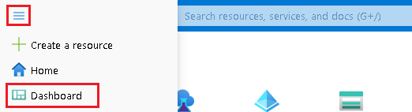
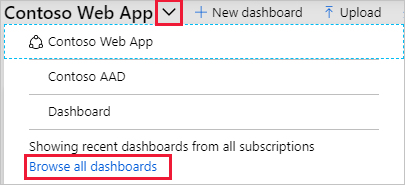
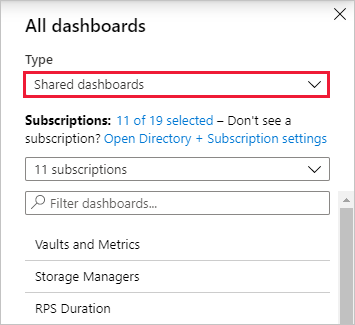
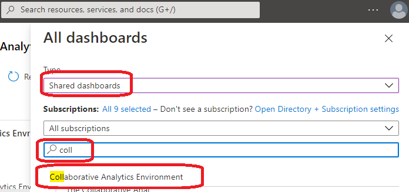

# Dashboards
Dashboards are a focused and organized view of your cloud resources in the Azure portal. They serve as a workspace where you can quickly launch tasks for day-to-day operations and monitor resources. Build custom dashboards based on projects, tasks, or user roles, for example.

The Azure portal provides a default dashboard as a starting point. You can edit the default dashboard. Create and customize additional dashboards, and publish and share dashboards to make them available to other users.

## Access the Collaborative Analytics Environment Dashboard
1. From the Azure portal menu, select **Dashboard**. Your default view might already be set to dashboard.  
  

2. Select the arrow next to the dashboard name.  
3. Select the **Collaborative Analytics Environment** dashboard from the displayed list of dashboards. If this dashboard isn't listed:  

    a. Select **Browse all dashboards**.  
      

    b. In the **Type** field, select **Shared dashboards**.  
      

    c. Ensure the list of selected subsciptions includes the **vdl** subscription. You can also enter text to filter dashboards by name.  

    d. Select the **Collaborative Analytics Environment** dashboard from the list of shared dashboards.
    

## Microsoft Documentation
https://docs.microsoft.com/en-us/azure/azure-portal/azure-portal-dashboards

# Change Display Language

See the [Language](Language.md) page to find out how to change the display language.
