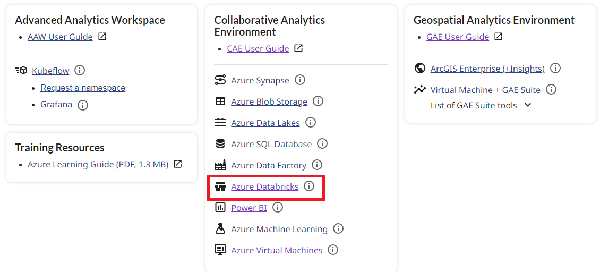
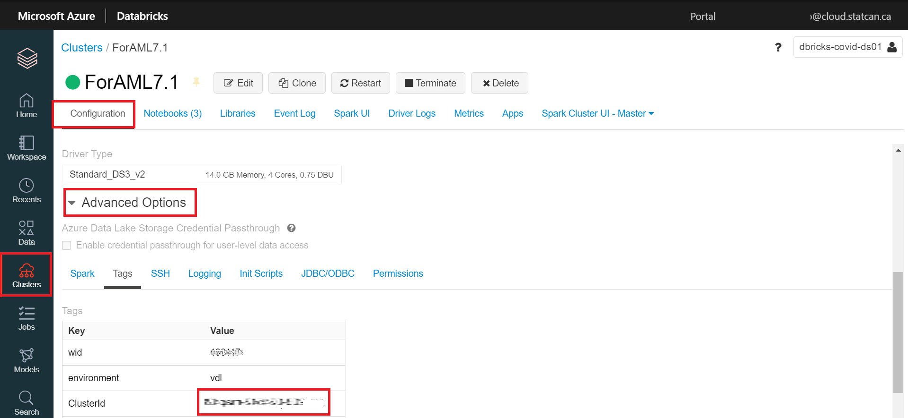

## Accessing Databricks - External Users

### DAaaS Portal
  
1. To access any of the services, you must first login to your virtual machine. See [Login](LoginDAS.md)
2. On your virtual machine, using your web browser, login to the DAS portal.
  

4. In side the DaaaS portal, you can click this link (show image)
5. This can can also be used to access Databricks from your virutal machine: https://canadacentral.azuredatabricks.net/, sign in with your cloud account credentials, and select the Databricks workspace that was created for you.  

    

## Accessing Databricks - Internal Users
### DAaaS Portal
Using your Azure Virtaul Desktop (AVD), you can access the Databricks URL from the DAaaS PortAL.  
1. Click on the Dashboard menu from the Azure Portal.  

     

### Dashboard

See the [Dashboard section](Dashboards.md) of this documentation from more information.  
1. Click on the Dashboard menu from the Azure Portal.  

      

### Databricks URL

1. Navigate to https://canadacentral.azuredatabricks.net/, sign in with your cloud account credentials, and select the Databricks workspace that was created for you.  

    

### Azure Portal

1. In the Azure Portal Search box, search for **Databricks**.  

      

2. You should then see a list of the Databricks workspaces you were given permission to access.  

    

## Getting Started

Once inside Databricks you can create a new notebook or open an existing notebook. See [First Access to Databricks](https://docs.microsoft.com/en-us/azure/azure-databricks/quickstart-create-databricks-workspace-portal#run-a-spark-sql-job ) for more information.

## Creating a Cluster

Since you do not have permission to create a cluster, please send a [slack](https://cae-eac.slack.com) message if a cluster has not been created for you or if you require changes to your cluster.

**Note:** You must have a cluster running before you can run code inside your notebook. See below or the [FAQ](FAQ.md) for information on how to start a cluster.

## Creating a Notebook

 - One way to create a notebook is to click on the **New Notebook** link from the main Databricks page. You can then provide a name for your notebook and select the default notebook language.

 - From the available list of clusters, select the cluster to which you wish to attach your notebook.

    

 - To start or change a cluster from within a notebook, open the notebook and click on the cluster drop down found at the top right of the notebook. You can then start the cluster or detach it and attach a different one.  

## Sharing a Databricks Notebook

To share a notebook or invite other collaborators, right-click on a specific notebook file or folder from the Workspace menu, and select **Permissions**. You can also do this by clicking on the **Permissions** button from within a notebook. Once shared, multiple authors can participate in the same notebook session and co-author at the same time.  

**Note:** To add a user to the Databricks workspace, please send a [Slack](https://cae-eac.slack.com) message.  


## Ingesting Data into Databricks

Data can be mounted or uploaded to the Databricks File System (DBFS), which is storage specific to the Databricks workspace. You can read data from a data source or even upload a data file (e.g. CSV) directly to the DBFS.

**Note:** The internal data lake container for your environment has already been mounted for you and you can work with the container directly. Please send a [Slack](https://cae-eac.slack.com) message if you don't know the name of your mounted data lake container.

## Adding Data to Databricks


## Reading Mounted Files


Example:
```
%python
testData = spark.read.format('csv').options(header='true', inferSchema='true').load('/mnt/mad-du/incoming/age-single-years-2018-census-csv.csv')

display(testData)
```

## Changing Notebook Default Language


## Mixing Notebook Languages

You can override the default language by specifying the language magic command % at the beginning of a cell. The supported magic commands are: %python, %r, %scala, and %sql.

_Note:_  
When you invoke a language magic command, the command is dispatched to the REPL in the execution context for the notebook. Variables defined in one language (and hence in the REPL for that language) are not available in the REPL of another language. REPLs can share state only through external resources such as files in DBFS or objects in object storage.    

Notebooks also support a few auxiliary magic commands:  
%sh: Allows you to run shell code in your notebook. To fail the cell if the shell command has a non-zero exit status, add the -e option. This command runs only on the Apache Spark driver, and not the workers. To run a shell command on all nodes, use an init script.  
%fs: Allows you to use dbutils filesystem commands.  
%md: Allows you to include various types of documentation, including text, images, and mathematical formulas and equations.  

## Starting a Databricks Cluster

1. Click on the cluster drop-down list.

2. Select a cluster from the list.

3. Click on the **Start Cluster** link.  

      

## Databricks Connect VM Setup
Databricks connect is a method for accessing a Databricks environment without having to connect through the Azure Portal or the Databricks UI. It allows you to use other IDEs to work on Databricks code.

The following are the steps for installing and testing Databricks Connect on your virtual machine (VM):

1. Databricks Connect conflicts with the Pyspark installation found on the Data Science Virtual Machine images. The default path for this Pyspark installation is `C:\dsvm\tools\spark-2.4.4-bin-hadoop2.7`. Either delete or move this folder in order to install Databricks Connect.

2. Before installing Databricks Connect, create a conda environment. To do this, open a command prompt and run the following commands:
```
    conda create --name dbconnect python=3.7
    conda activate dbconnect
    type pip install -U databricks-connect==X.Y.*
```
**NOTE:** Replace **X** and **Y** with the version number of the Databricks cluster. To find this value, open the Databricks workspace from the Azure portal, click on **Clusters** on the left of the page, and note the **Runtime** version for your cluster.

3. In a command prompt, type **databricks-connect configure**, then enter the following values when prompted:

    - **Databricks Host:** `https://canadacentral.azuredatabricks.net`

    - **Databricks Token:** a [personal access token](https://docs.microsoft.com/en-us/azure/databricks/dev-tools/api/latest/authentication#--generate-a-personal-access-token) generated in your Databricks Workspace User Settings

    - **Cluster ID:** the value found under **Cluster --> Advanced Options --> Tags** in your Databricks workspace.

        

    - **Org ID:** the part of the Databricks URL found after **.net/?o=**

        

    - **Port:** keep the existing value

4. Change the `SPARK_HOME` enviroment variable to `c:\miniconda\envs\(conda env name))\lib\site-packages\pyspark`, and restart your VM. (Please ask for help via a [Slack](https://cae-eac.slack.com) message if you do not know how to change environment variables.)

5. Test the connectivity to Azure Databricks by running **databricks-connect test** in a command prompt. If your Databricks cluster is not running when you start this test you will receive warning messages until it has started, which can take some time.

### Troubleshooting :
- If you are using databricks connect on windows and you get an error saying: *Cannot find winutils.exe* please refer to [the Databricks documentation on the error](https://docs.microsoft.com/en-us/azure/databricks/dev-tools/databricks-connect#cannot-find-winutilsexe-on-windows).

## Installing Libraries 

### Databricks Cluster
Please contact the [slack](https://cae-eac.slack.com) channel to have the support team install these libraries for you.

### Notebook
Use the following commands to install a library in a notebook session:

Python: 
```python
dbutils.library.installPyPI("pypipackage", version="version", repo="repo", extras="extras")
dbutils.library.restartPython() # Removes Python state, but some libraries might not work without calling this function
```
R Code:
```R
install.packages("library") 
```

## Microsoft Documentation  
- [First Access to Databricks](https://docs.microsoft.com/en-us/azure/azure-databricks/quickstart-create-databricks-workspace-portal#run-a-spark-sql-job)  
- [For more information on Databricks](https://azure.microsoft.com/en-us/resources/videos/connect-2017-introduction-to-azure-databricks)  
- [Databricks Connect](https://docs.databricks.com/dev-tools/databricks-connect.html)
- [Install Libraries in Current Notebook Session](https://docs.microsoft.com/en-us/azure/databricks/notebooks/notebooks-python-libraries)  
- [Library Management for Admins](https://docs.microsoft.com/en-us/azure/databricks/libraries#:~:text=Azure%20Databricks%20supports%20three%20library,its%20path%20in%20the%20workspace)  
