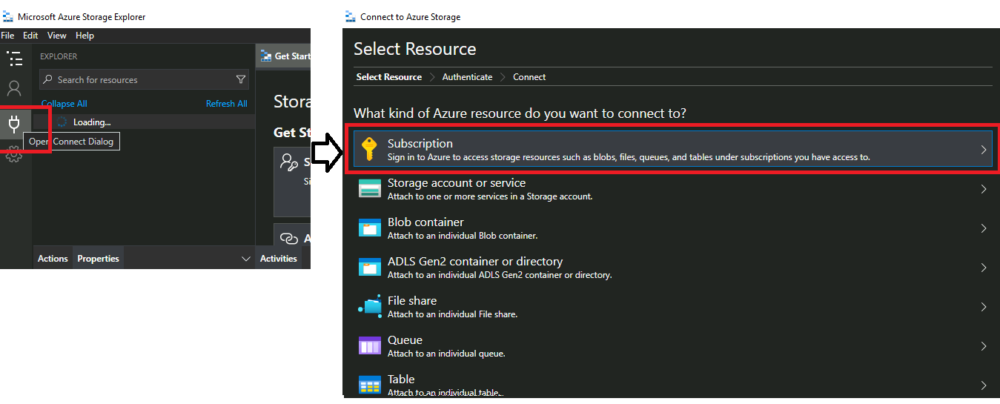
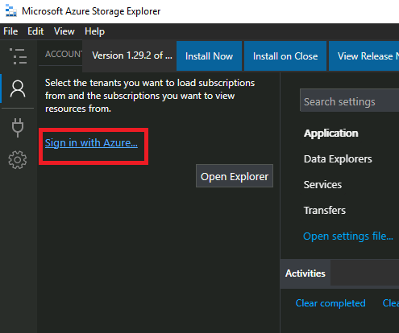
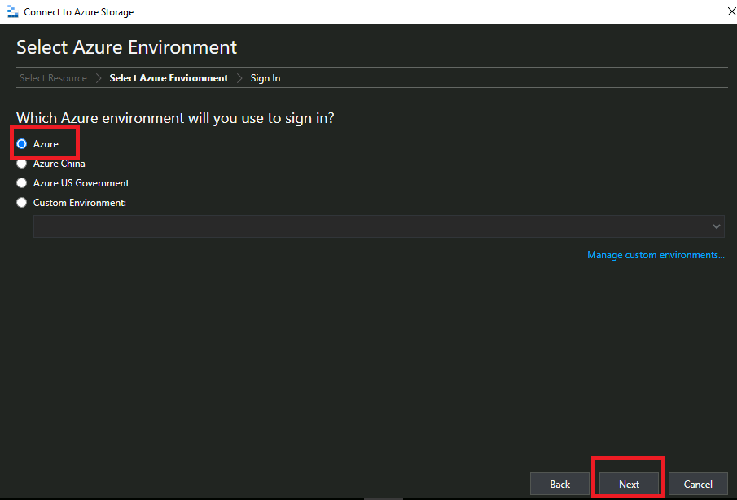
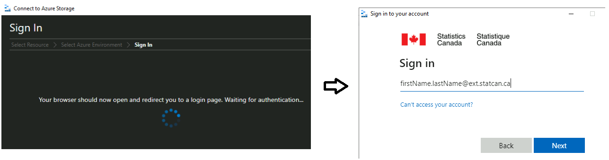
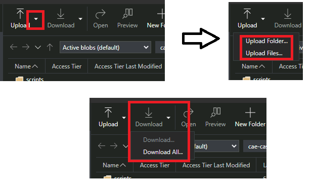

# Azure Storage - External User

## Storage Explorer 

1. To access any of the services, you must first login to your virtual machine. See [Login](ExtVirtualMachines.md)

2. On your virtual machines, you will be able to access your storage account using[Azure Storage Explorer](AzureStorageExplorer.md)

# Ingesting Data Files

## Electronic File Tranfser (EFT)
For some use cases senstive data can be sent to the Environment using EFT. Please contact us for instrucitons if you would like to setup this service.

## Download data to your Storage Account
1. From your virutal, some URLs are accessable so that you can download data directly. Examples:
- statcan.gc.ca
- open.toronto.ca
2. Download to the local Virtual Machine
3. Upload the data using [Azure Storage Explorer](AzureStorageExplorer.md) into your project storage account.

<!-- 3. The first time you launch the Storage explorer, you need to click the connect button 

   

   or click the ***Sign in with Azure*** Button

   

3. You then have to select your environment.  

     

4. and login with your Azure Account by entering your credentials

    
   
5. Once you login, your storage account and containers will be visible to you.

6. Files can be download and uploaded to\from your virtual machine from your respective container 

    

7. You must download data files to your local virtual machines so that it can be used by installed software. Storage accounts can not be mapped to virtual machines.
8. You can create a personal folder in your container, to organize your personal files.

Note:
9. Best practice is to always upload or store data to your storage account.  Virtual machines and thier data are not backed up. -->

<!-- ### Azure Storage - Internal User

Data can be uploaded to the platform via the Azure Portal or the Azure Storage Explorer application. Once data uploaded to an external **Blob storage** account, it is automatically ingested into an internal **Azure Data Lake Storage (ADLS)** account.  Once data is in the data lake, users have their choice of tools for transformation and integration. They can use Web based tools such as Databricks and Data Factory to do their transformations or they can use desktop tools on a virtual machine (VM) to tansform & analyse the data. Cleansed and transformed data can be placed into different folders (containing higher quality / processed datasets) or loaded into a database. Users can once again connect to this data with the tools they would like to use, either from their VMs or other platform services such as Databricks and Data Factory. -->

