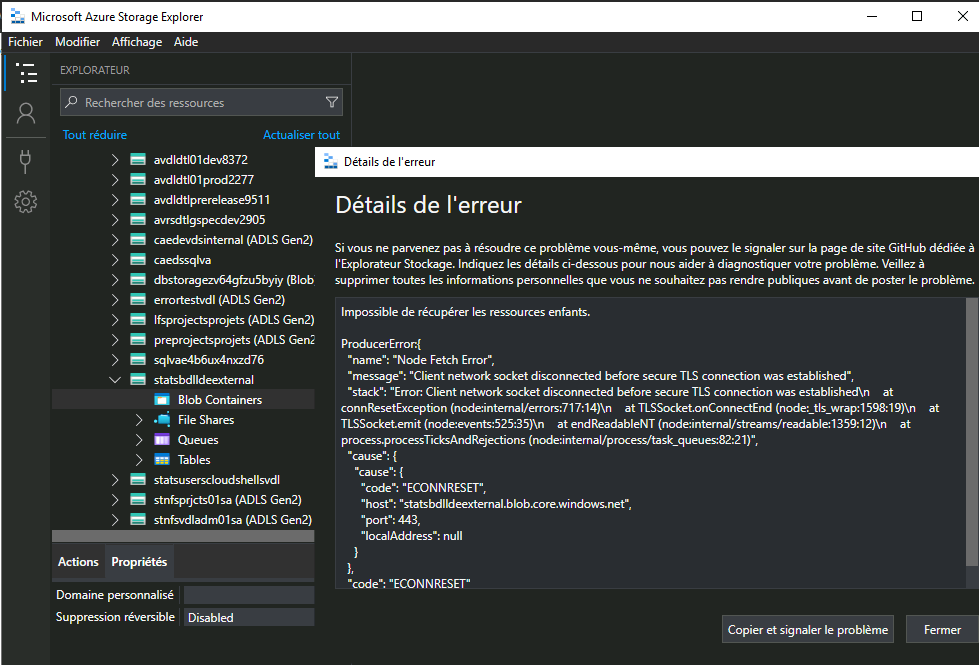
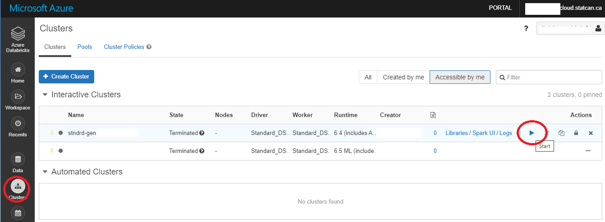

_[Français](../../fr/FAQ)_
# FAQ

## Data Ingestion ##

### How do I ingest data (including large files) into the platform?

#### External Storage Account
Files may be uploaded to the **inbox** or **to-vers-int** container of an external storage account, as documented in [Azure Storage Explorer](AzureStorage.md). These files will then automatically be moved into an internal storage account (Data Lake), and made accessible from authorized services.


*Note:* The external storage accounts have the naming convention **stats*project-acronym*external**.

#### Electronic File Transfer Service (EFT)
Statistics Canada employees can use [EFT](https://www75.statcan.gc.ca/eft-tef) to transfer files to/from on-premises (Net A or B) to/from the Azure cloud environment. Please  contact the support team through the https://cae-eac.slack.com channel for informaton about this process.

#### Platform Tools
Platform tools such as Databricks or Data Factory may be used to ingest data from public data sources.

## Storage Explorer

### How do I configure Azure Storage Explorer proxy settings on a network B VDI?
_For Statistics Canada Employees only_
1. Proxy configuration is required if you receive the following error:  
  
2. In Azure Storage Explorer, go to **Edit** --> **Proxy Settings**. Enter the necessary proxy settings, and click on **OK**.  
  

### How do I request a new SAS token (required for Azure Storage Explorer on a Network B VDI)?
_For Statistics Canada Employees only_

Please contact the support team through the https://cae-eac.slack.com channel to request a temporary SAS token.

### Why do I get an error message when accessing the internal Data Lake?
The internal Data Lake is only accessible from within a VM in the Collaborative Analytics Environment (CAE). It is not accessible from your personal or work laptop, Network B VDI or other cloud VM.

## Source Code Control

### How do I link my Visual Studio Subscription to my StatCan cloud account?
1. Login to https://visualstudio.microsoft.com/subscriptions/ with your organization's email address. For StatCan employees, this will be your canada.ca email address.  
.  
2. Add your cloud account as an alternate account.  This will allow you to use your licenses for Visual Studio & Azure DevOps in the CAE.  


**For Statistics Canada employees:**  If you do not have a Visual Studio Subscription, please consult your supervisor. If they decide that a subscription is needed, they can then contact StatCan Software Asset Management by submitting an SRM to request a license on your behalf.

## Virtual Machines

### What do I do if I have forgotten the password for my virtual machine?
If you forget the password of your virtual machine, please contact the support team through the https://cae-eac.slack.com channel to have it reset. You can also delete and recreate your virtual machine. Unfortunately, recreating your virtual machine means you will lose any data and software on your old machine.

### What do I do if I need to run a long running job on my virtual machine?
Machines are shut down every day at 7pm EST in order to reduce costs. If you have a long-running job, it is recommended that you use Databricks or Data Factory.

**WARNING:** Disabling Auto-shutdown is **not** recommended as it can incur significant costs.  
To disable Auto-shutdown:  
1. Navigate to your virtual machine in the Azure Portal.
2. Disable Auto-shutdown.  
  

### How do I request changes to my virtual machine?
If the virtual machine you are currently using does not meet your requirements, please contact the support team through the https://cae-eac.slack.com channel.

## Databricks

### Why am I unable to run code from my Databricks notebook?
You must first start a Databricks cluster that was previously created for you:
1. Click on Clusters.  
2. Navigate to your cluster and click on the **Start** (arrow) button.  


### What type of clusters are available in databricks?
See the following link for the different types of available clusters: 
https://docs.microsoft.com/en-us/azure/databricks/release-notes/runtime/releases#:~:text=Supported%20Databricks%20runtime%20releases%20and%20support%20schedule%20,Sep%2002%2C%202021%20%2022%20more%20rows%20

Generally, LTS (long term support) clusters are supported and recommended by Databricks. If you need a different version of the databricks cluster, please contact the CAE support team.

### What happens when clusters are upgraded?
LTS (long term support) have support for 1-2 years. They will need to be periodically updated to a newer version. When upgraded, all code should be re-run to ensure there are no issues when a cluster is updated

### How do you read an excel file with databricks/python?
Here is an example of how to read in an excel file:
```python
%python
import pandas as pd
pd.read_excel("/dbfs/mnt/ccei-ccie-ext/Daily charts.xlsx", engine='openyxl')
```

## Dashboard
### How do I change my subscription so that I can see my resources?
1. In the Azure Portal click the **Directory + subscription** icon.

2. Select the **vdl** subscription.

## CAE's SQL Server Deployment Options

<table>
  <tr>
    <th>Azure SQL Database</th>
    <th>Azure SQL Database - Managed Instance</th>
    <th>SQL Server on Azure Virtual Machines</th>
  </tr>
  <tr>
    <td>Yes</td>
    <td>No</td>
    <td>No</td>
  </tr>
</table>

## SQL Server Machine Learning Services
Machine Learning Services is a feature in SQL Server that allows to run Python and R scripts and perform predictive analytics and machine learning with relational data. The scripts are executed in-database without the need to move data outside SQL Server and can use open-source packages and frameworks as well as Microsoft's enterprise packages. This feature is offered only offered in 2 of the 3 Azure Cloud SQL Server deployment options, SQL Server on Azure Virtual Machines and Azure SQL Database - Managed Instance.

Presently, CAE has only Azure SQL Database that doesn't offer this feature.


## Other

### How do I connect to the internal data lake with Power BI Desktop?
Prerequisites:
1. A VM in the Collaborative Analytics Environment (CAE).
2. Power BI Desktop. (Available by default in the Windows Data Science Virtual Machine images.)

Steps:
1. Login to your CAE VM.  
2. Launch Power BI Desktop.  
3. Follow the steps in [Analyze data in Azure Data Lake Storage Gen2 by using Power BI - Create a report in Power BI Desktop](https://docs.microsoft.com/en-us/power-query/connectors/datalakestorage#create-a-report-in-power-bi-desktop). Please send a slack message to https://cae-eac.slack.com if you don't know the Azure Data Lake Storage Gen2 URL.

### How can Statistics Canada employees transfer files from their data centre?
For Statistics Canada Employees, they can refer to this internal documentation: https://confluence.statcan.ca/display/DAaaS/CAE+-+Data+Ingestion

### How do I add a FAQ?
Please send your suggestion through the https://cae-eac.slack.com channel.

# Change Display Language

See [Language](Language.md) page to find out how to change the display language.
