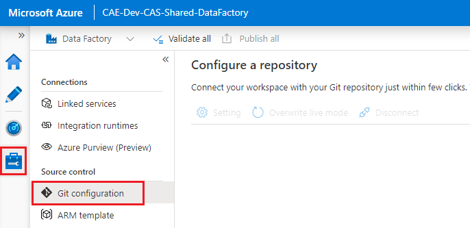
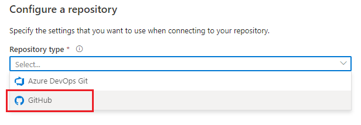
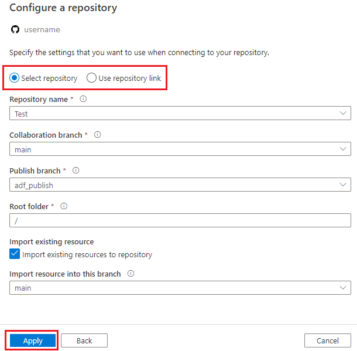
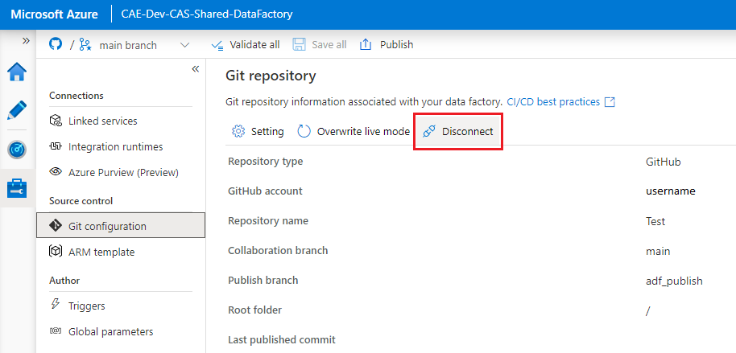
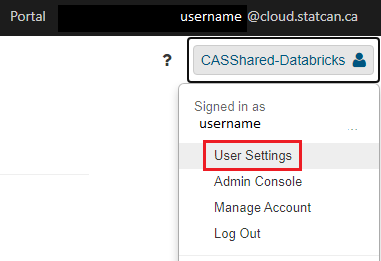
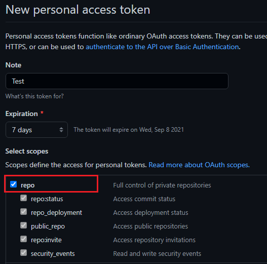
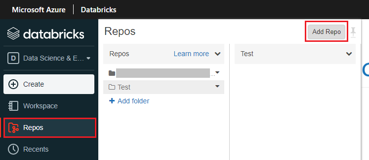

# GitHub

## Creating a GitHub Account

Information on creating a GitHub account (or using your existing account) can be found at: https://digital.statcan.gc.ca/drafts/guides-platforms-github.

## Azure Data Factory

1. On the Manage tab, click on **Git configuration**.

2. Click **Configure**. Under **Repository type**, select **GitHub**, then enter your GitHub account username. Click **Continue**.

3. A pop-up will appear. Click **AuthorizeAzureDataFactory**, then enter your GitHub account password.
4. Configure a repository. You can either select a repository that you own, or enter a repository link. Specify additional settings, then click **Apply**.

5. Set your working branch. You can either create a new branch or use an existing one. Then click **Save**.

**To remove GitHub Integration:** On the Git configuration screen, click **Disconnect**. Enter the name of the Data Factory, then click **Disconnect** again to confirm.

## Azure Databricks

### Set up Git Integration
 
1. Go to **User Setting** (by clicking the workspace name in the top right of the screen), then click on the **Git Integration** tab.

2. Under **Git provider**, select GitHub. Enter your GitHub username.
3. From your GitHub account, [follow the instructions to create a personal access token](https://docs.github.com/en/github/authenticating-to-github/keeping-your-account-and-data-secure/creating-a-personal-access-token), ensuring that the **repo** permission is checked.

4. Copy the token, and paste it into Databricks. Click **Save**.

### Add a Git Repository

1. On the Repos tab, click **Add Repo**.

2. With **Clone remote Git repo** selected, enter your GitHub repository url. The Git provider and Repo name should fill in automatically. Click **Create**.

## CAE Virtual Machines

### VS Code

### R-Studio

## Azure Machine Learning

## Azure Synapse