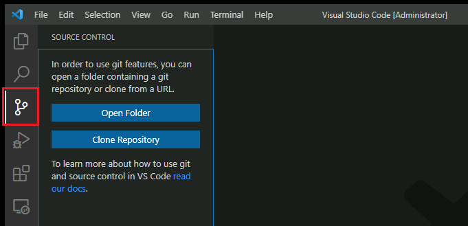
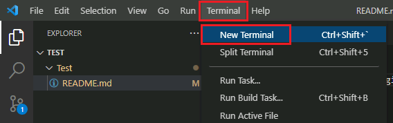
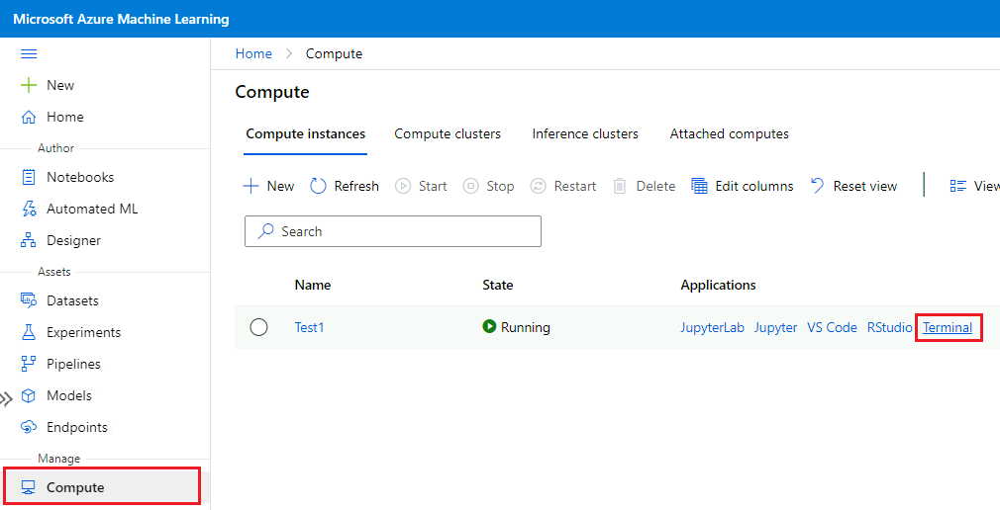
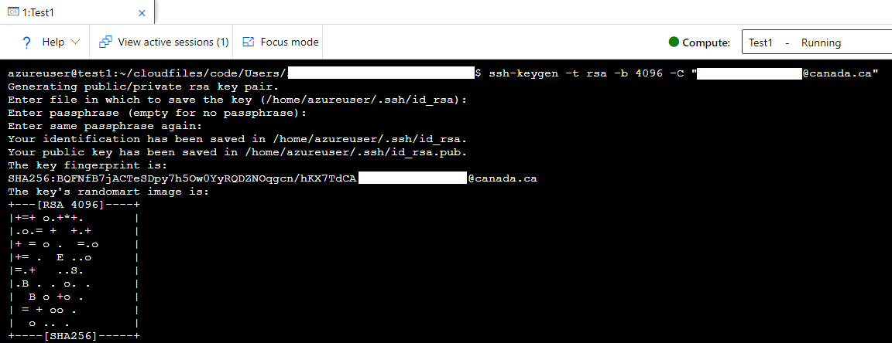
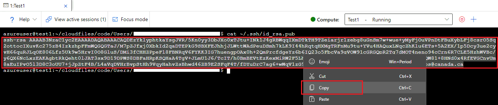
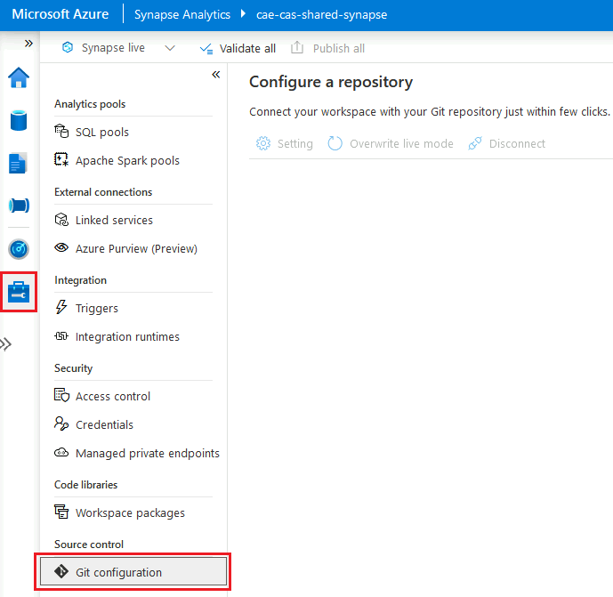

_[Français](../../fr/GitHub)_

# GitHub

GitHub.com is an online platform that is used for collaboration as well as tracking changes and versioning for a variety of project types.

**IMPORTANT: Do not store protected B data on GitHub.**

## Creating a GitHub Account

Information on creating a GitHub account (or using your existing account) can be found at: https://digital.statcan.gc.ca/drafts/guides-platforms-github.

## Azure Data Factory

1. On the Manage tab, click on **Git configuration**.

2. Click **Configure**. Under **Repository type**, select **GitHub**, then enter your GitHub account username. Click **Continue**.

3. A pop-up will appear. Click **AuthorizeAzureDataFactory**, then enter your GitHub account password.
4. Configure a repository. You can either select a repository that you own, or enter a repository link. Specify additional settings, then click **Apply**.

5. Set your working branch. You can either create a new branch or use an existing one. Then click **Save**.

**To remove GitHub Integration:** On the Git configuration screen, click **Disconnect**. Enter the name of the Data Factory, then click **Disconnect** again to confirm.


## Azure Databricks

### Set up Git Integration
 
1. Go to **User Setting** (by clicking the workspace name in the top right of the screen), then click on the **Git Integration** tab.

2. Under **Git provider**, select GitHub. Enter your GitHub username.
3. From your GitHub account, [follow the instructions to create a personal access token](https://docs.github.com/en/github/authenticating-to-github/keeping-your-account-and-data-secure/creating-a-personal-access-token), ensuring that the **repo** permission is checked.

4. Copy the token, and paste it into Databricks. Click **Save**.

### Add a Git Repository

1. On the Repos tab, click **Add Repo**.

2. With **Clone remote Git repo** selected, enter your GitHub repository url. The Git provider and Repo name should fill in automatically. Click **Create**.

## CAE Virtual Machines

### VS Code
1. Click on the **Source Control** tab. Then you can either open a folder containing a git repository (if you already have one on your cloud VM), or clone a repository from a URL.

2. To clone a repository, click **Clone Repository**. Copy the repository URL from GitHub (e.g. `https://github.com/username/reponame`), paste it in the textbox, and click **Clone from URL**.

3. Choose a folder on your cloud VM where the git repository will be stored locally. You may be promted to sign in to your GitHub account.
4. Once the repository is cloned to your machine, you can open the local folder in VS Code.
5. Before you can commit changes, you need to configure your user name and email. Open a terminal window (by clicking **Terminal** > **New Terminal** in the menu bar). In the terminal, type the following:
```
git config user.name "First Last"
git config user.email "first.last@canada.ca"
``` 


#### How to Commit changes
1. When you are ready to publish your changes to GitHub, on the **Source Control** tab, type in a commit message, then click the checkmark button.

2. Click the source control menu button, then click **Push**. If you get an error message (this will happen if your local copy of the repository is not up to date with the version stored on GitHub), first click **Pull, then Push** to merge your changes.


### R-Studio

1. In the **File** menu, click **New Project...**, then select **Version Control**.

2. Select **Git**. Enter the URL for the GitHub repository that you want to clone, choose a folder on your VM where the local files will be stored, then click **Create Project**.


#### How to Commit Changes
1. When you are ready to publish your changes to GitHub, on the **Git** tab, click **Commit**.

2. Click the checkbox for each of changes you want to commit. Enter a commit message briefly describing your changes, then click **Commit**. A pop-up will appear confirming that your commit was successful. Click **Close**.

3. Click the **Push** button to upload your changes to GitHub. A pop-up will appear confirming that the push was successful. If you get an error message, (this will happen if your local copy of the repository is not up to date with the version stored on GitHub), first click **Pull, then Push** to merge your changes.

## Azure Machine Learning

1. Create a compute instance, then open a terminal.

2. In the terminal window, enter the following (replace the example email with your own): `ssh-keygen -t rsa -b 4096 -C "first.last@canada.ca"`
3. Press **ENTER** until your key is generated.

4. Enter in the terminal: `cat ~/.ssh/id_rsa.pub`. Select the output and copy it to the clipboard.

5. Go to your GitHub account settings (on GitHub.com), click on **SSH and GPG keys**, then **New SSH key**. Paste in the key you just copied, then click **Add SSH key**.

6. In the terminal window, type: `git clone [url]` (replace **[url]** with the SSH url for your GitHub repository, e.g. `git@github.com:username/reponame.git`).
7. When prompted, type `yes`.

### Microsoft Documentation
- [Git Integration for Azure Machine Learning](https://docs.microsoft.com/en-us/azure/machine-learning/concept-train-model-git-integration)


## Azure Synapse

1. On the Manage tab, click on **Git configuration**.

2. Click **Configure**. Under **Repository type**, select **GitHub**, then enter your GitHub account username. Click **Continue**.
3. A pop-up will appear. Enter your GitHub account login info, then click **AuthorizeAzureSynapse**.
4. Configure a repository. You can either select a repository that you own, or enter a repository link. Specify additional settings, then click **Apply**.
5. Set your working branch. You can either create a new branch or use an existing one. Then click **Save**.

**To remove GitHub Integration:** On the Git configuration screen, click **Disconnect**. Enter the workspace name, then click **Disconnect** again to confirm.

# Change Display Language
See [Language](Language.md) page to find out how to change the display language.