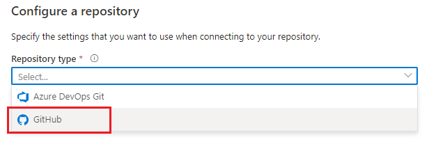
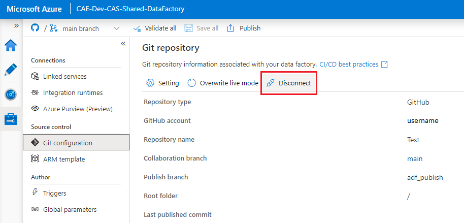
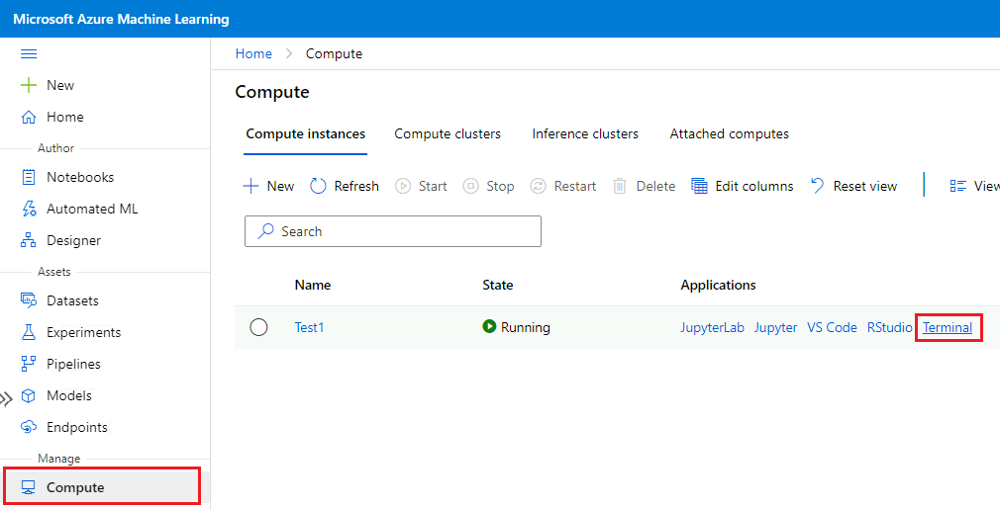
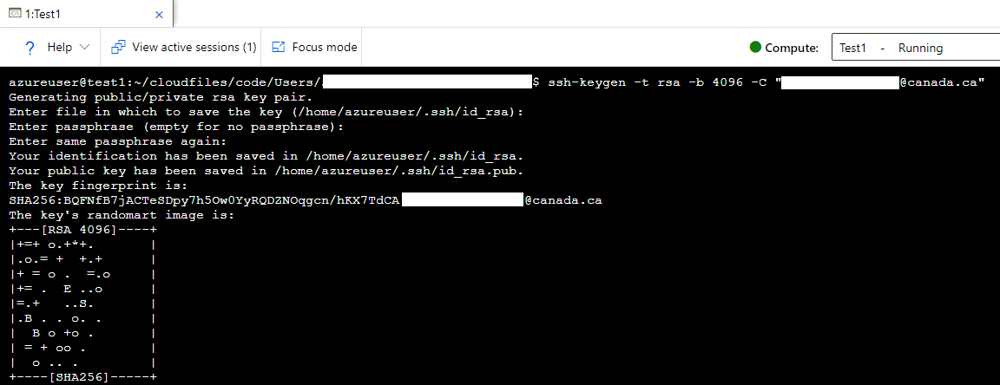
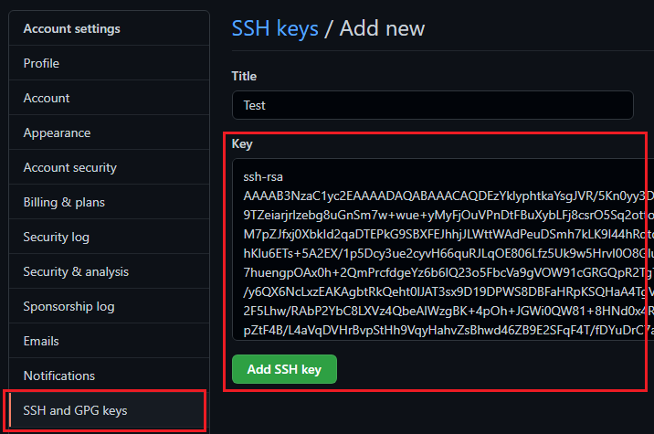
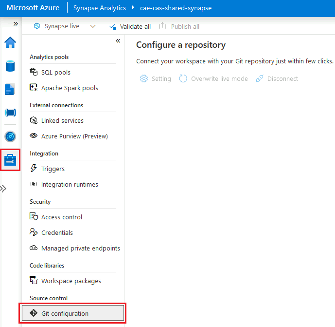

_[Français](../../fr/GitHubConfiguration)_

# GitHub - Configuration

GitHub.com is an online platform that is used for collaboration as well as tracking changes and versioning for a variety of project types.

**IMPORTANT: Do not store protected B data on GitHub.com**

## Creating a GitHub Account

Information on creating a GitHub account (or using your existing account) can be found at: [https://digital.statcan.gc.ca/drafts/guides-platforms-github](https://digital.statcan.gc.ca/drafts/guides-platforms-github).

## Azure Data Factory

1. On the Manage tab, click on **Git configuration**.

2. Click **Configure**. Under **Repository type**, select **GitHub**, then enter your GitHub account username. Click **Continue**.

3. A pop-up will appear. Click **AuthorizeAzureDataFactory**, then enter your GitHub account password.
4. Configure a repository. You can either select a repository that you own, or enter a repository link. Specify additional settings, then click **Apply**.

5. Set your working branch. You can either create a new branch or use an existing one. Then click **Save**.

**To remove GitHub Integration:** On the Git configuration screen, click **Disconnect**. Enter the name of the Data Factory, then click **Disconnect** again to confirm.

## Azure Databricks

### Set up Git Integration
 
1. Go to **User Setting**, then click on the **Git Integration** tab.

2. Under **Git provider**, select GitHub. Enter your GitHub username.
3. From your GitHub account, [follow the instructions to create a personal access token](https://docs.github.com/en/github/authenticating-to-github/keeping-your-account-and-data-secure/creating-a-personal-access-token), ensuring that the **repo** permission is checked.

4. Copy the token, and paste it into Databricks. Click **Save**.

### Add a Git Repository

1. On the Repos tab, click **Add Repo**.

2. With **Clone remote Git repo** selected, enter your GitHub repository url. The Git provider and Repo name should fill in automatically. Click **Create**.

## CAE Virtual Machines

### VS Code

To learn how to use GitHub with VS Code, see the [GitHub - Getting Started](/GitHubGettingStarted) documentation.

### R-Studio

1. In the **File** menu, click **New Project...**, then select **Version Control**.

2. Select **Git**. Enter the URL for the GitHub repository that you want to clone, choose a folder on your VM where the local files will be stored, then click **Create Project**.

## Azure Machine Learning

1. Create a compute instance, then open a terminal.

2. In the terminal window, enter the following (replace the example email with your own): `ssh-keygen -t rsa -b 4096 -C "first.last@canada.ca"`
3. Press **ENTER** until your key is generated.

4. Enter in the terminal: `cat ~/.ssh/id_rsa.pub`. Select the output and copy it to the clipboard.

5. Go to your GitHub account settings (on GitHub.com), click on **SSH and GPG keys**, then **New SSH key**. Paste in the key you just copied, then click **Add SSH key**.

6. In the terminal window, type: `git clone [url]` (replace **[url]** with the SSH url for your GitHub repository, e.g. `git@github.com:username/reponame.git`).
7. When prompted, type `yes`.

### Microsoft Documentation
- [Git Integration for Azure Machine Learning](https://docs.microsoft.com/en-us/azure/machine-learning/concept-train-model-git-integration)

## Azure Synapse

1. On the Manage tab, click on **Git configuration**.

2. Click **Configure**. Under **Repository type**, select **GitHub**, then enter your GitHub account username. Click **Continue**.
3. A pop-up will appear. Enter your GitHub account login info, then click **AuthorizeAzureSynapse**.
4. Configure a repository. You can either select a repository that you own, or enter a repository link. Specify additional settings, then click **Apply**.
5. Set your working branch. You can either create a new branch or use an existing one. Then click **Save**.

**To remove GitHub Integration:** On the Git configuration screen, click **Disconnect**. Enter the workspace name, then click **Disconnect** again to confirm.

# Change Display Language
See [Language](Language.md) page to find out how to change the display language.