_[Français](../../fr/GitHubGettingStarted)_

# GitHub - Getting Started

GitHub.com is an online platform that is used for collaboration as well as tracking changes and versioning for a variety of project types.

**IMPORTANT: Do not store protected B data on GitHub.**

## Creating a GitHub Account

Information on creating a GitHub account (or using your existing account) can be found at: https://digital.statcan.gc.ca/drafts/guides-platforms-github.

## Azure Data Factory

If git integration is set up for your Data Factory, whenever you **save** or **publish** changes, these changes will automatically sync with the GitHub repository.

To change which branch you're working one (the default collaboration branch is **main**), click on the down arrow next to the branch name in the top left of the screen. From there, you can select a different branch or create a new one.
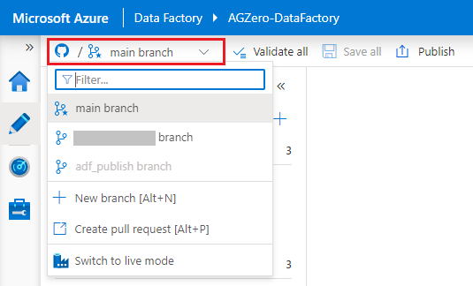

## Databricks

### Configuring a Personal Access Token

Before you can work with GitHub repositories in Databricks, you first need to configure a personal access token (this gives Databricks access to your GitHub account).

1. Go to **User Setting**, then click on the **Git Integration** tab.

2. Under **Git provider**, select GitHub. Enter your GitHub username.
3. From your GitHub account, [follow the instructions to create a personal access token](https://docs.github.com/en/github/authenticating-to-github/keeping-your-account-and-data-secure/creating-a-personal-access-token), ensuring that the **repo** permission is checked.

4. Copy the token, and paste it into Databricks. Click **Save**.

### Creating/Changing Branches

It is a best practice to do all of your work on your own **branch** (not main), then merge your changes with the main branch once you are ready to publish.

1. To create a new branch or change to an existing branch, from the **Repos** tab, click the folder containing the GitHub repository to open it. Click on the down arrow next to the branch name, then click **Git...**.
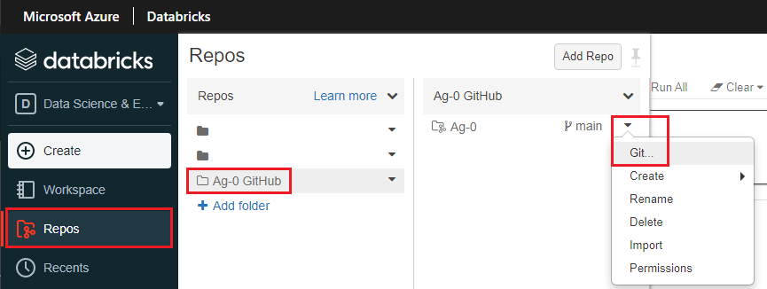
2. Click the down arrow to find an existing branch, or the plus to create a new one. Your branch should include your name.
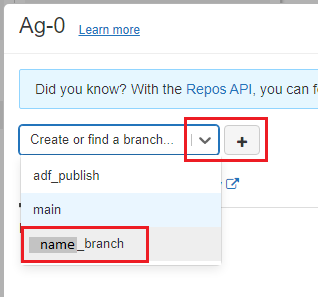
3. Once your branch is created, find it in the drop-down menu and click on it to switch to it. Click **close**. All of your work will now be saved to this branch unless you change it again later.

### Creating, Moving, and Cloning Notebooks

- To create a new notebook within the repository, from the drop-down menu next to your branch name, hover over **Create**, then click **Notebook**. You can also create folders this way.
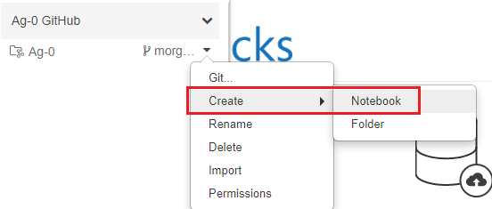
- To move or clone an existing notebook from your workspace, navigate to the notebook (in the **Workspace** tab), click on the down arrown next to the notebook name, then click **Clone** to create a copy of the notebook in the repo, or **Move** to move the notebook from the workspace to the repo. Find the repo in the pop-up menu, and navigate to the folder where you want the notebook to be cloned or moved to. Click **Clone/Select**.

### Committing and Pushing Changes

1. From the **Repos** tab, click the folder containing the GitHub repository to open it. Click on the down arrow next to the branch name, then click **Git...**.
2. Make sure all the changes that you want to commit are checked, type a short summary describing what was changed, then click **Commit & Push**.
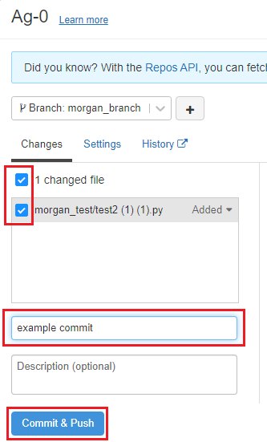

## VS Code

### How to Clone a Repository

1. Click on the **Source Control** tab. Then you can either open a folder containing a git repository (if you already have one on your cloud VM), or clone a repository from a URL.
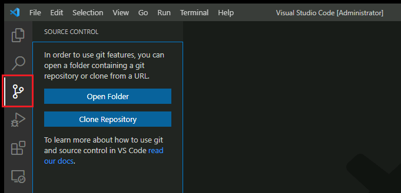
2. To clone a repository, click **Clone Repository**. Copy the repository URL from GitHub (e.g. `https://github.com/username/reponame`), paste it in the textbox, and click **Clone from URL**.
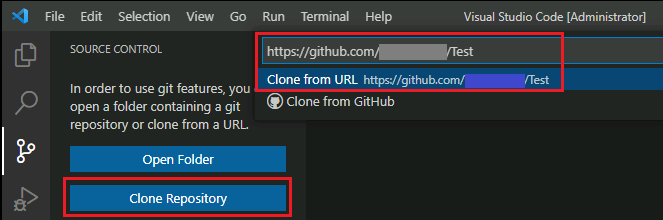
3. Choose a folder on your cloud VM where the git repository will be stored locally. You may be promted to sign in to your GitHub account.
4. Once the repository is cloned to your machine, you can open the local folder in VS Code.

### How to Commit Changes

1. Before you can commit changes, you need to configure your user name and email. Open a terminal window (by clicking **Terminal** > **New Terminal** in the menu bar). In the terminal, type the following:
```
git config user.name "First Last"
git config user.email "first.last@canada.ca"
``` 
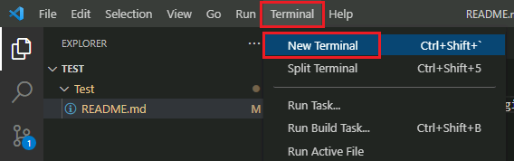
2. When you are ready to publish your changes to GitHub, on the **Source Control** tab, type in a commit message, then click the checkmark button.
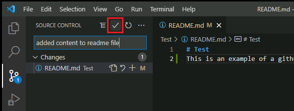
3. Click the source control menu button, then click **Push**. If you get an error message (this will happen if your local copy of the repository is not up to date with the version stored on GitHub), first click **Pull, then Push** to merge your changes.
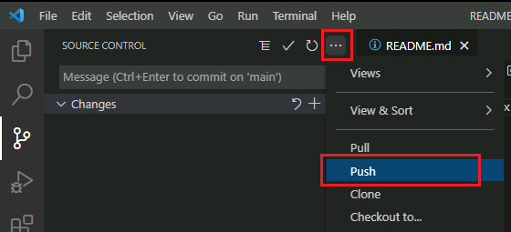

## R Studio

**Note:** Instructions are the same whether you are using the desktop version of R Studio from a cloud VM or the web version through Databricks.

### Set Up

1. In the **File** menu, click **New Project...**, then select **Version Control**.

2. Select **Git**. Enter the URL for the GitHub repository that you want to clone, choose a folder where the local files will be stored, then click **Create Project**.
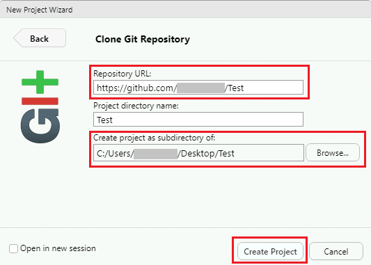
3. If you are prompted to sign in to your GitHub account, enter your GitHub username and a [personal access token](https://docs.github.com/en/github/authenticating-to-github/keeping-your-account-and-data-secure/creating-a-personal-access-token) as the password.

### How to Commit Changes

1. When you are ready to publish your changes to GitHub, on the **Git** tab, click **Commit**.

2. Click the checkbox for each of changes you want to commit. Enter a commit message briefly describing your changes, then click **Commit**. A pop-up will appear confirming that your commit was successful. Click **Close**.

3. Click the **Push** button to upload your changes to GitHub. A pop-up will appear confirming that the push was successful. If you get an error message, (this will happen if your local copy of the repository is not up to date with the version stored on GitHub), first click **Pull, then Push** to merge your changes.


# Change Display Language
See [Language](Language.md) page to find out how to change the display language.