_[Français](../../fr/Language)_
# Language 
The document describes how to change languages in the various service offerings.

## Azure portal
To change the language settings in the Azure portal:

1. Click the **Settings** menu in the global page header.
2. Click the **Language & region** tab.
3. Use the drop-downs to choose your preferred language and regional format settings.
4. Click **Apply** to update your language and regional format settings.

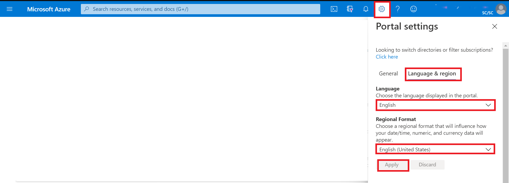  

## Dashboard
To select the English dashboard of the Collaborative Analytics Environment (CAE):

1. From the dashboard view, click the arrow next to the dashboard name.
2. Select the **Collaborative Analytics Environment** dashboard from the displayed list of dashboards. 
</br>**Note:** If the dashboard is not listed, select **Browse all dashboards** to access the complete list.

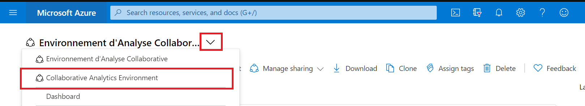  

## Data Factory
To select the language:

1. In Azure Data Factory, go to **Settings**.
2. Select **English**.
3. Click on **Apply**.

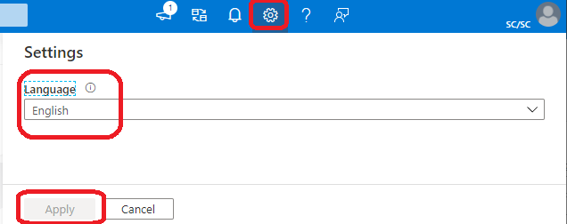  


## Databricks
This tool is available only in English for now.

## Virtual Machines
### Windows Server
To configure the display language for a Windows virtual machine:

1.	Go to **Settings**. 
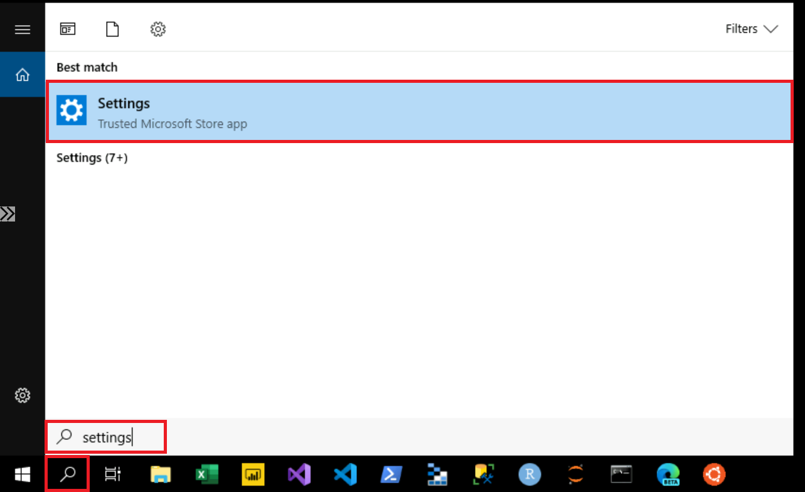  

2.	Select **Time & Language**.
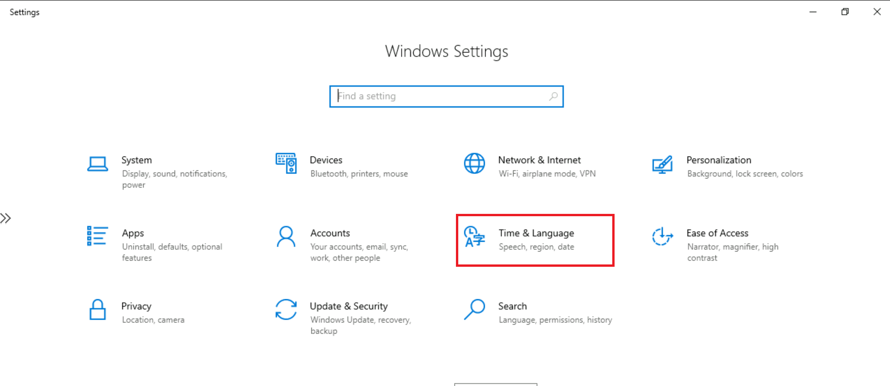  
 
3.	Select **Language**. Under **Preferred languages**, select **Add a language**. 
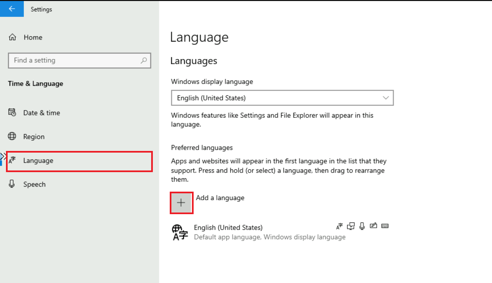  

4.	In the **Choose a language to install** dialog box, select your preferred language pack and then click **Next**.
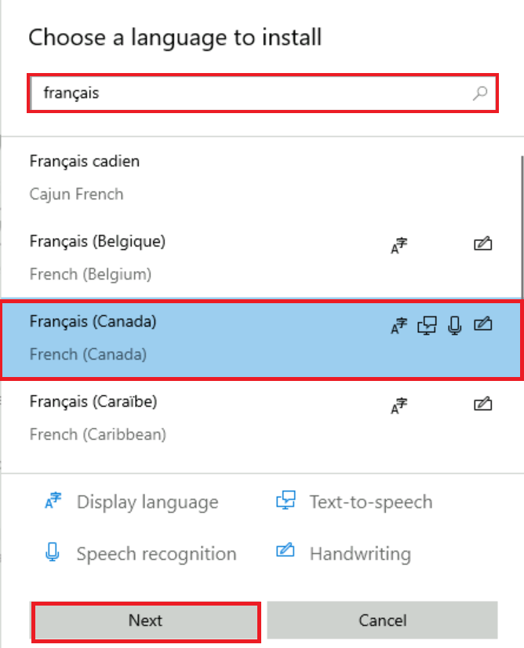  
 
5.	In the **Install language features** dialog box, click **Install**. 
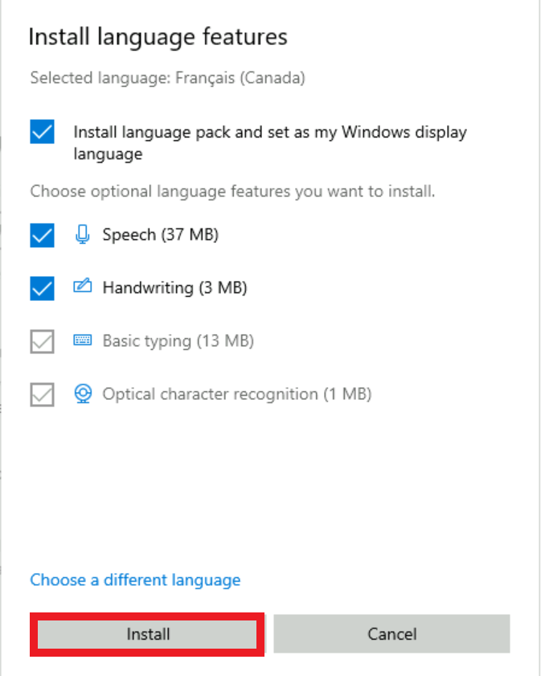  
 
6.	The Windows display language box should now include the newly added language. To switch to the new language, select it from the Windows display language box, sign out of the current Windows session, and then sign back in.

### Ubuntu Server
<!-- To configure an Ubuntu virtual machine display language, see [Language settings](https://help.ubuntu.com/stable/ubuntu-help/prefs-language-install.html.en). -->
If you are using **X2GO** to access the GUI of your Ubuntu machine, you might need to manually install additional language packages because the default session is available only in English.


## Azure Machine Learning
To change the language settings in the Microsoft Azure Machine Learning workspace:

1. Click the **Settings** menu in the global page header.

2. Under **Language and formats**, use the drop-downs to choose your preferred language and the regional format settings.

3. Click **Apply** to update your language and regional format settings.

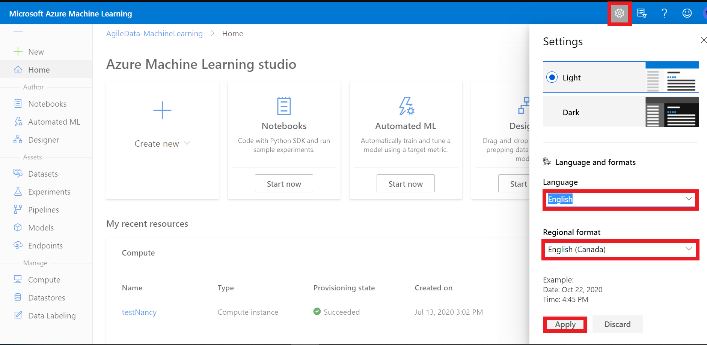 

###  Azure Machine Learning - Jupyter Lab
1. Run in Azure ML compute instance terminal: 
```sh
pip install jupyterlab==3
```
2. Restart compute instance
3. Run in Azure ML compute instance terminal: 
```sh
pip install git+https://github.com/StatCan/jupyterlab-language-pack-fr_FR
```
4. In JupyterLab, switch Settings - Language - French


## Slack
To change the language settings in the Slack application:

1.	Click the **profile icon** in the global page header.

2.	Click **Preferences**.

 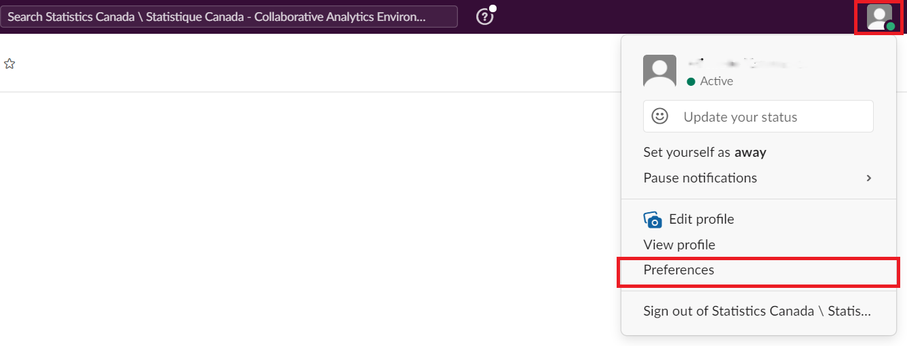 

3. Select the **Language & region** tab.

4. Under **Language**, use the drop-down to choose your preferred language.

 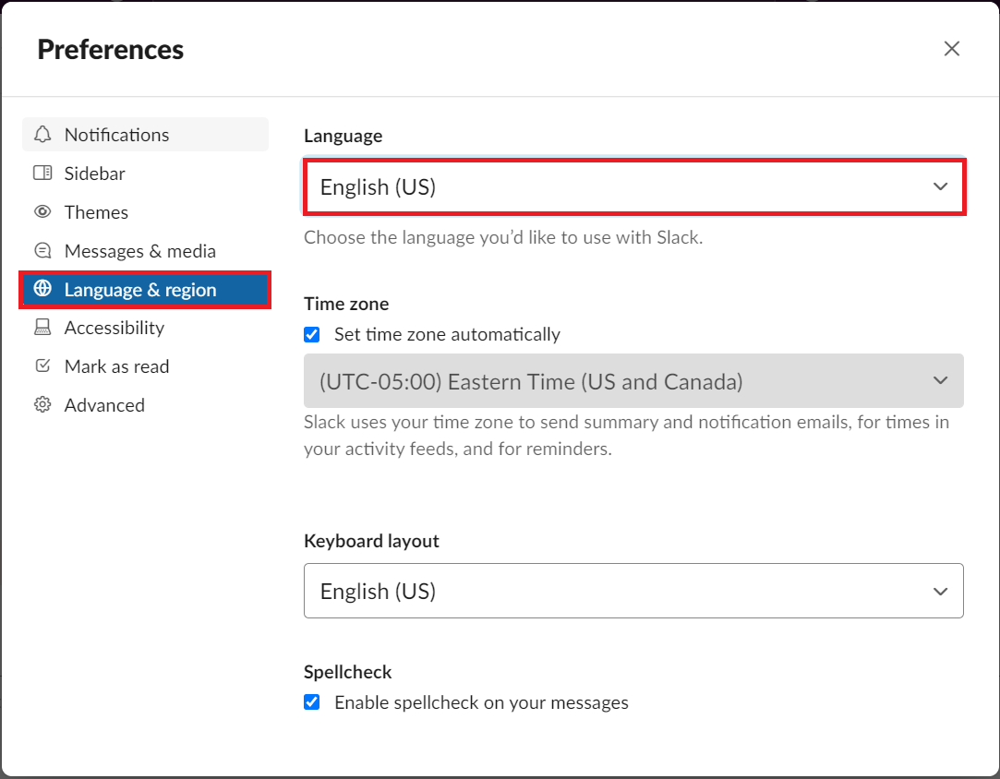 

5. Close the **Preferences** window.


## Microsoft Azure Storage Explorer

By default, the application detects your language based on the language preferences on your computer. 

To change the language settings on Microsoft Azure Storage Explorer:

1.	Click **Edit**.

2.	Click **Settings**. 

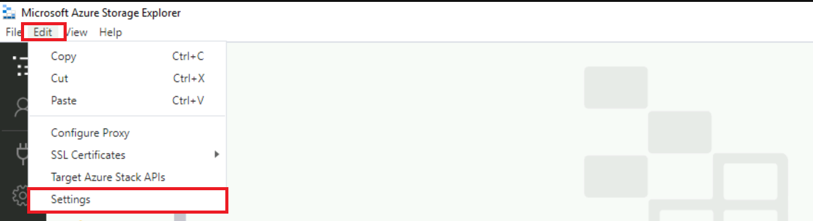 

3.	In the Settings page, select **Application**. Under **Regional Settings**, use the drop-down to choose your preferred language.  

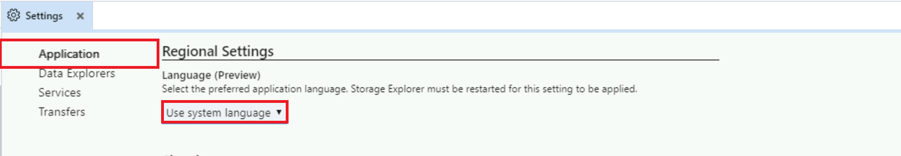 

4.	To switch to the new language, close and restart the application.


## Power BI

More information is also available in [Supported languages and countries/regions for Power BI](https://docs.microsoft.com/en-us/power-bi/fundamentals/supported-languages-countries-regions).

### Power BI Service

By default, the Power BI service detects your language based on the language preferences on your computer. The steps to access and change these preferences may vary depending on your operating system and browser.

To switch the menu language in the Power BI service:

1.	In the Power BI service, click the **Settings icon** and select **Settings**.

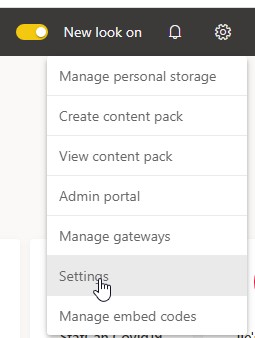  

2.	In the **General** tab, select **Language**.

 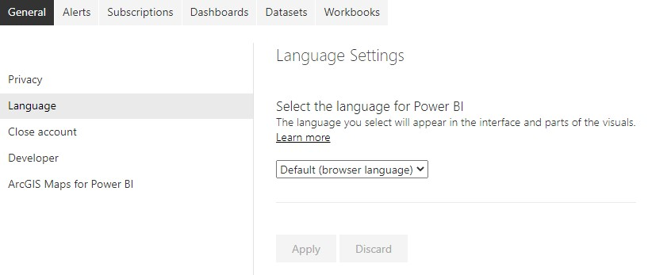  

3.	Select your language and click **Apply**.

See [Languages for the Power BI service](https://docs.microsoft.com/en-us/power-bi/fundamentals/supported-languages-countries-regions#languages-for-the-power-bi-service) for more details.


### Power BI Desktop

By default,

•   the **Application language** is based on the **Windows language**

•	the **Model language** is based on the **Application language**

•	the **Query steps** are based on the **Application language**.

It is recommended to set the **Model language** to **English (United States)**.

The model language applies only **when the report is first created** and **cannot be changed** on existing reports. Thus, setting the language model to **U.S. English** is recommended, unless you have a specific need to use another language for the report model. String comparisons and internal date fields are affected by this setting.

To switch the menu language and model language in Power BI Desktop:

1.	Open the **Options** menu.

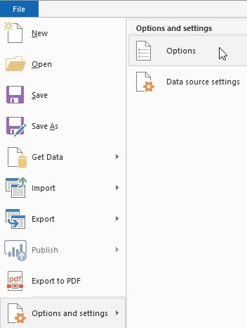   

2.	Under **GLOBAL**, click **Regional Settings** and set the **Application language** and **Model language** to the desired language.

 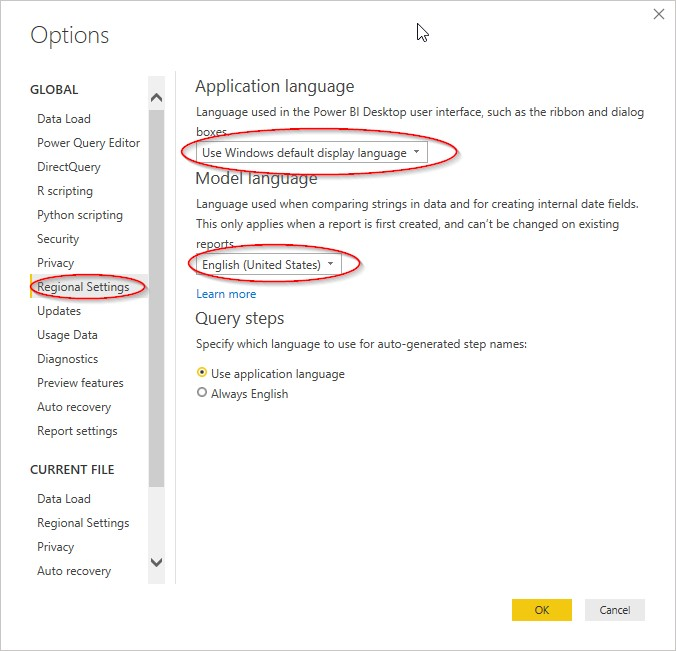   

**NOTE**: The **Import language** is set separately in the **CURRENT FILE** section **Regional Settings**. You need to change this only if you import data files that have numbers and dates in a specific locale (e.g., Canada English DD/MM/YYYY, United State English MM/DD/YYYY).

## Web browsers

* [Chrome](https://support.google.com/chrome/answer/173424?co=GENIE.Platform%3DDesktop&hl=en)
* [Safari](https://support.apple.com/en-ca/guide/mac-help/mh26684/mac)
* [Edge](https://support.microsoft.com/en-US/microsoft-edge/use-microsoft-edge-in-another-language-4da8b5e0-11ce-7ea4-81d7-4e332eec551f)
* [Firefox](https://support.mozilla.org/en-US/kb/use-firefox-another-language)
* [Opera](https://help.opera.com/en/latest/customization/#changeLanguage)


