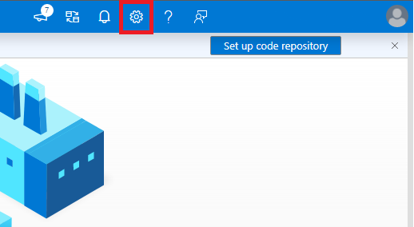
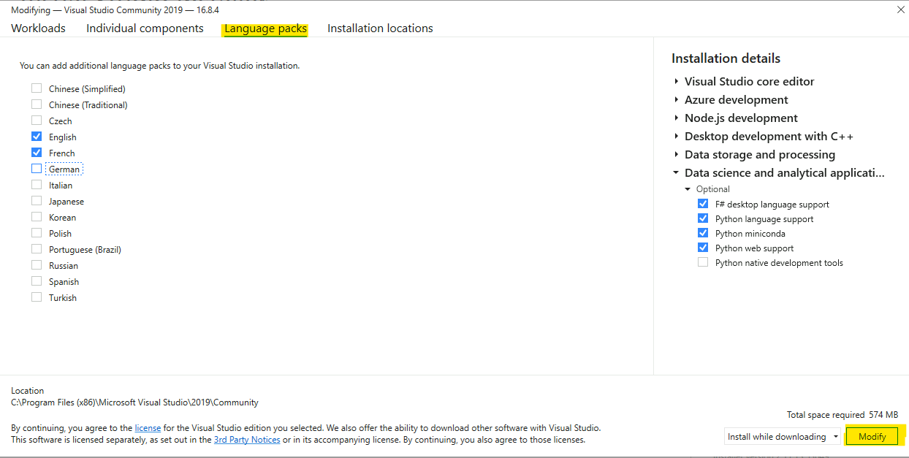

_[Français](../../fr/Langue)_
# Language 
The document describes how to change languages in the various service offerings.

## Azure portal
To change the language settings in the Azure portal:

1. Click the **Settings** menu in the global page header.
2. Click the **Language & region** tab.
3. Use the drop-downs to choose your preferred language and regional format settings.
4. Click **Apply** to update your language and regional format settings.

  

## Dashboard
To select the English dashboard of the Collaborative Analytics Environment (CAE):

1. From the dashboard view, click the arrow next to the dashboard name.
2. Select the **Collaborative Analytics Environment** dashboard from the displayed list of dashboards. 
</br>**Note:** If the dashboard is not listed, select **Browse all dashboards** to access the complete list.

  

## Azure Data Factory
To select the language:

1. In Azure Data Factory, go to **Settings**.
2. Select **English**.
3. Click on **Apply**.

  


## Virtual Machines
### Windows Server
To configure the display language for a Windows virtual machine:

1.	Go to **Settings**. 
  

2.	Select **Time & Language**.
  
 
3.	Select **Language**. Under **Preferred languages**, select **Add a language**. 
  

4.	In the **Choose a language to install** dialog box, select your preferred language pack and then click **Next**.
  
 
5.	In the **Install language features** dialog box, click **Install**. 
  
 
6.	The Windows display language box should now include the newly added language. To switch to the new language, select it from the Windows display language box, sign out of the current Windows session, and then sign back in.

### Ubuntu Server
<!-- To configure an Ubuntu virtual machine display language, see [Language settings](https://help.ubuntu.com/stable/ubuntu-help/prefs-language-install.html.en). -->
If you are using **X2GO** to access the GUI of your Ubuntu machine, you might need to manually install additional language packages because the default session is available only in English.


## Azure Machine Learning
To change the language settings in the Microsoft Azure Machine Learning workspace:

1. Click the **Settings** menu in the global page header.

2. Under **Language and formats**, use the drop-downs to choose your preferred language and the regional format settings.

3. Click **Apply** to update your language and regional format settings.

 

###  Azure Machine Learning - Jupyter Lab
1. Run in Azure ML compute instance terminal: 
```sh
pip install jupyterlab==3
```
2. Restart compute instance
3. Run in Azure ML compute instance terminal: 
```sh
pip install git+https://github.com/StatCan/jupyterlab-language-pack-fr_FR
```
4. In JupyterLab, switch Settings - Language - French


## Slack
To change the language settings in the Slack application:

1.	Click the **profile icon** in the global page header.

2.	Click **Preferences**.

  

3. Select the **Language & region** tab.

4. Under **Language**, use the drop-down to choose your preferred language.

  

5. Close the **Preferences** window.


##  Azure Storage Explorer

By default, the application detects your language based on the language preferences on your computer. 

To change the language settings on Microsoft Azure Storage Explorer:

1.	Click **Edit**.

2.	Click **Settings**. 

 

3.	In the Settings page, select **Application**. Under **Regional Settings**, use the drop-down to choose your preferred language.  

 

4.	To switch to the new language, close and restart the application.


## Power BI

More information is also available in [Supported languages and countries/regions for Power BI](https://docs.microsoft.com/en-us/power-bi/fundamentals/supported-languages-countries-regions).

### Power BI Service

By default, the Power BI service detects your language based on the language preferences on your computer. The steps to access and change these preferences may vary depending on your operating system and browser.

To switch the menu language in the Power BI service:

1.	In the Power BI service, click the **Settings icon** and select **Settings**.

  

2.	In the **General** tab, select **Language**.

   

3.	Select your language and click **Apply**.

See [Languages for the Power BI service](https://docs.microsoft.com/en-us/power-bi/fundamentals/supported-languages-countries-regions#languages-for-the-power-bi-service) for more details.


### Power BI Desktop

By default,

•   the **Application language** is based on the **Windows language**

•	the **Model language** is based on the **Application language**

•	the **Query steps** are based on the **Application language**.

It is recommended to set the **Model language** to **English (United States)**.

The model language applies only **when the report is first created** and **cannot be changed** on existing reports. Thus, setting the language model to **U.S. English** is recommended, unless you have a specific need to use another language for the report model. String comparisons and internal date fields are affected by this setting.

To switch the menu language and model language in Power BI Desktop:

1.	Open the **Options** menu.

   

2.	Under **GLOBAL**, click **Regional Settings** and set the **Application language** and **Model language** to the desired language.

    

**NOTE**: The **Import language** is set separately in the **CURRENT FILE** section **Regional Settings**. You need to change this only if you import data files that have numbers and dates in a specific locale (e.g., Canada English DD/MM/YYYY, United State English MM/DD/YYYY).

## Azure Databricks

To change the language settings in Databricks:

1. Select the user dropdown at the top right and select **User Settings**


2. On the page, select **Language Settings**


3. Click on the dropdown and select the language of your choice.

## Data Factory

To change the language settings in Data Factory:

1. Select the **Settings Icon** at the top right



2. Get to the Language section and select the language of your choice. 


## JupyterLab

To change the language settings in JupyterLab:

1. Within JupyterLab, open up a console or terminal.

2. Install the language example of your choice using pip.

Example:

```python
pip install jupyterlab-language-pack-zh-CN
```
3. Under the settings tab, highlight over language and select the language you installed.


4. Click on **OK** to refresh the page, you will see the language change.

For More information about changing languages:

https://jupyterlab.readthedocs.io/en/stable/user/language.html#changing-the-display-language

## Visual Studio Code (VSCode)

To change the display language in VSCode:

1. Open VSCode and open the command Pallette (Ctrl+Shift+P).

2. In the command pallette, type in "display" and select **install additional languages**.


Note: If you have already installed the language you wanted, you can select the language from the dropdown.

3. On the left side of VSCode, languages will appear which can be installed, select the language of your choice.

4. A pop-up may appear at the bottom right of the screen in which you can change the language and it will restart VSCode. 


## Visual Studio

If you have already installed language packages within Visual Studio:

1. On the top bar, select **Tools** then **Options**.


2. From the menu, under the **Environment** tab, select **International Settings**


3. From the drop down under **Language**, select the language of your choice.

If you have not installed other language packages within Visual Studio:

1. On your computer, open the Visual Studio Installer.

2. In the installer, select the modify button.


3. On the new window, select **Language Packs**. Select all the languages you want to add and then select modify.



4. From here you can follow the steps on using the installed language packages within Visual Studio. 

## RStudio

To set RStudio into a different language: 

1. Open up RStudio and open up the console.

2. In the console, type in "Sys.getenv(LANGUAGE = "fr")
Note: "fr" is for the french language, for a list of other languages that can be used:

https://en.wikipedia.org/wiki/List_of_ISO_639-1_codes

3. To test it, you can type "2+x" and it should give an error in the language inputted.

## Web browsers

* [Chrome](https://support.google.com/chrome/answer/173424?co=GENIE.Platform%3DDesktop&hl=en)
* [Safari](https://support.apple.com/en-ca/guide/mac-help/mh26684/mac)
* [Edge](https://support.microsoft.com/en-US/microsoft-edge/use-microsoft-edge-in-another-language-4da8b5e0-11ce-7ea4-81d7-4e332eec551f)
* [Firefox](https://support.mozilla.org/en-US/kb/use-firefox-another-language)
* [Opera](https://help.opera.com/en/latest/customization/#changeLanguage)


