## Prerequisites
- An authorized StatCan account; the cloud account previously used is not required anymore.

## Notes 
We recommend you use  a modern web browser such as Chrome or Edge (not Internet Explorer) to access the Azure Portal or any Azure services.
When connecting to the Azure portal, you will login with your [StatCan Network account](#statcan-network-account-firstnamelastnamestatcangcca) (i.e. firstname.lastname@statcan.gc.ca) for StatCan employees.  

Follow the instructions for your type of account to complete your sign-in. 

## StatCan Network Account (firstname.lastname@statcan.gc.ca)   
*Applicable to all Azure cloud Services (Power BI, Databricks, Data Factory, Virtual Machine, etc.) for internal users only*

1. Using Chrome, Chromium or Edge, open either:   
    - The [Collaborative Analytics Environment](https://portal.azure.com/#@cloud.statcan.ca/dashboard/arm/subscriptions/d2d3c198-2275-4c7b-bd79-0fc949819c0e/resourcegroups/dashboards/providers/microsoft.portal/dashboards/82e4ac29-4a7f-4ba0-9244-67835193508a) Azure Portal Dashboard
    - The Power BI App URL (if provided) or [Power BI Service Login Page](https://powerbi.microsoft.com/en-us/landing/signin/)  
    
2. When opening a Power BI App URL or the Power BI Service login page, you will be directed to the Microsoft Power BI Sign In landing page, as shown below, saying “Already have an account?”. Click on **SIGN IN**.  

    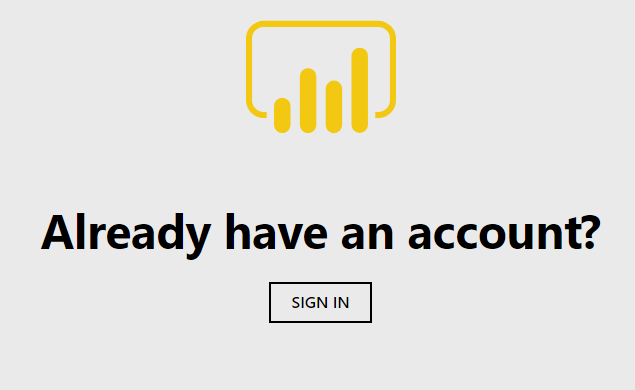  

3. You will then be prompted to either enter or pick an account:  

    - Upon your first time signing in, you will receive the Microsoft Sign in prompt, as shown below.  
   
          

    - Enter your statcan account credentials (firstname.lastname@statcan.gc.ca), and click on **Next**.  

    - On subsequent sign-ins, you will receive the Microsoft Pick an account prompt, as shown below. Click on your statcan.gc.ca account.  

          

4. You will then be prompted to enter your account password, as shown below. Once entered, click on **Sign in**.  

       

<!-- ## Prerequisites
- An authorized StatCan Cloud account or guest account. Access using StatCan Network accounts is currently only available for the Power BI Service, but may be added in the future for other services in the Collaborative Analytics Environment (CAE).

## Notes 
We recommend you use Chrome, Chromium or Edge (not Internet Explorer) to access the Azure Portal, Azure services or the Power BI Service.
When connecting to the Azure cloud services, you will either login with your:  
- [StatCan Cloud account](#statcan-cloud-account-firstnamelastnamecloudstatcanca) (i.e. firstname.lastname@cloud.statcan.ca), or
- [Other government or researcher email credentials](#other-government-or-researcher-email-credentials) (e.g. firstname.lastname@dept-dépt.gc.ca or name@gov.prov.ca), or
- [StatCan Network account](#statcan-network-account-firstnamelastnamestatcangcca) (i.e. firstname.lastname@statcan.gc.ca) for StatCan employees using the Power BI Service only.  

Follow the instructions for your type of account to complete your sign-in. 

## StatCan Cloud Account (firstname.lastname@cloud.statcan.ca)
*Applicable to all Azure cloud Services (Power BI, Databricks, Data Factory, Virtual Machine, etc.)*

1. Using Chrome, Chromium or Edge, open either:   
    - The [Collaborative Analytics Environment](https://portal.azure.com/#@cloud.statcan.ca/dashboard/arm/subscriptions/d2d3c198-2275-4c7b-bd79-0fc949819c0e/resourcegroups/dashboards/providers/microsoft.portal/dashboards/82e4ac29-4a7f-4ba0-9244-67835193508a) Azure Portal Dashboard
    - The Power BI App URL (if provided) or [Power BI Service Login Page](https://powerbi.microsoft.com/en-us/landing/signin/)  
    
2. When opening a Power BI App URL or the Power BI Service login page, you will be directed to the Microsoft Power BI Sign In landing page, as shown below, saying “Already have an account?”. Click on **SIGN IN**.  

      

3. You will then be prompted to either enter or pick an account:  

    - Upon your first time signing in, you will receive the Microsoft Sign in prompt, as shown below.  
   
          

    - Enter your cloud account credentials (firstname.lastname@cloud.statcan.ca), and click on **Next**.  

    - On subsequent sign-ins, you will receive the Microsoft Pick an account prompt, as shown below. Click on your cloud.statcan.ca account.  

          

4. You will then be prompted to enter your cloud account password, as shown below. Once entered, click on **Sign in**.  

       

5. Lastly, you may receive the More Information required – Your organization needs more information to keep your account secure prompt from Statistics Canada, as shown below, especially if it’s the first time you log in to a Web portal with your cloud account. 

Click on **Next** and ensure to follow the instructions to secure your account by configuring your authentication email and configuring your security questions.  

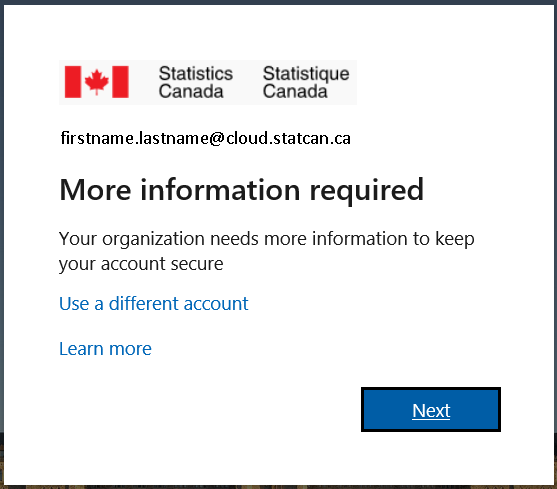  
 
## Other Government or Researcher Email Credentials
*Applicable to **most** Azure cloud Services (Power BI, Databricks, Data Factory, Virtual Machine, etc.)*

1. Using Chrome, Chromium or Edge, open either:   

    - The [Collaborative Analytics Environment](https://portal.azure.com/#@cloud.statcan.ca/dashboard/arm/subscriptions/d2d3c198-2275-4c7b-bd79-0fc949819c0e/resourcegroups/dashboards/providers/microsoft.portal/dashboards/82e4ac29-4a7f-4ba0-9244-67835193508a) Azure Portal Dashboard

    - The Power BI App URL (if provided) or [Power BI Service Login Page](https://powerbi.microsoft.com/en-us/landing/signin/)  

    - [Azure Databricks](https://canadacentral.azuredatabricks.net/)  

    - [Azure Data Factory](https://adf.azure.com/)      
    
2. When opening a Power BI App URL or the Power BI Service login page, you will be directed to the Microsoft Power BI Sign In landing page, as shown below, saying “Already have an account?”. Click on **SIGN IN**.  

      

3. You will then be prompted to either enter or pick an account:   
    - Upon your first time signing in, you will receive the Microsoft Sign in prompt, as shown below.  
   
        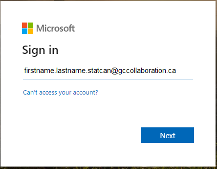 

    - Enter your official email/O365 credentials or GCCollaboration credentials (e.g., firstname.lastname@dept-dépt.gc.ca, firstname.lastname.department@gccollaboration.ca or name@gov.prov.ca), and click on **Next**.  

    - On subsequent sign-ins, you will receive the Microsoft Pick an account prompt, as shown below. Click on your official email/O365 credentials or GCCollaboration credentials (e.g., firstname.lastname@dept-dépt.gc.ca, firstname.lastname.department@gccollaboration.ca or name@gov.prov.ca) account.  

          

4. You will then be prompted to enter your cloud account password, as shown below. Once entered, click on **Sign in**.  

    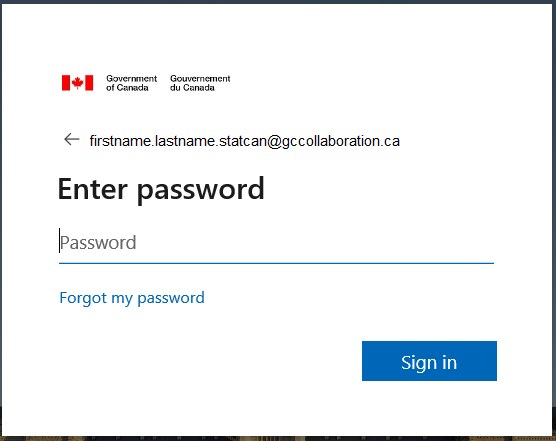 

    - If your Official Email Credentials do not support this type of login you will automatically be emailed a code to enter in place of a password and then click on **Sign in**.
    
        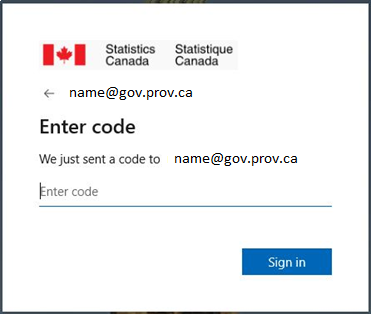  

    - The Email you receive will look like the following, if you do not receive it double check if it was sent to your Spam or Junk folder. 
    
        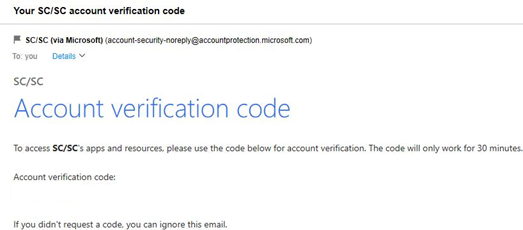  
   
5. **Accept** the Review permissions (first time only consent).  

    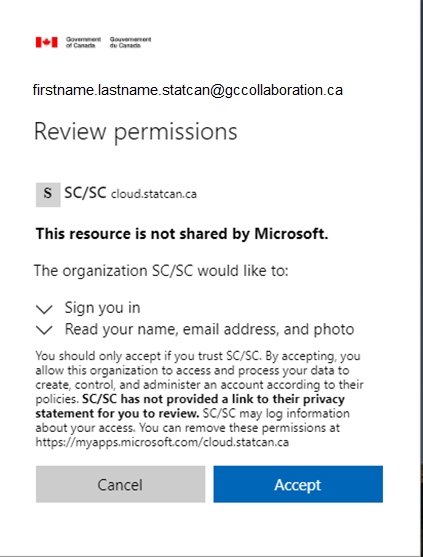 

6. You will then receive the following message. **Wait** until completed.  

    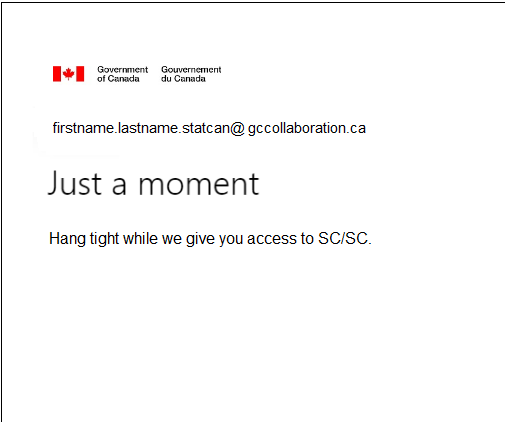 

7. Lastly, you may receive the More Information required – Your organization needs more information to keep your account secure prompt from Statistics Canada, as shown below, especially if it’s the first time you log in to a Web portal with your cloud account. Click on **Next** and ensure to follow the instructions to secure your account by configuring your authentication email and configuring your security questions. 

    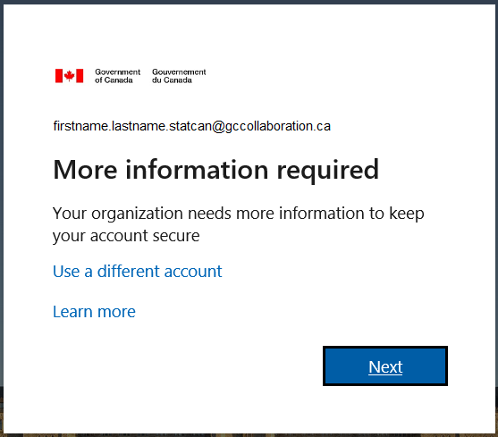  

    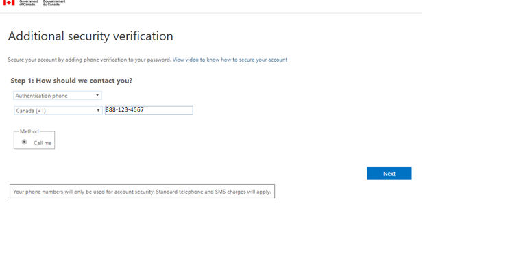  

## StatCan Network Account (firstname.lastname@statcan.gc.ca)   
*Applicable to the Power BI Service for Statistics Canada employees only. May be added in the future for other services in the Collaborative Analytics Environment (CAE)*

Please note that step 5 (Internet password) below may not appear in the order specified. 

1. From a StatCan laptop or Network B VDI, and using Chrome or Chromium, open either:   
    - The Power BI App URL (if provided) or  
    - [https://powerbi.microsoft.com/en-us/landing/signin/](https://powerbi.microsoft.com/en-us/landing/signin/)

2. You will be directed to the Microsoft Power BI Sign In landing page, as shown below, saying “Already have an account?”.   

         

3. You will then be prompted to either enter or pick an account: 

    - On first time sign-in, you will receive the Microsoft Sign in prompt, as shown below.  

        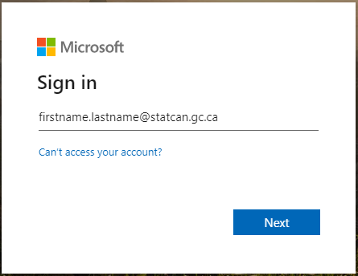  

    - Enter your StatCan Network account (firstname.lastname@statcan.gc.ca), and then, click on **Next**.  
    
    - On subsequent sign-ins, you will receive the Microsoft Pick an account prompt, as shown below. Click on your statcan.gc.ca account.  

        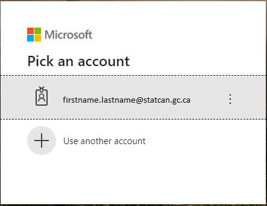  

4. You will then receive a Microsoft message “Taking you to your organizations sign-in page”. 

5. You may then be prompted to enter your **Internet** username and password as shown below. Once entered, click **Sign in**.   

    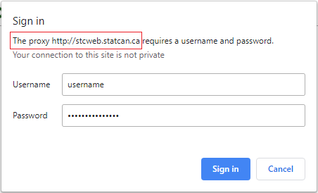  

6. You will then be prompted to sign in using your StatCan Network account (i.e. firstname.lastname@statcan.gc.ca) and Network A password. Once entered, click **Sign in**.   

    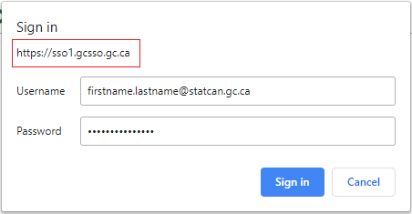  

7. Lastly, you may receive the More Information required – Your organization needs more information to keep your account secure prompt from Statistics Canada, as shown below, especially if it’s the first time you logged in to a Web portal with your StatCan Network account. Click on **Next** and ensure to follow the instructions to secure your account by configuring your authentication email and configuring your security questions.  

    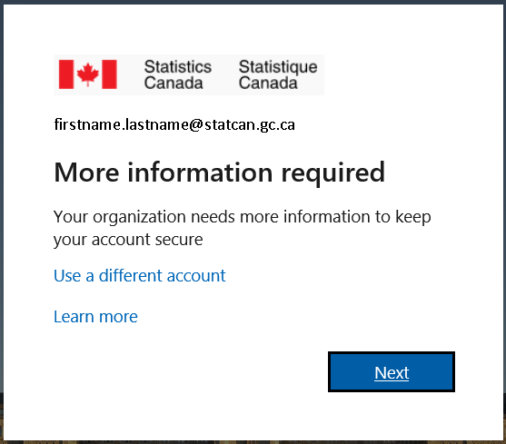   

## Microsoft Documentation
- [Azure portal documentation](https://docs.microsoft.com/en-us/azure/azure-portal/)

 

 

 

 

 
 -->
