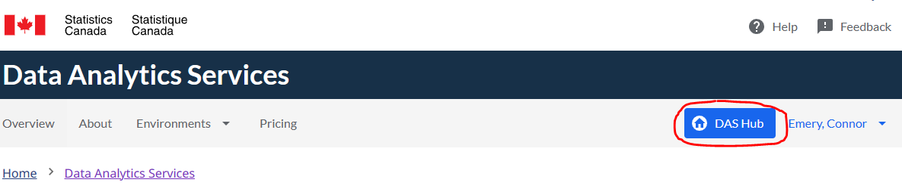

## StatCan external Account (firstname.lastname@ext.statcan.ca)   

1. Using a modern web browser: 
    - [https://daaas-portal.prod.cloud.statcan.ca/data-analytics-services/hub](https://daaas-portal.dev.cloud.statcan.ca/data-analytics-services/hub)

2. Once signed in, you will be in the hub page. You can go to that page by selecting the arrow next to the user name and select Das Hub as shown here.   

         

3. You will see at the bottom of the hub page the Virtual Machine that you can access.
From the portal, you will be able to either
    -Start the VM
    -Stop the VM
    -Connect to the VM

         

4. To connect to the VM, you will need to hit te Browser connect button. This will open a new page where you will be prompted to sign in using your credential provided to you by StatCan. Once entered, click **Login**.

         
