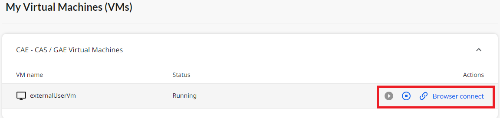

## StatCan external Account (firstname.lastname@ext.statcan.ca)   

1. Using a modern web browser, click the sign-in button:  (add image of sign-in)
    - [https://daaas-portal.prod.cloud.statcan.ca/data-analytics-services/hub](https://daaas-portal.dev.cloud.statcan.ca/data-analytics-services/hub)

Note: First time logging in, you will prompted to change your password.

2. Once signed in, you will be in the hub page. You can go to that page by selecting the arrow next to the user name and select Das Hub as shown here.   

         

3. You will see at the bottom of the hub page the Virtual Machine that you can access.
From the portal, you will be able to either
    -Start the VM
    -Stop the VM
    -Connect to the VM

         

4. You will need to start your virtual machine and wait for your virtual machines to be in the "running" state. This can take a few minutes. (add image of running start and start button)
5. To connect to the VM, you will need to hit te Browser connect button. This will open a new page where you will be prompted to sign in using your credential provided to you by StatCan. Once launched, click the **Login** button.

     
    
Best Practices
1. You can stop  your virtual machine when not in use. All virtual machines are turned off every evening at 7 PM EST.
2. Do not share your password with others.

Frequently Asked Quesitons (FAQ)
1. I have forgotten my ext.statcan.ca password?
    Please use the DAS portal Help button to submit a request for assitance (add image)
2. I have forgotten my virtual machines username and password?
    Please use the DAS portal Help button to submit a request for assitance (add image)

