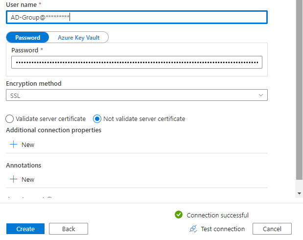

_[Français](../../fr)_
# Azure PostgreSQL Database
An Azure Postgres Database can be setup in advance if your project requires one.

**Reminder:** The CAE Azure PostgreSQL Databases are only accessible from inside the CAE cloud environment. They are not accessible from any of the Government of Canada Data Centres.

## Accessing Azure PostgreSQL Database

### Azure Data Factory
A linked service can be setup inside Azure Data Factory. Configure the linked service to connect via the self-hosted integration runtime and provide username and password.
Username is **Cloud account username** or AD group name if access was granted to a AD group, followed by the server name.
Password is an Azure AD access Token as described below in step 6 of pgAdmin section

or

Please contact the support team through the https://cae-eac.slack.com channel if you need assistance.

### Virtual Machine

You can access an Azure PostgreSQL database from your cloud virtual machine, using various applications including:
1. pgAdmin 
2. Azure Data Studio 
3. Visual Studio Code

#### Prerequisites
1.	A **virtual machine** in the Collaborative Analytics Environment (CAE). See the [VM page](VirtualMachines.md) for more information.
2.  **pgAdmin** or **Azure Data Studio** and **Visual Studio Code**. Those two are available by default in the **Windows Data Science Virtual Machine** images.  

# pgAdmin
This is one of the common tool for PostgreSQL database administration.

1. In your cloud VM install pgAdmin from https://www.pgadmin.org/download/

2. Connect to your cloud VM and launch **pgAdmin**.

   

3. Add the server you need to connect to by right clicking on Servers in the top left corner

   

4. In the General tab, enter a name for your server. You can write the real name of the server
   In the Connection tab, enter the full Server name and add your Cloud Account  as Username followed by the server name
   or the active directory group you belong to followed by the server name if access to the server was granted to that active directory group.

   

5. You can now see in the list of server the newly added server. 
   Click on it to connect and you will be asked to enter a password

   

6. The password you need to enter is a Azure AD access Token that will be generated for an authenticated Azure AD user. 
   From PowerShell, you can generate this access token by entering the following command

   *az account get-access-token --resource https://ossrdbms-aad.database.windows.net*

   The output is as follow, where you will need to copy the value for accessToken and use it as Password in  pgAdmin

   

# Azure Data Studio

1. Connectez-vous à votre **machine virtuelle** dans l'EAC et lancez **Azure Data Studio**. 

   

2. The connexion details should be as follow
   Where the user name can be the **cloud account username** followed by the server name:

   *firstname.lastname\ @cloud.statcan.ca@servername.postgres.database.azure.com*
   or
   *firstname.lastname@cloud.statcan.ca@servername*
 
   if the access to the server was granted to an active directory group the user belong to

   *AD-Group@servername.postgres.database.azure.com*
   or
   *AD-Group@servername*

   
