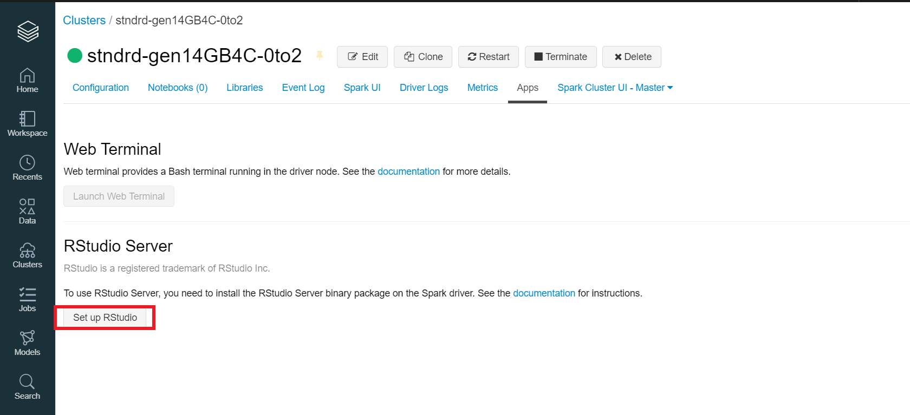
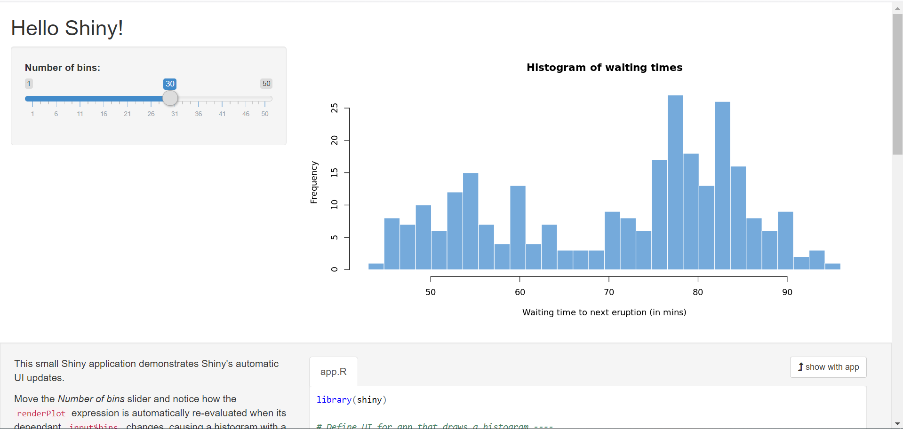

_[Français](../../fr/R-Shiny)_
# R-Shiny from RStudio
The document describes how to access the R-Shiny package from RStudio.

## Getting Started

To use R-Shiny, please send a [slack](https://cae-eac.slack.com) message to the CEA team to enable RStudio on your Databricks cluster.

**Warning** :
R-Shiny clusters are shut down **every day at 7pm**. To save on costs, please stop your R-Shiny clusters when you are not using them.

## Accessing R-Shiny from Databricks

1.	From the Azure portal, launch the Databricks workspace that was created for you.
2.	From the Databricks workspace, click on **Clusters**.
      

3. From the list of available clusters, select the cluster with RStudio installed.
      

    **Note:** You must have the cluster running before you can access RStudio. See the [Databricks section](DataBricks.md) for information on how to start a cluster.

4.	Select the **Apps** tab.
    

5.	Click on **Set up RStudio**.
    

6.  A **one-time password** is generated for you, click on **show** to display and copy it.
    

7.	Click on **Open RStudio**.
    

8.	A new tab opens, enter the username and password provided (step 6) in the login form and sign in to RStudio.
    

9.	From the RStudio UI, enter the **library(shiny)** command in the console to import the Shiny package.
    


## RShiny App Example

You can use use the **Hello Shiny** example to explore the structure of a Shiny app.

1. Launch the app from your R session by running:

    library(shiny)

    runExample("01_hello")

2.	Your app should match the image below.
    


## Accessing files from the datalake

By default, the working directory in RStudio will be on the driver node of the Databricks cluster. To persist your work, you'll need to use DBFS.

1. To access DBFS in the File Explorer, click on the **...** to the right and enter **/dbfs/mnt/** at the prompt.


2. The data lake will be available and you will be able to access and store your files. When your cluster is terminated at the end of your session, your work will be there for you when you return.

**NOTE:** Here are some code samples to access your files from the datalake.
```
library(SparkR)
sparkR.session()
testData = as.data.frame(read.df("/mnt/the file path", source = "the file extension", header="true", inferSchema = "true"))
str(testData)
```

```
setwd("/dbfs/mnt/the file path")
testData = read.csv("the filename")
str(testData)
```

# Change Display Language

See [Language](Language.md) page to find out how to change the display language.
