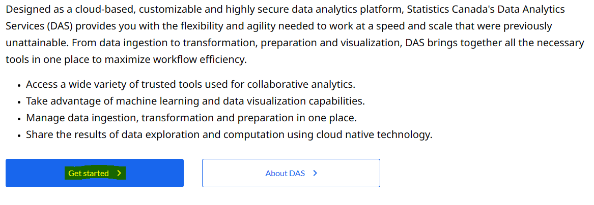
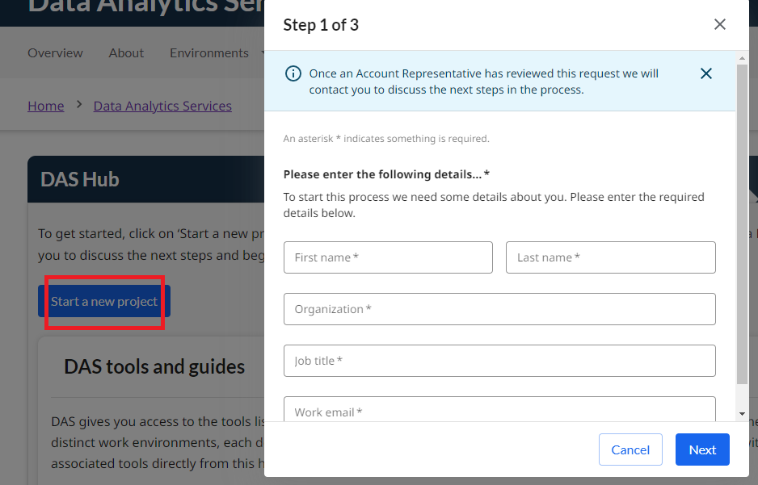

Register here to be part of the Data Analytics as a Service (DAaaS) Early Adopter Community. Go to the Data Analyitics Services (DAS) Portal and click on "Get Started".
 
[https://www.statcan.gc.ca/data-analytics-services](https://www.statcan.gc.ca/data-analytics-services)

If you have already been given access to the platform, see [How to login](Login.md) for more information.

Before you sign in you may see the ***Get started*** button.
If you click that button you will be requested to login.
            

Once on the hub page, you have the option to register a new project by clicking the ***Start a New project*** button
            
