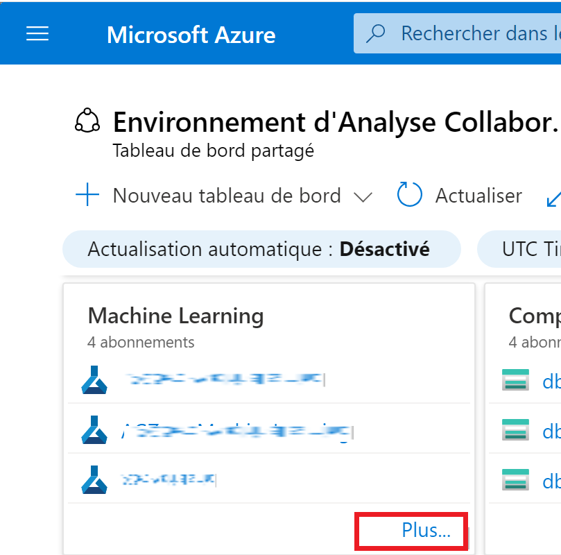

_[English](../en/AzureML)_
# Azure Machine Learning
## Accès à Azure Machine Learning
### Tableau de bord

Consultez la section  [Tableau de bord](Dashboards.md) de cette documentation pour obtenir de plus amples renseignements..  
1. 	Cliquez sur le menu **Tableau de bord** du portail Azure. L’affichage par défaut pourrait déjà correspondre au tableau de bord.  


2. Sous **Machine Learning** (apprentissage automatique), sélectionnez l’espace de travail Machine Learning qui a été créé pour vous. Si l’espace de travail que vous souhaitez ouvrir n’est pas répertorié, cliquez sur **Plus…** pour accéder à la liste complète.




### Portail Azure

1.	Dans la boîte de recherche du portail Azure, cherchez **Machine Learning**.
 
2.	Vous devriez voir une liste des espaces de travail Machine Learning auxquels vous avez été autorisé à accéder. Sélectionnez l’**espace de travail Machine Learning** auquel vous souhaitez accéder
  

### Adresse de Machine Learning
1.	Allez sur https://ml.azure.com/, connectez-vous avec les justificatifs d’identité de votre compte d’infonuagique, puis sélectionnez l’abonnement **vdl** et l’**espace de travail Machine Learning** qui a été créé pour vous.


### Pour commencer
1.	À la page **Vue d’ensemble** de l’apprentissage automatique, cliquez sur **Lancer le studio**.
   
2.	Utilisez le menu déroulant pour sélectionner l’abonnement **vdl** et l’**espace de travail Machine Learning** auquel vous souhaitez accéder, puis cliquez sur Démarrer.
 
3.	Une fois dans votre espace de travail Machine Learning, vous pouvez former, déployer et gérer des modèles d’apprentissage automatique, utiliser AutoML et utiliser des pipelines. [Voir le Guide de démarrage](https://docs.microsoft.com/fr-fr/azure/machine-learning/) rapide pour obtenir de plus amples renseignements.
  

## Utilisation de la fonction indépendante notebook d’Azure Machine Learning
### Exigences
Une instance de calcul dans Azure Machine Learning est nécessaire. Vous devriez la voir sous **Calculer --> Instances de calcul**.
**Note** : Si une instance de calcul n’a pas été créée pour vous, veuillez communiquer avec l’équipe de soutien au moyen de [Slack](https://cae-eac.slack.com/).
### Étapes
1.	Sous **Notebooks**, créez un nouveau notebook dans votre répertoire d’utilisateur. Vous pouvez ensuite saisir le code à exécuter.
 
2.	Sélectionnez l’**instance de calcul** qui vous est attribuée.
 
3.	Cliquez sur le bouton **Démarrer le calcul et exécuter toutes les cellules** pour exécuter votre code.


## Utilisation de Databricks Connect comme ordinateur à distance
**Avertissement** : Veuillez noter que la configuration de Databricks Connect présentée ci-dessous est en cours de révision et qu’elle changera probablement dans un avenir proche.
### Exigences
Une instance de calcul dans Azure Machine Learning est nécessaire. Vous devriez la voir sous **Calculer --> Instances de calcul**.
**Note** : Si une instance de calcul n’a pas été créée pour vous, veuillez communiquer avec l’équipe de soutien au moyen de [Slack](https://cae-eac.slack.com/).
### Étapes
1.	Sous **Notebooks**, ouvrez **Terminal**.
 
2.	Sélectionnez votre **instance de calcul** dans le menu déroulant à côté de **Calculer**.
3.	Exécutez le code à partir de la page [Databricks Connect Setup](https://github.com/StatCan/cae-eac/blob/master/Examples/AzureML/Databricks-Connect-Setup.txt) dans le terminal tout en suivant les directives pour continuer selon les besoins. Ce code installe Python 3.7 et met en place un nouveau noyau pour les notebooks d’Azure Machine Learning.


    Lorsque vous y êtes invité, entrez les valeurs suivantes pour configurer Databricks Connect :

     **Hôte** : l’URL de la page **Vue d’ensemble** pour votre espace de travail Databricks
     

      **Jeton** : le [jeton d’accès personnel](https://docs.microsoft.com/fr-ca/azure/databricks/dev-tools/api/latest/authentication#--generate-a-personal-access-token) généré dans les paramètres utilisateur de votre espace de travail Databricks

     **ID de grappe** : la valeur indiquée sous **Instance de calcul --> Options avancées--> Étiquettes** dans votre espace de travail Databricks
     

    **ID de l’organisation** : la partie de l’URL de Databricks qui se trouve après **.net/?o=**  
    

    **Port** : conserver la valeur existante

4.	Exécutez le code suivant dans le terminal pour tester la connexion avec Azure Databricks.
 ```
databricks-connect test (databricks - test de connexion)
 ```
5.	Créez un nouveau notebook avec l’espace de travail Azure Machine Learning et sélectionnez noyau Python 3. La version Python 3.7.9 devrait maintenant s’afficher.
 
6.	Databricks Connect devrait maintenant être configuré! Essayez le code échantillon Databricks Connect dans le bloc-notes, en remplaçant public-data/incoming/1test.txt par le chemin d’accès à un fichier dans votre conteneur de lac de données.

# Demander un calcul
Veuillez utiliser [slack](https://cae-eac.slack.com) pour demander un calcul à distance. Vous recevrez l'erreur suivante si vous procédez à la création par vous-même:


# Changer la langue d'affichage
Voir la page [Langue](Langue.md) pour savoir comment changer la langue d'affichage.
