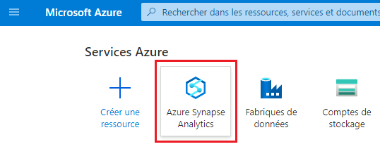
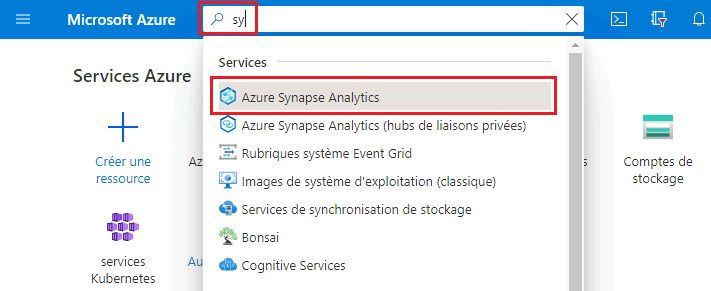
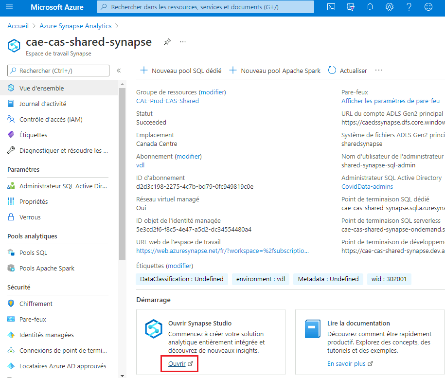
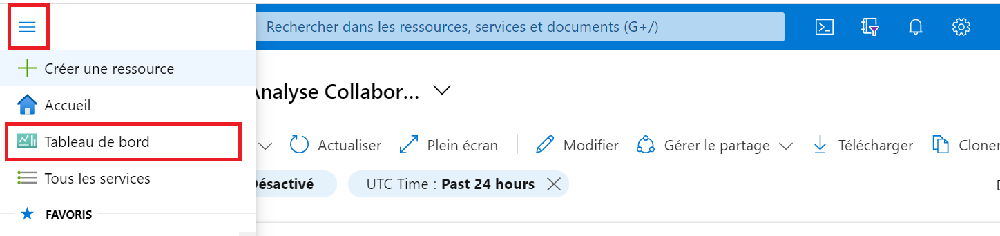
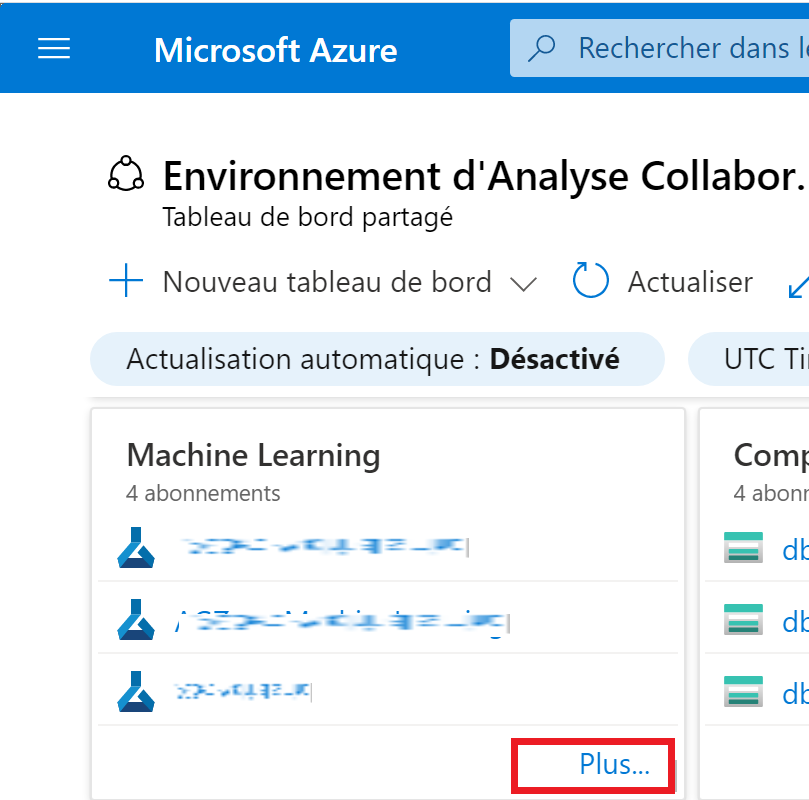
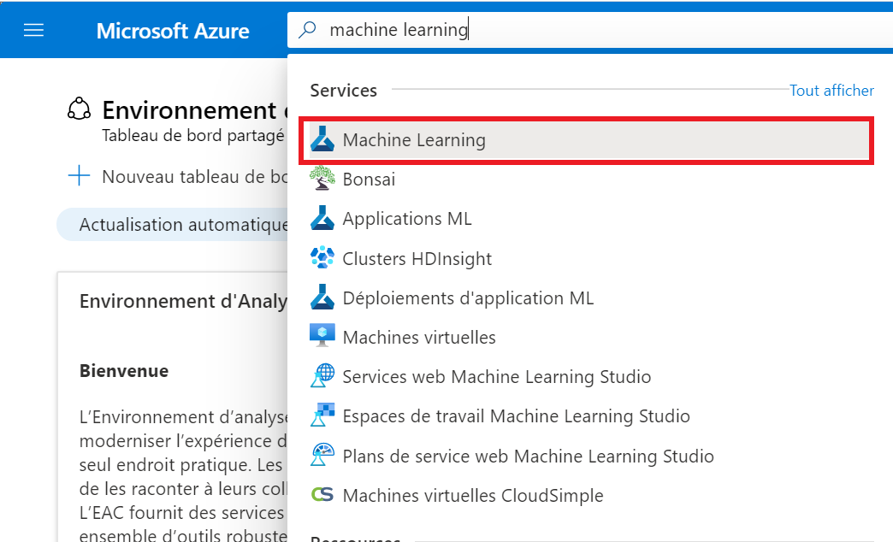
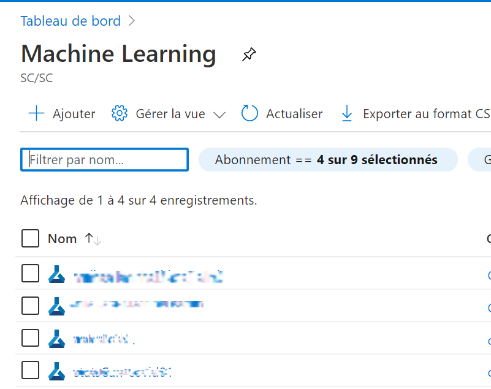
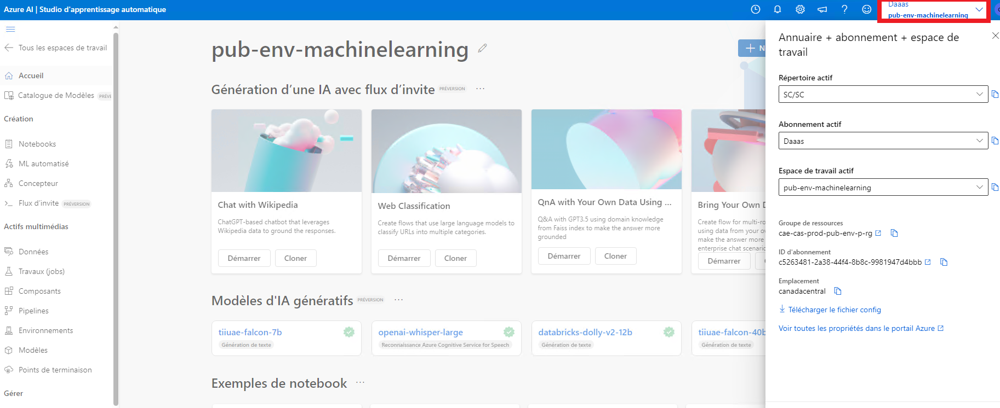

### Tableau de bord

Consultez la [section Tableau de bord](TableauxDeBord.md)
de cette documentation pour obtenir de plus amples renseignements.

1. Cliquez sur le menu **Tableau de bord** dans le portail Azure.

    
  

## Accéder à Databricks- Utilisateurs internes

1.  Dans la boîte de recherche du portail Azure, recherchez **Databricks**.

    

2.  Vous devriez alors voir une liste des espaces de travail Databricks auxquels vous pouvez accéder.

    

## Accéder à Synapse- Utilisateurs internes
Il est recommandé aux utilisateurs de Statistiques Canada d'accéder aux différents service à partir de leur [Bureau Virtuel Azure](BVA.md)
1.	Assurez-vous que vous utilisez votre machine virtuelle en nuage pour accéder à Azure Synapse. Reportez-vous à la rubrique [Machines virtuelles](VirtualMachines.md) pour savoir comment en créer une si nécessaire.

2. Dans votre machine virtuelle, ouvrez un navigateur Web et accédez au [portail Azure](https://portal.azure.com). Ouvrez une session à l’aide des données d’identification de votre compte en nuage.

3. 
    a. Cliquez sur l’icône **Azure Synapse Analytics** sous **Services Azure**. Si vous ne voyez pas cette icône, suivez plutôt l’étape 3b.
    
    

    b. Commencez à taper "synapse" dans la barre de recherche pour trouver **Azure Synapse Analytics**.
    
     

4. Repérez votre espace de travail Synapse dans la liste, puis cliquez dessus. Cliquez ensuite sur **Ouvrir Synapse Studio**.

   

Note: Vous pouvez également accéder aux espaces de travail Synapse à partir du tableau de bord **Environnement d’analyse collaborative**.

<!-- *New:* Please access Azure ML form your CAE [Virtual Machine](VirtualMarchine.md). -->

## Accéder à Azure Machine Learning- Utilisateurs internes
Il est recommandé aux utilisateurs de Statistiques Canada d'accéder aux différents service à partir de leur [Bureau Virtuel Azure](BVA.md)
### Tableau de bord

Consultez la section  [Tableau de bord](TableauxDeBord.md) de cette documentation pour obtenir de plus amples renseignements..  

1. 	Cliquez sur le menu **Tableau de bord** du portail Azure. L’affichage par défaut pourrait déjà correspondre au tableau de bord.  

    

2. Sous **Machine Learning** (apprentissage automatique), sélectionnez l’espace de travail Machine Learning qui a été créé pour vous. Si l’espace de travail que vous souhaitez ouvrir n’est pas répertorié, cliquez sur **Plus…** pour accéder à la liste complète.

    

### Portail Azure
1.	Dans la boîte de recherche du portail Azure, cherchez **Machine Learning**.

    

2.	Vous devriez voir une liste des espaces de travail Machine Learning auxquels vous avez été autorisé à accéder. Sélectionnez l’**espace de travail Machine Learning** auquel vous souhaitez accéder

    

### Adresse de Machine Learning

1.	Allez sur [Machine Learning](https://ml.azure.com/), connectez-vous avec les justificatifs d’identité de votre compte d’infonuagique, puis sélectionnez l’abonnement **vdl** et l’**espace de travail Machine Learning** qui a été créé pour vous.
    
    