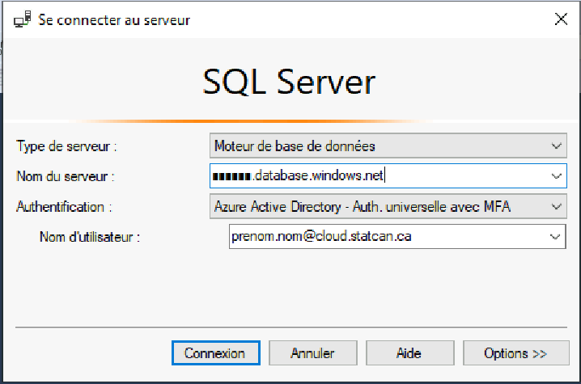
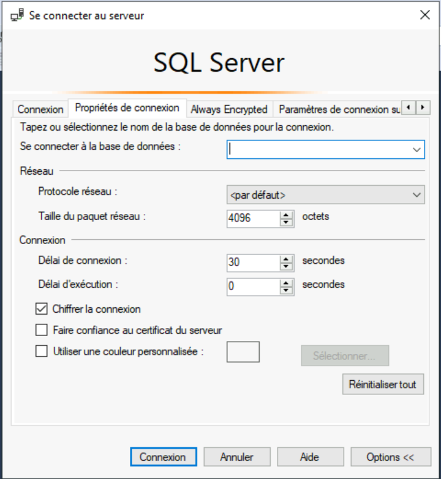

_[English](../../en/AzureSQL)_
# Base de données Azure SQL
Une base de données Azure SQL peut être créée à l'avance si vous en avez besoin pour votre projet.

**Rappel**: Les bases de données Azure SQL de l'Environnement d'Analyse Collaborative (EAC) sont seulement disponibles à partir de l'environnement infonuagique de l'EAC. Vous ne pouvez y accéder à partir des centres de données du gouvernement du Canada.

## Accès à une base de données Azure SQL

### Azure Data Factory
On peut créer un service lié dans Azure Data Factory. Configurez le service lié pour se connecter via le runtime d'intégration auto-hébergé et utilisez **Identité managée** comme **Méthode d'authentification**. Veuillez communiquer avec l'équipe de soutien par l'intermédiaire du canal https://cae-eac.slack.com si vous avez besoin d'aide.

### Databricks
On peut configurer un carnet Databricks pour ouvrir une connexion à la base de données. Puisque ceci exige une configuration additionnelle, veuillez faire une demande auprès de l'équipe de soutien par l'intermédiaire du canal https://cae-eac.slack.com.

### Machine virtuelle
Vous pouvez vous connecter à une base de données Azure SQL à partir de votre machine virtuelle en infonuagique, en utilisant une application telle que: 
1. SQL Server Management Studio 
2. Power BI Desktop
3. Azure Data Studio
4. Visual Studio ou Visual Studio Code

#### Prérequis

1.  Une **machine virtuelle** dans l'EAC. Voir la page [Machines Virtuelle](VirtualMachines.md) pour plus d'informations.
2.  **SQL Server Management Studio** ou un autre outil tel que **Power BI Desktop**. Ces outils sont offerts par défaut dans les images de machine virtuelle **Data Science Virtual Machine**.

#### Étapes

1.  Connectez-vous à votre **machine virtuelle** dans l'EAC.

2.  Lancez un outil tel que **SQL Server Management Studio**.

3.  Choisissez **Azure Active Directory - Auth.universelle avec MFA** comme type d'Authentication.

4.  Entrez le **nom de votre serveur SQL** puis entrez votre **compte Cloud** comme nom d'utilisateur.
    

5. Cliquez sur le bouton **Options**.

6.  Sous l'onglet **Propriétés de Connexion**, selectionnez le nom de la base de données en face du libellé **Se connecter à la base de données**, puis cliquez sur le bouton de **Connexion**.

    

7. Effectuer l'authentication avec les paramètres d'identification de votre compte Cloud.

# Changer la langue d'affichage
Voir la page [Langue](Langue.md) pour savoir comment changer la langue d'affichage.
