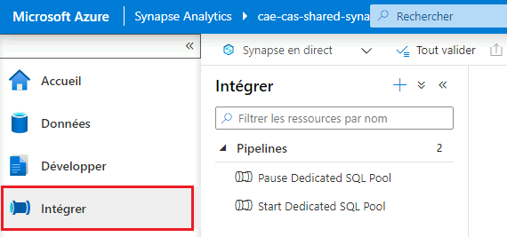
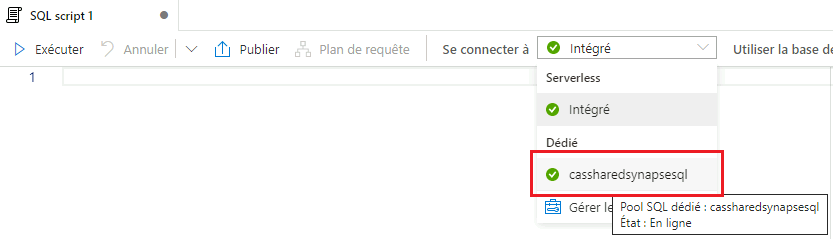
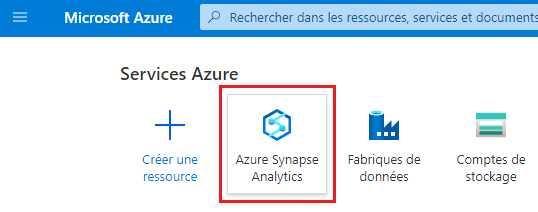

## Pour commencer

### Démarrer et arrêter un pool SQL dédié

1. Cliquez sur l’onglet **Intégrer**.

   

2. Sous **Pipelines**, cliquez soit sur **Start Dedicated SQL Pool**, soit sur **Pause Dedicated SQL Pool**. Ensuite, cliquez sur le bouton de déclenchement pour ouvrir un menu, puis sélectionnez **Déclencher maintenant**. À l’écran suivant, cliquez sur **OK**.

  

##  Accueil

L’onglet **Accueil** est l’endroit où vous commencez lorsque vous ouvrez Azure Synapse Studio pour la première fois.

À partir de cet endroit, vous pouvez accéder à des raccourcis pour des tâches courantes telles que la création de scripts SQL ou de notebooks en cliquant sur le bouton du menu déroulant **Nouveau**. Les ressources récemment ouvertes sont également affichées.

##  Données

L’onglet Données est l’endroit où vous pouvez explorer tout ce qui se trouve dans votre base de données et les jeux de données liés.

Sous l’onglet **Espace de travail**, vous pouvez explorer la base de données du pool SQL dédié ainsi que toutes les bases de données Spark.

Sous l’onglet **Lié**, vous pouvez explorer des objets externes (p. ex. comptes Data Lake) et explorer et créer tous jeux de données d’intégration à partir de données externes liées (p. ex. Data Lake, stockage Blob, service Web) à utiliser dans les pipelines.

### Comment introduire des données à partir de services liés

**Note**: Cet exemple montre comment obtenir des données à partir de Data Lake, bien qu’il y ait de nombreux types de sources disponibles.

1. Cliquez sur le bouton « **+** » pour ajouter une nouvelle ressource, puis cliquez sur **Jeu de données d’intégration**.

   

2.	Sélectionnez **Azure Data Lake Storage Gen2** (pour ce faire, vous devrez peut-être effectuer une recherche), puis cliquez sur **Continuer**. 

   

3.	Sélectionnez le type de format, puis cliquez sur **Continuer**.

4.	Saisissez un nom, puis cliquez sur le menu déroulant sous **Service lié**. Sélectionnez ensuite votre lac de données.

   

5.	Sous **Runtime d’intégration**, assurez-vous que la création interactive est activée. Dans la négative, cliquez sur le bouton d’édition pour l’activer, puis cliquez sur **Appliquer**.

   

6. Définissez des propriétés supplémentaires comme il convient, puis cliquez sur **OK**.

### Comment explorer les données dans le lac de données

Recherchez votre fichier de données (CSV, Parquet, JSON, Avro, etc.) et faites un clic droit dessus. Un menu s’ouvre avec des options permettant d’avoir un aperçu des données ou de créer des ressources telles que des scripts SQL et des notebooks.

   

### Comment explorer le pool SQL dédié

Sous l’onglet **Espace de travail**, vous pouvez explorer les bases de données de manière similaire à SQL Server Management Studio. Cliquez avec le bouton droit de la souris sur n’importe quel tableau, mettez en surbrillance **Nouveau script SQL**, puis cliquez sur **Sélectionner les 100 premières lignes** pour créer une nouvelle requête. Vous pouvez ensuite afficher les résultats sous forme de tableau ou de graphique.

   

### Importation de données vers le pool SQL dédié

Pour importer des données vers le pool SQL dédié, vous pouvez soit:
-	**créer un pipeline avec une activité de copie de données** (la plus efficace pour les grands jeux de données);
-	utiliser l’assistant [Chargement en masse](https://docs.microsoft.com/en-us/azure/synapse-analytics/quickstart-load-studio-sql-pool).

##  Développer

À partir de là, vous pouvez créer et enregistrer des ressources telles que des scripts SQL, des notebooks et des rapports Power BI.

Pour ajouter une nouvelle ressource, cliquez sur le bouton «**+**». Un menu déroulant s’ouvre.

   

Pour rendre vos modifications visibles aux autres, vous devez cliquer sur le bouton **Publier**.

### Scripts SQL

Assurez-vous de vous connecter à votre pool SQL dédié pour exécuter des scripts SQL.

   

### Notebooks

Pour exécuter les cellules notebook, vous devez d’abord sélectionner votre pool Apache Spark.

   

Pour changer de langue pour une seule cellule, vous pouvez utiliser les commandes magiques suivantes : %%pyspark, %%spark, %%csharp et %%sql. Vous pouvez également modifier la langue par défaut à l’aide du menu déroulant **Langue**.

   

### Flux de données

Pour ajouter une source à un flux de données, cliquez sur le bouton «**+**» sous **Paramètres de la source**, puis sélectionnez **Azure Data Lake Storage Gen2** (pour ce faire, vous devrez peut-être effectuer une recherche). Cliquez sur **Continuer**, sélectionnez le format de données, puis, sur la page suivante, sélectionnez votre service lié.

   

### Rapports Power BI

Vous pouvez afficher et créer des rapports Power BI directement dans Azure Synapse. Veuillez communiquer avec l’équipe d’assistance de l’Environnement d’analyse collaborative pour valider qu’un service lié est configuré.

##  Intégrer

C’est ici que vous pouvez créer des pipelines pour ingérer, préparer et transformer toutes vos données, comme dans [Azure Data Factory](DataFactory.md). 

### Exemple : Copier les données d’un blob externe vers un lac de données
1. Cliquez sur le bouton «**+**» pour ajouter une nouvelle ressource, puis cliquez sur **Pipeline**.

   

2. Sous **Déplacer et transformer**, faites glisser et déposez **Copier les données** dans la fenêtre.

   

3. Cliquez sur l’onglet **Source**, puis cliquez sur **Nouveau** pour ajouter le jeu de données source (d’où vous voulez copier les données).

   

4. Sélectionnez **Azure Blob Storage**, puis sélectionnez le type de format (CSV, Parquet, JSON, etc.). Définissez toute propriété supplémentaire si nécessaire, puis cliquez sur **OK**.

5. Cliquez sur **Récepteur**, puis sur **Nouveau** pour définir le jeu de données récepteur (où vous souhaitez que les données soient copiées). Choisissez **Azure Data Lake Storage Gen2**, puis sélectionnez le type de format. Sous **Service lié**, choisissez votre lac de données et assurez-vous que la création interactive est activée (voir **Comment introduire des données à partir de services liés** sous **Données** pour de plus amples renseignements).

### Débogage et exécution des pipelines

Pour exécuter un pipeline en mode débogage, cliquez sur le bouton **Déboguer** en haut de la fenêtre du pipeline. Les résultats figureront dans l’onglet **Sortie**.
  
  

Pour exécuter un pipeline sans déboguer, cliquez sur le bouton **Ajouter un déclencheur**, puis sur **Déclencher maintenant**.

Lorsque vous êtes prêt à publier vos pipelines, cliquez sur le bouton **Tout valider**, puis sur **Tout publier**. Il est à noter que cette publication permettra à l’ensemble des utilisateurs de voir tout ce que vous avez actuellement ouvert (pipelines, scripts SQL, notebooks, etc.).

  

##  Superviser

À partir de l’onglet Superviser, vous pouvez superviser les exécutions en direct du pipeline (les entrées et les sorties de chaque activité et les éventuelles erreurs) et afficher l’historique des exécutions du pipeline, des déclencheurs, des requêtes SQL, etc.

##  Gérer

C’est ici que vous pouvez :
-	ajouter de nouveaux pools SQL ou Apache Spark;
-	ajouter de nouveaux services liés;
-	accorder à d’autres personnes l’accès à l’espace de travail;
-	configurer l’intégration de Git.

## Documentation Microsoft

- [Azure Synapse Analytics](https://docs.microsoft.com/fr-ca/azure/synapse-analytics/)
- [Qu’est-ce qu’Azure Synapse Analytics?](https://docs.microsoft.com/fr-ca/azure/synapse-analytics/overview-what-is) 
- [Analyser des données avec des pools SQL dédiés](https://docs.microsoft.com/fr-ca/azure/synapse-analytics/get-started-analyze-sql-pool)
- [Intégrer avec des pipelines](https://docs.microsoft.com/fr-ca/azure/synapse-analytics/get-started-pipelines)
- [Visualiser des données avec Power BI](https://docs.microsoft.com/fr-ca/azure/synapse-analytics/get-started-visualize-power-bi)
- [Surveiller votre espace de travail Synapse](https://docs.microsoft.com/fr-ca/azure/synapse-analytics/get-started-monitor)

# Changer la langue d’affichage
Consultez la page [Langue](Language.md) pour savoir comment modifier la langue d’affichage.

<!-- 

### Accéder à Azure Synapse

1.	Assurez-vous que vous utilisez votre machine virtuelle en nuage pour accéder à Azure Synapse. Reportez-vous à la rubrique [Machines virtuelles](VirtualMachines.md) pour savoir comment en créer une si nécessaire.

2. Dans votre machine virtuelle, ouvrez un navigateur Web et accédez au [portail Azure](https://portal.azure.com). Ouvrez une session à l’aide des données d’identification de votre compte en nuage.

3. 
    a. Cliquez sur l’icône **Azure Synapse Analytics** sous **Services Azure**. Si vous ne voyez pas cette icône, suivez plutôt l’étape 3b.
    
    

    b. Commencez à taper "synapse" dans la barre de recherche pour trouver **Azure Synapse Analytics**.
    
     

4. Repérez votre espace de travail Synapse dans la liste, puis cliquez dessus. Cliquez ensuite sur **Ouvrir Synapse Studio**.

   

Note: Vous pouvez également accéder aux espaces de travail Synapse à partir du tableau de bord **Environnement d’analyse collaborative**. -->