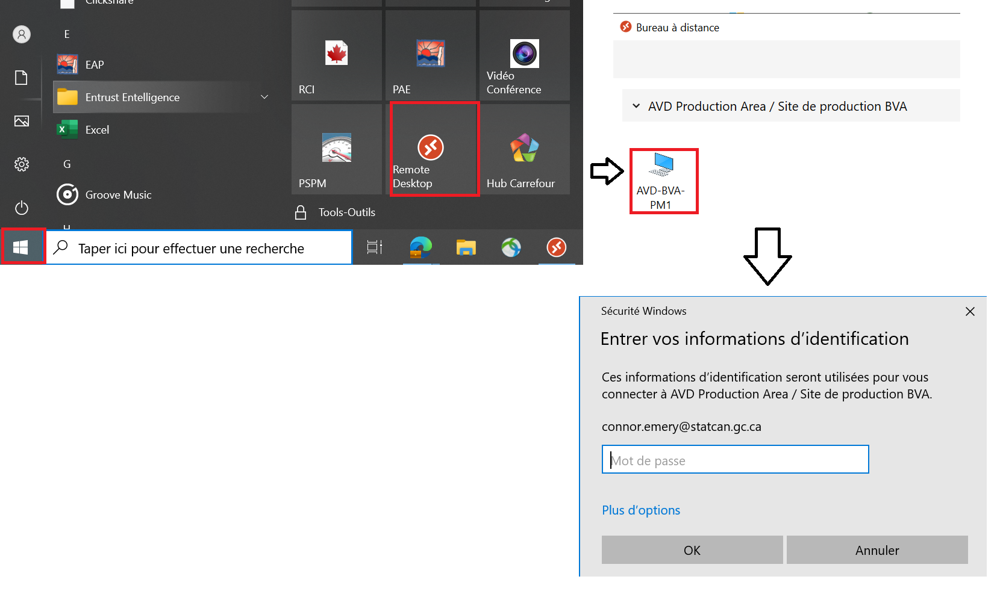

## Bureau Virtuel Azure
Les employés de Statistiques Canada ont accès au Bureau Virtuel Azure sur leur ordinateur de travail. Ils peuvent utiliser leur compte statcan.gc.ca pour se connecter au Bureau Virtuel Azure.

1. Pour pouvoir se connecter au Bureau Virtuel Azure, vous aurez besoin de votre identifiant statcan: **firstname.lastname@statcan.gc.ca**

2. Vous devrez vous connecter à votre environement  à partir du Bureau Virtuel Azure (BVA).
A partir de la barre de recherche Windows, vous pouvez accéder à l'application de bureau à distance et sélectionner votre BVA et entrer votre identifiant et votre mot de passe du réseau A comme le montre l'image ci-dessous.

     
    
3. Une fois connecté, vous pouvez accéder aux services à partir du [Tableau de bord Azure](TableauxDeBord.md) 
