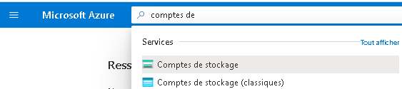
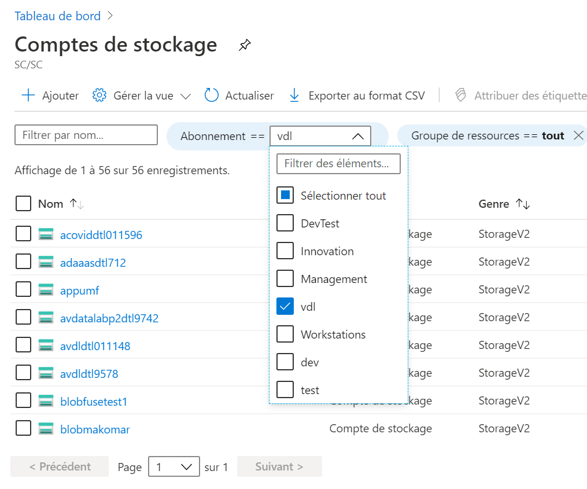

# Stockage Azure - Employés de Statistiques Canada

Les données peuvent être téléversées sur la plateforme par l'entremise du portail Azure ou de l'application Explorateur de stockage Azure. Une
fois qu'elles auront été téléversées dans un compte de stockage externe **Blob Azure**, elles seront automatiquement ingérées dans un compte de
stockage interne **Azure Data Lake Storage (ADLS)**. Lorsque les données seront dans Data Lake, les utilisateurs pourront choisir des outils de
transformation et d'intégration. Ils pourront utiliser des outils Web, comme Databricks et Data Factory, pour effectuer des transformations ou
des outils de bureau sur une machine virtuelle pour transformer et analyser les données. Les données nettoyées et transformées pourront
être placées dans différents dossiers (contenant des ensembles de données traitées ou de meilleure qualité) ou téléversées dans une base
de données. Les utilisateurs seront de nouveau en mesure de se connecter à ces données à l'aide des outils qu'ils souhaiteront utiliser, et ce, à
partir de leur machine virtuelle ou d'autres services offerts sur la plateforme, tels que Databricks et Data Factory.

En utilisant votre [Bureau Virtuel Azure](BVA.md), vous pouvez accéder à votre espace de stockage infonuagique.

## Explorateur de stockage

1. Si vous n'avez pas l'explorateur de stockage installé dans votre Bureau Virtuel Azure, vous pouvez en faire la demande avec le  [Portail de Gestion des Demandes de Service (GDS)](https://srm.statcan.ca/) _Uniquement pour les employés de Statistiques Canada_. Selectionnez ce qui suit:
-  Type de Demande: "Soutien aux postes de travail"
-  Sujet: "Bureau Virtuel (BVA/AVD, VDI)"
-  Sous-sujet: "Bureau Virtuel Azure - BVA/AVD (Créer ou Modifier)"
-  Description: "J'aimerais obtenir un Bureau Virtuel Azure avec l'explorateur de Stockage installé"

2. Sur votre Bureau Virtuel Azure, vous serez en mesure d'accéder à vos espaces de stockage en utilisant [l'explorateur de Stockage Azure](AzureStorageExplorer.md)

## Portail Azure 

1.  Accédez au compte de stockage (aperçu) Storage Account (Preview) à partir du portail Azure.

    

2.  Sélectionnez votre type d'abonnement, puis naviguez dans votre compte de stockage.

    

Questions Frequemment posées (FAQ)
1. J'obtiens l'erreur suivante en essayant d'accéder à mon espace de stockage.

   
   Assurez vous d'accéder à l'espace de stockage à partir de votre Bureau Virtuel Azure (BVA) et non directement à partir de votre appareil de travail fourni par le gouvernement.

## Documentation Microsoft

- [Téléchargez l'Explorateur de stockage Azure](https://azure.microsoft.com/fr-fr/features/storage-explorer/)
- [Démarrage rapide : Charger, télécharger et lister les objets blob avec le portail Azure](https://docs.microsoft.com/fr-fr/azure/storage/blobs/storage-quickstart-blobs-portal)

<!-- 2. Launch Azure Storage Explorer from the Start menu.

      

3. Login with your Azure Account.  

     

4. Enter your credentials

     
 -->

<!-- ## Storage Explorer - Network B VDI
_This section is for Statistics Canada employees who need to upload data from Network B._  
1. Download the [Azure Storage Explorer](https://azure.microsoft.com/en-us/features/storage-explorer/) application, and install it on your Network B VDI. 
2. Launch Azure Storage Explorer from the Start menu.  
3. On a Network B VDI, you can only access your storage account with a temporary SAS token. Please contact the support team through the Slack channel to obtain one.  

**Note:** See the [FAQ](FAQ.md) for information on configuring Network B proxy settings.

## Microsoft Documentation
- [Azure Storage Explorer Download](https://azure.microsoft.com/en-us/features/storage-explorer/)  
- [Quickstart: Upload, download, and list blobs with the Azure portal](https://docs.microsoft.com/en-us/azure/storage/blobs/storage-quickstart-blobs-portal)  -->
