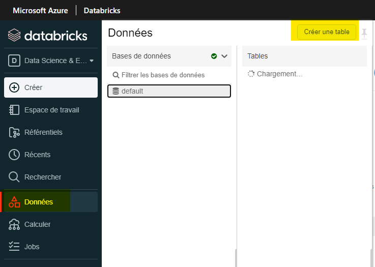

_[English](../../en/BestPractices)_

# Bonnes pratiques 

## Quel est le meilleur format de fichier à utiliser pour les fichiers de données volumineux? 
Il est recommandé d'utiliser un format plus récent comme Parquet, car il enregistre des ensembles de dates plus volumineux dans un fichier plus petit par rapport à un fichier CSV. Si vous n'accédez qu'à certaines sections de l'ensemble de données, il est également plus rapide d'utiliser Parquet car il utilise un format de stockage en colonnes.

## Ai-je besoin d'une base de données SQL?
Dans de nombreux cas, une base de données SQL n'est pas nécessaire, les données peuvent être enregistrées dans des fichiers sur le datalake.

## Ai-je besoin d'une base de données SQL lorsque j'utilise Power BI?
Il n'est pas nécessaire d'avoir une base de données SQL lors de l'utilisation de Power BI. Vous pouvez lire des fichiers à partir du stockage Azure. Une base de données n'est nécessaire que lorsque vous utilisez un système similaire à un schéma en étoile plus complexe.

Pour vous connecter au lac de données interne avec Power BI Desktop, veuillez vous référer à ce lien :
[Comment puis je me connecter au compte de stockage interne data lake avec power bi desktop](https://statcan.github.io/cae-eac/fr/FAQ/#comment-puis-je-me-connecter-au-compte-de-stockage-interne-data-lake-avec-power-bi-desktop)

## Comment devons-nous structurer le conteneur de lac de données de nos projets?
Il y a 4 parties dans lesquelles structurer votre conteneur de lac de données :

### **Zone Bronze/Brute**
Cette zone stocke le format d'origine de tous les fichiers ou fichiers/données qui sont immuables. Les données contenues dans cette zone sont généralement verrouillées et ne sont accessibles qu'à certains membres ou sont en lecture seule. Cette zone est également organisée en différents dossiers par système source, chaque processus d'ingestion n'ayant un accès en écriture qu'à son dossier associé.

### **Zone Argent/Nettoyée**
Cette zone est l'endroit où des parties de données suppriment les colonnes inutiles des données, valide, standardise et harmonise ces données au sein de cette zone. Cette zone est principalement un dossier par projet. Toutes les données auxquelles il faut accéder dans cette zone bénéficient généralement d'un accès en lecture seule.

### **Zone Or/Curé**
Cette zone est principalement destinée à l'analyse plutôt qu'à l'ingestion ou au traitement de données. Les données de la zone organisée sont stockées dans des schémas en étoile. La modélisation dimensionnelle est généralement effectuée à l'aide de Spark ou de Data Factory au lieu de l'intérieur du moteur de base de données. Mais si la modélisation dimensionnelle est effectuée à l'extérieur du lac, il est préférable de publier le modèle dans le lac. Cette zone est la mieux adaptée pour exécuter des requêtes et des analyses à grande échelle qui n'ont pas de besoins stricts en matière de rapports sensibles au temps.

### **Zone Laboratoire**
Cette zone est principalement destinée à l'expérimentation et à l'exploration. Il est utilisé pour le prototype et l'innovation en mélangeant à la fois vos propres ensembles de données avec des ensembles de données de production. Cette zone ne remplace pas un lac de données de développement ou de test requis pour un développement plus minutieux. Chaque projet de lac de données wil aurait sa propre zone de laboratoire via un dossier. Les autorisations dans cette zone sont généralement en lecture et en écriture pour chaque utilisateur/projet.

Pour plus d'informations sur la structuration du conteneur de lac de données de vos projets :

[Construire votre Data Lake sur Azure Data Lake Storage gen2](https://medium.com/microsoftazure/building-your-data-lake-on-adls-gen2-3f196fc6b430)
[Concevoir Azure Data Lake Storage](https://www.mssqltips.com/sqlservertip/6807/design-azure-data-lake-store-gen2/)

## Je reçois une exception de mémoire insuffisante dans Databricks?

### **Option 1:**
Le moyen le plus rapide et le plus coûteux de résoudre ce problème consiste à augmenter la taille de votre cluster.

Pour augmenter la taille du cluster, veuillez contacter l'équipe d'assistance CAE pour augmenter la taille du cluster.

### **Option 2:**
Pour une réponse plus programmatique, si vous utilisez des pandas, il est également suggéré de basculer et d'utiliser pySpark ou koalas. PySpark et les koalas peuvent s'exécuter plus rapidement que les pandas, ils ont de meilleurs avantages à utiliser des pipelines d'ingestion de données et fonctionnent également efficacement car ils s'exécutent en parallèle sur différents nœuds d'un cluster.

[Opérations Spark Dataframe](https://www.analyticsvidhya.com/blog/2016/10/spark-dataframe-and-operations/)

### **Option 3:**
Pensez à utiliser un sous-ensemble de vos données lorsque vous effectuez des requêtes si possible. Si vous ne travaillez qu'avec une certaine section de l'ensemble de données mais que vous l'interrogez sur l'ensemble, il est possible d'utiliser uniquement le sous-ensemble.

### **Option 4:**
Envisagez de changer le format de fichier en quelque chose comme Parquet ou Avro qui utilise moins d'espace qu'un fichier CSV traditionnel.

Conversion de CSV en parquet:
```python
%python

testConvert = spark.read.format('csv').options(header='true', inferSchema='true').load('/mnt/public-data/incoming/titanic.csv')
testConvert.write.parquet("/mnt/public-data/incoming/testingFile")
```

Conversion de CSV en Avro:
```python
%python

diamonds = spark.read.format('csv').options(header='true', inferSchema='true').load('/mnt/public-data/incoming/titanic.csv')
diamonds.write.format("avro").save("/mnt/public-data/incoming/testingFile")
```

## Comment puis-je facilement convertir le code SAS en Python ou R?
Il n'est pas possible de convertir facilement le code SAS en Python ou R automatiquement, le seul moyen connu de convertir est de faire manuellement la conversion.

## Comment puis-je valider que je développe mon application de la manière la plus rentable dans le cloud à l'aide des technologies Microsoft (CAE)?
Il existe de nombreuses façons de valider que votre développement est le plus rentable possible:

1. Profitez de Spark dans les databricks.

    a. Spark est un excellent ajout aux databricks qui s'exécutent plus rapidement et mieux, en particulier pour les grands ensembles de données. Utiliser Spark coûterait moins cher car cela prend moins de temps pour faire sa tâche.

2. Assurez-vous que votre cluster est en cours d'exécution pendant une durée minimale.

    a. Si le cluster n'est plus nécessaire ou n'est pas utilisé, assurez-vous qu'il n'est pas en cours d'exécution et qu'il ne s'exécute que lorsqu'il est nécessaire.

3. Assurez-vous que votre cluster de briques de données est correctement dimensionné.

    a. Assurez-vous que vous devez corriger le nombre de travailleurs dans votre cluster, un trop grand nombre de clusters entraîne un coût plus élevé.

4. Supprimez les fichiers de données que vous n'utilisez pas.

    a. Assurez-vous que tous les fichiers qui ne sont plus nécessaires ou qui ne sont plus utilisés sont supprimés du conteneur.
    
5. Essayez de ne pas effectuer de traitement sur une machine virtuelle cloud.
    
6. Demandez un examen de votre architecture.

7. Revue de code.

8. Si vous utilisez des Pandas, c'est une bonne idée de passer aux Koalas.

9. Utilisez un format de fichier optimal pour votre charge de travail (par exemple, Parquet, Avro)

## Comment les données doivent-elles être structurées si nous prévoyons d'utiliser Power BI?
Les données doivent être structurées à l'aide du schéma en étoile.

Pour plus de détails sur l'utilisation de Star Schema, cliquez sur le lien ci-dessous pour en savoir plus sur l'utilisation de Star Schema et les avantages avec Power BI:

[Documentation du Star Schema](https://docs.microsoft.com/fr-ca/power-bi/guidance/star-schema)

## Comment lire dans un fichier Excel depuis Databricks?
Voici un exemple de lecture d'un fichier Excel à l'aide de Python:

```python
%python
import pandas as pd
pd.read_excel("/dbfs/mnt/ccei-ccie-ext/Daily charts.xlsx", engine='openpyxl')
```

## Quels types de fichiers sont les meilleurs à utiliser quand?
### Parquet  
Il est bon à utiliser pour de très grands ensembles de données. Il est également bon de l'utiliser si seule une section de l'ensemble de données est nécessaire pour lire les données à un rythme plus rapide.

Lire:

```python
%python
data = spark.read.parquet("/tmp/testParquet")
display(data)
```

Écrivez:

```python
%python
//Supposition qu'un cadre de données a déjà été créé

data.write.parquet("/tmp/tempFile")
```

### Avro
Tout comme Parquet, il est idéal pour les très grands ensembles de données. Pour comparer, il est préférable de l'utiliser pour éditer/écrire dans un ensemble de données et pour interroger toutes les colonnes de l'ensemble de données.

Lire:

```python
data = spark.read.format("avro").load("/tmp/test_dataset")
display(data)
```

Écrivez:

```scala
%scala
val ex = Seq((132, "baseball"),
    (148, "softball"),
    (172, "slow pitch")).toDF("players", "sport")
ex.write.format("avro").save("/tmp/testExample")
```

### CSV
Il convient de l'utiliser avec des ensembles de données légèrement plus petits, car les fichiers CSV ne se chargent pas bien lorsque la taille du fichier est très volumineuse. Mais avec des ensembles de données plus petits, c'est simple et lisible par l'homme. Pour écrire dans un fichier CSV, il est également bon de noter que vous pouvez modifier le fichier avec Office.

Lire:

```python
%python
data = spark.read.format('csv').options(header='true', inferSchema='true').load('/tmp/test_dataCSV.csv')
display(data)
```

### Excel
Veuillez voir ci-dessus comment utiliser Excel.

Les autres formats ci-dessus sont préférables à Excel.

## Comment convertir des fichiers (CSV, Text, JSON) en parquet à l'aide de databricks?
La règle de base lors de la conversion d'un fichier en parquet est de d'abord lire le fichier, puis d'écrire un nouveau fichier dans le parquet.

CSV vers Parquet: 
```python
%python

testConvert = spark.read.format('csv').options(header='true', inferSchema='true').load('/mnt/public-data/incoming/titanic.csv')
testConvert.write.parquet("/mnt/public-data/incoming/testingFile")
```

JSON vers Parquet:
```python
%python

testConvert = spark.read.json('tmp/test.json')
testConvert.write.parquet('tmp/testingJson')
```

Text vers Parquet:
```python
%python

testConvert = spark.read.text("/mnt/public-data/incoming/testing.txt")
testConvert.write.parquet("/mnt/public-data/incoming/testingFile")
```

## Puis-je lire un document Word dans Databricks?
Il est préférable de lire les documents Word via Office à la place.

## Quand devons-nous utiliser ADF ou Databricks pour l'ingestion de données?
Databricks est capable de diffuser en temps réel via l'API Apache Spark qui peut gérer les charges de travail d'analyse de streaming. Databricks n'a pas besoin que vous encapsulez le code python dans des fonctions ou des modules exécutables, tout le code peut fonctionner tel quel. Databricks prend également en charge le Machine Learning, ce qui facilite également l'ingestion de données.

Pour tout code qui se trouve déjà dans une fonction Azure ou qui est facilement traduit en un exécutable, l'utilisation de la fabrique de données est utilisable. L'usine de données est également bonne à utiliser s'il s'agit d'un algorithme lourd qui n'est pas utilisable dans Databricks.

## Quelle est la différence entre les tables temporelles de la base de données SQL et Delta Lake?
Les tables temporelles SQL sont spécifiques à SQL 2018 et ne sont actuellement pas disponibles dans Azure Synapse. D'autre part, Delta Lake est disponible à la fois dans Azure Synapse et dans Databricks. Une autre différence est que les tables temporelles SQL ne sont disponibles qu'avec des requêtes SQL, tandis que le voyage dans le temps du lac Delta est disponible en Scala, Python et SQL.

## Quand utiliser Power BI ou R-Shiny?
Il est recommandé d'utiliser Power BI sur R-shiny car moins de codage est requis lors de l'utilisation de Power BI. L'utilisation de Power BI présente de nombreux avantages, notamment la quantité supplémentaire de types de graphiques disponibles, la visualisation des données dans des graphiques est plus facile à utiliser dans Power BI par rapport à R-Shiny, la création d'un tableau de bord est plus rapide dans PowerBI, et la facilité de connectivité avec d'autres applications au sein d'Azure.

## Quel est le bon moment pour utiliser Azure Synapse vs ADF et Databricks?
Azure Synapse est utile pour effectuer des requêtes et des analyses de données via le lac de données, effectuer des analyses SQL et un entreposage de données, et utiliser des services supplémentaires comme Power BI. Il est facile d'interroger les données du lac de données à l'aide d'Azure Snapse et vous n'avez pas besoin de monter le lac de données sur l'espace de travail. En ce qui concerne les analyses de données et l'entreposage de données, synapse est préféré car il permet des modèles de données réels complets, fournit toutes les fonctionnalités SQL et utilise également Delta Lake. Synapse inclut également des services directs avec Power BI pour une facilité d'utilisation.

D'autre part, Databricks est préféré lors du développement de l'apprentissage automatique et des transformations en temps réel. Databricks inclut son propre développement d'apprentissage automatique qui inclut des bibliothèques populaires telles que PyTorch, gère la version de MLflow. Databricks est également préféré pour les transformations en temps réel car il utilise le streaming structuré Spark et il vous donne la possibilité de visualiser les modifications des autres utilisateurs en temps réel.

## Quand devrions-nous utiliser un entrepôt de données de base de données SQL par rapport à Delta Lake?
La meilleure pratique serait d'utiliser Delta Lake sur le serveur SQL car il n'utilise pas de ressources de calcul SQL supplémentaires et réduira les coûts globaux du cloud.

## Comment puis-je facilement convertir des fichiers SAS dans un autre format?
Les utilisateurs de Statcan peuvent utiliser SAS sur le réseau interne stats-can pour le convertir en un format de fichier pris en charge. 

Vous pouvez convertir un fichier SAS en CSV ou JSON avec cette méthode:

1. Ouvrez d'abord les databricks et installez le convertisseur sas7bdat dans votre ordinateur portable.

```python
%pip install sas7bdat-converter
```

2. À l'aide de python et de l'éditeur de code de votre choix, saisissez ce code avec le répertoire du fichier dans lequel se trouve le fichier et le répertoire dans lequel vous souhaitez que le fichier de sortie se trouve.

```python
%python

import sas7bdat_converter

file_dicts = [{
    'sas7bdat_file': '/dbfs/mnt/public-data/ToNetA/sas7bdat/tablea_1_10k.sas7bdat',
    'export_file': '/dbfs/mnt/public-data/testFolder/testingConvert.csv',
}]

sas7bdat_converter.batch_to_csv(file_dicts)
```

Vous obtiendrez alors le fichier de sortie dans le répertoire que vous avez spécifié.

Pour plus d'informations sur le convertisseur, veuillez vous référer à ce lien :

[Documentation du sas7bdat](https://pypi.org/project/sas7bdat-converter/)

##  Puis-je convertir un document Word en bloc-notes?
Il n'y a pas de moyen facile de convertir un document Word en bloc-notes.

Une solution manuelle pour convertir un document Word en bloc-notes consiste à copier le code contenu dans le document Word dans un bloc-notes.

## Quelle taille de table dataframe/spark peut-on stocker dans l'espace de travail?
Les tables Spark sont stockées en tant que fichiers parquet et sont stockées dans le compte de stockage interne lié à l'espace de travail Databricks, mais il est recommandé de supprimer la table si elle n'est plus utilisée.

## Quelle est la meilleure façon d'obtenir des fichiers de données dans Azure ML?
Le meilleur moyen serait de télécharger vos fichiers sur le lac de données. Si vous devez ajouter un nouveau compte de stockage cloud, contactez l'équipe CAE pour ajouter le compte de stockage au studio Azure ML.

## Quelle est la différence avec le Machine Learning dans Databricks ou dans Azure ML?
La principale différence entre Azure ML et Databricks réside dans le langage utilisé par chaque application. Azure ML utilise des bibliothèques basées sur python ou R tandis que Databricks utilise la plate-forme Apache Spark et MLFlow.

Azure ML contient également un système de suivi capable de suivre les exécutions individuelles de l'expérience et d'inclure les métriques spécifiques de ce qui doit être vu. Databricks inclut MLflow qui permet également le suivi mais n'offre pas autant de fonctionnalités qu'Azure ML.

À titre de recommandation, il est recommandé d'utiliser Databricks pour la préparation des données et pour les grands ensembles de données, mais d'utiliser Azure ML pour leur système de suivi, l'apprentissage automatique sur les ensembles de données normaux, l'apprentissage profond sur les GPU et l'opérationnalisation.

## Comment créer une table dans Databricks?

### Option 1 : Utiliser la fonction Créer une table
Dans Databricks, sélectionnez Données et dans la base de données que vous avez sélectionnée, cliquez sur Créer une table. 



Pour plus d'informations sur cette option, veuillez consulter ce lien :

[Databricks créer un tableau](https://docs.databricks.com/data/tables.html#create-a-table)

### Option 2 : Créer une table à partir d'une table Dataframe
Python:

```python
df.write.saveAsTable("Table-Name")
```

SQL:

```sql
CREATE TABLE IF NOT EXISTS Table-Name AS 
SELECT * FROM df
```

### Option 3: Create Table Programatically

SQL:
```
CREATE TABLE example (id INT, name STRING, age INT) USING CSV;
```

## Quand utiliser Spark Dataframe ou Spark Table?
Il n'y a vraiment aucune différence entre l'utilisation d'un Spark Dataframe ou Spark Table.

Actuellement avec Databricks, la meilleure pratique en ce moment serait de stocker les tables en tant que tables delta car elles sont enregistrées au format parquet et donnent les capacités de suivi.

## Que dois-je faire si la taille de la table diffusée dépasse de loin les estimations et dépasse la limite de spark.driver.maxResultSize = _____?
Modifiez la configuration Spark "spark.driver.maxResultSize" en "0" (signifie pas de limite) ou quelque chose de plus grand que vos besoins.

## Que dois-je faire si je ne peux pas diffuser la table dont la taille est supérieure à 8GB?
Cela se produit uniquement avec BroadcastHashJoin. Il y a 2 possibilités :

1. Remplacez la configuration Spark "spark.sql.autoBroadcastJoinThreshold" par "-1". Cela force Databricks à effectuer un SortMergeJoin.

    ### Remarque sur la modification de la configuration Spark
     **Avertissement : La modification des configurations Spark peut entraîner des erreurs de mémoire insuffisante**

    Approche normale:

        - spark.conf.set("configuration", "value")

    Si vous n'êtes pas autorisé à modifier certaines configurations, cela semble être une solution:

        - conf = spark.sparkContext._cibf,setAkk([("configuration", "value"), ("configuration", "value")])

    Comment obtenir la configuration Spark :

        - spark.conf.get("configuration")


2. Étapes pour éviter de modifier les configurations:

     a. Partitionner le DataFrame A en plusieurs parties.

     b. Effectuez des jointures avec chaque partition de DataFrame A avec DataFrame B (c'est simultanément le moyen le plus rapide mais peut nécessiter l'écriture de Dataframes dans un fichier pour la lecture à l'étape suivante).

     c. Effectuez une union sur tous les DataFrames joints.


# Changer la langue d'affichage

Voir la page [Langue](Langue.md) pour savoir comment changer la langue d'affichage.
