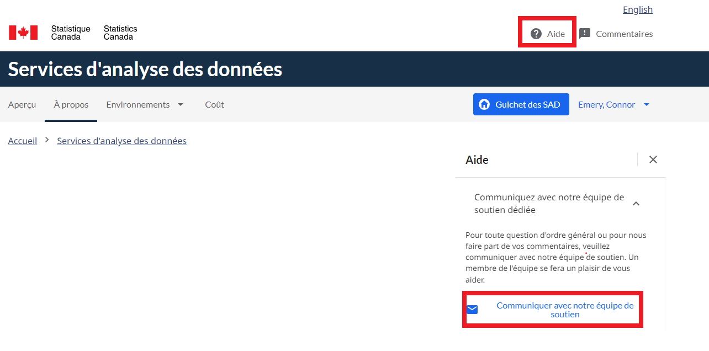

## Data Analyitics Services (DAS) Portal 
Veuillez utiliser le bouton d'aide sur le portail de l'analyse de données en tant que services (ADS)pour introduire une demande d'assistance.    
    

## Commentaires
Utilisez le formulaire _Commentaires_ sur ce site Web :

 - [Feedback Form](https://www.statcan.gc.ca/data-analytics-service/fr)

## Documentation
 - [https://statcan.github.io/cae-eac/fr/](https://statcan.github.io/cae-eac/fr/)
 - [Foire aux questions (FAQ)](FAQ.md)
 - [Bonnes pratiques](BonnesPratiques.md)

## Documentation Microsoft
 - [Documentation Azure](https://docs.microsoft.com/fr-ca/azure/)