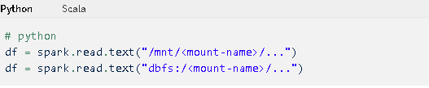

_[English](../../en/DataBricks)_
# Azure Databricks

## Accès à Databricks

### Tableau de bord

Consultez la [section Tableau de bord](Dashboards.md) de cette documentation pour obtenir de plus amples renseignements.

1. Cliquez sur le menu Tableau de bord dans le portail Azure.


### Adresse URL de Databricks

1.  Rendez-vous au site https://canadacentral.azuredatabricks.net/, ouvrez une session en utilisant vos justificatifs d'identité du compte infonuagique et sélectionnez l'espace de travail Databricks qui a été créé pour vous.

 

### Portail Azure

1.  Dans la boîte de recherche du portail Azure, recherchez **Databricks**.

 

2.  Vous devriez alors voir une liste des espaces de travail Databricks auxquels vous pouvez accéder.

 

## Commencer

Une fois dans Databricks, vous pouvez créer un carnet ou ouvrir un carnet existant. Pour plus d'information, veuillez consulter le processus à suivre pour [accéder à Databricks pour la première fois](https://docs.microsoft.com/fr-ca/azure/databricks/scenarios/quickstart-create-databricks-workspace-portal?tabs=azure-portal#run-a-spark-sqljob).


## Création d'un cluster

Si aucun cluster n'a été créé pour vous ou si vous avez besoin d'apporter des changements à votre cluster, veuillez envoyer un message sur [Slack](https://cae-eac.slack.com), puisque vous n'avez pas la permission de créer un cluster.

**Note :** Vous devez avoir un cluster en mode actif avant de pouvoir exécuter le code dans votre carnet. Pour obtenir des renseignements sur la façon de démarrer un cluster, consultez la section ci-dessous ou la [FAQ](FAQ.md).

## Création d'un carnet

-   Une façon de créer un carnet consiste à cliquer sur l'option **Nouveau carnet** depuis la page principale de Databricks. Vous pouvez ensuite nommer votre carnet et choisir le langage par défaut.

-   Dans le champ « Grappe », sélectionnez parmis la liste proposée le cluster auquel vous souhaitez attacher votre carnet.
   

-   Pour démarrer un cluster ou le modifier à partir d'un carnet, ouvrez le carnet et, dans le coin supérieur droit, cliquez sur le menu déroulant pour cluster. Vous pourrez alors démarrer le cluster ou le détacher et en attacher un autre.

## Partage de carnets dans Databricks

Pour partager un carnet ou inviter d'autres collaborateurs, depuis le menu Espace de travail, faites un clic droit sur le fichier ou le dossier du carnet souhaité et sélectionnez l'option **Autorisations**. Vous pouvez également le faire à partir d'un carnet, en cliquant sur le bouton **Autorisations**. Une fois que le carnet aura été partagé, plusieurs auteurs pourront le consulter et le modifier simultanément.

**Note :** Pour ajouter un utilisateur à l'espace de travail Databricks, veuillez envoyer un message [Slack](https://cae-eac.slack.com).


## Ingestion de données dans Databricks

Les données peuvent être montées ou téléversées dans le Système de fichiers Databricks (DBFS), qui est un espace de stockage propre à l'espace de travail Databricks. Vous pouvez lire des données d'une source de données ou même téléverser un fichier de données (p. ex. CSV) directement dans le DBFS.

**Note :** Le conteneur interne de lac de données pour votre environnement a déjà été monté pour vous, et vous pouvez travailler directement avec le conteneur. Si vous ne connaissez pas le nom de votre conteneur de lac de données, veuillez envoyer un message [Slack](https://cae-eac.slack.com).


## Ajout de données dans Databricks


## Lecture de fichiers montés



Exemple :
```
%python
testData = spark.read.format('csv').options(header='true', inferSchema='true').load('/mnt/mad-du/incoming/age-single-years-2018-census-csv.csv')

display(testData)
```

## Modification du langage par défaut dans un carnet


## Utilisation de plusieurs langages dans un carnet

Vous pouvez changer les paramètres de langage par défaut en entrant la commande spéciale % au début d'une cellule. Les commandes spéciales prises en charge sont les suivantes : %python, %r, %scala et %sql.

*Note:*
Lorsque vous utilisez une commande spéciale Langage, celle-ci est distribuée à la valeur REPL dans le contexte d'exécution du carnet. Les variables définies dans un langage (et par conséquent dans la REPL pour ce langage) ne sont pas offertes dans la valeur REPL d'un autre langage. Les valeurs REPL permettent de partager l'état uniquement par l'intermédiaire de ressources externes, telles que des fichiers dans le DBFS ou des objets stockés.

Les carnets prennent également en charge quelques commandes spéciales auxiliaires:

* Vous permet d'exécuter du code Shell dans votre carnet. Pour faire échouer la cellule si la commande Shell a un état de sortie différent de zéro, ajoutez l'-e option. Cette commande s'exécute uniquement sur le pilote Apache Spark, et non sur les processus de travail. Pour exécuter une commande Shell sur tous les nœuds, utilisez un script d'initialisation (script init).

* Vous permet d'utiliser des commandes de type système de fichiers (dbutils).

* Vous permet d'inclure différents types de documentation, notamment du texte, des images ainsi que des formules et des équations mathématiques.


## Démarrage de clusters dans Databricks

1.  Cliquez sur la liste déroulante de clusters.

2.  Sélectionnez un cluster à partir de cette liste.

3.  Cliquez sur le bouton **Début** pour démarrer le cluster.

4.  

## Configuration de Databricks Connect sur une machine virtuelle
Databricks connect permet l'accès à un environnement Databricks sans avoir besoin de se connecter via le portail Azure ou l'IU Databricks. Il permet d'utiliser d'autres EDI pour travailler du code Databricks.

Voici les étapes pour installer et tester Databricks Connect sur votre machine virtuelle:

1. Il y a un conflit entre Databricks Connect et l'installation Pyspark qui se trouve sur les images Data Science Virtual Machine. Par défaut, cette installation de Pyspark se trouve dans `C:\dsvm\tools\spark-2.4.4-bin-hadoop2.7`. Veuillez supprimer ou déplacer ce dossier afin d'installer Databricks Connect.

2. Avant d'installer Databricks Connect, créez un environment conda. Pour ce faire, ouvrez une invite de commandes et executéz les commandes suivantes:
```
    conda create --name dbconnect python=3.7
    conda activate dbconnect
    type pip install -U databricks-connect==X.Y.*
```
**REMARQUE:** Remplacez **X** et **Y** avec le numéro de version de votre cluster Databricks. Vous pouvez trouvez cette valeur en ouvrant l'espace de travail Databricks du portail Azure. Cliquez sur **Clusters** dans le menu à gauche, et notez la version **Runtime** pour votre cluster.

3. Dans une invite de commandes, entrez **databricks-connect configure**, et entez les valeurs suivantes quand demandées:

* **Hôte Databricks:** `https//:canadacentral.azuredatabricks.net`

* **Jeton** : le [jeton d’accès personnel](https://docs.microsoft.com/fr-ca/azure/databricks/dev-tools/api/latest/authentication#--generate-a-personal-access-token) généré dans les paramètres utilisateur de votre espace de travail Databricks

* **ID du cluster** : la valeur indiquée sous **Instance de calcul --> Options avancées--> Étiquettes** dans votre espace de travail Databricks


* **ID de l’organisation** : la partie de l’URL de Databricks qui se trouve après **.net/?o=**  


* **Port** : conserver la valeur existante

4. Changez la valeur de la variable d'environnement `SPARK_HOME` à `c:\miniconda\envs\(conda env name))\lib\site-packages\pyspark`, et redémarrez votre machine virtuelle. (Veuillez demander de l'aide via un message [Slack](https://cae-eac.slack.com) si vous ne savez pas comment changer des variables d'environnement.)
5. Testez la connectivité avec Azure Databricks en exécutant **databricks-connect test** dans une invite de commandes. Si votre cluster Databricks est arrêté quand vous commencez ce test, vous recevrez des messages d'avertissement jusqu'à ce qu'il ait démarré, ce qui peut prendre du temps.

## Installation de librairies
### Cluster Databricks
Veuillez contacter le canal [slack] (https://cae-eac.slack.com) pour que l'équipe d'assistance puisse installer les librairies pour vous.
### Carnet
Veuillez utiliser les commandes suivantes pour installer une librairie dans une session de carnet.

Python: 
```python
dbutils.library.installPyPI ("pypipackage", version = "version", repo = "repo", extras = "extras")
dbutils.library.restartPython () # Supprime l'état Python, mais certaines bibliothèques peuvent ne pas fonctionner sans appeler cette fonction
```

R Code:
```R
install.packages("library") 
```
## Documentation Microsoft

-   [Accéder à Databricks pour la première fois](https://docs.microsoft.com/fr-ca/azure/databricks/scenarios/quickstart-create-databricks-workspace-portal)

-   [En savoir plus sur Databricks](https://azure.microsoft.com/fr-ca/resources/videos/connect-2017-introduction-to-azure-databricks/)
    (en anglais seulement)
- [Databricks Connect](https://docs.databricks.com/dev-tools/databricks-connect.html) (en anglais seulement)

-   [Installer des bibliothèques dans la session active d'un carnet](https://docs.microsoft.com/fr-ca/azure/databricks/notebooks/notebooks-python-libraries)

-   [Gestion des bibliothèques pour les administrateurs](https://docs.microsoft.com/frca/azure/databricks/libraries)

# Changer la langue d'affichage
Voir la page [Langue](Langue.md) pour savoir comment changer la langue d'affichage.
