# Azure Data Factory (ADF)

## Accès à Data Factory

### Tableau de bord

Consultez la [section Tableau de bord](Dashboards.md)
de cette documentation pour obtenir de plus amples renseignements.

1. Cliquez sur le menu **Tableau de bord** dans le portail Azure.

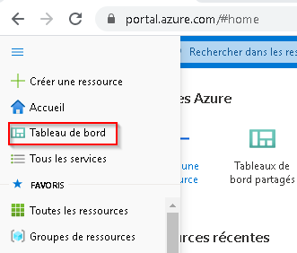

### ADRESSE URL D'ADF

1.  Rendez-vous à https://adf.azure.com et sélectionnez l'instance Data Factory qui a été créée pour vous.

 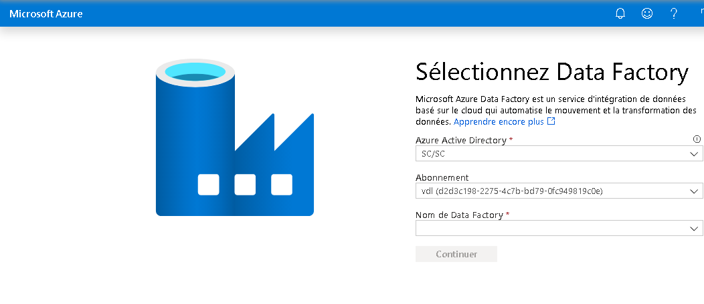

### Portail Azure

1.  Dans la boîte de recherche du portail Azure, recherchez **Data factories**.

2.  Vous devriez alors voir la liste des Data Factories auxquelles vous avez obtenu la permission d'accéder.
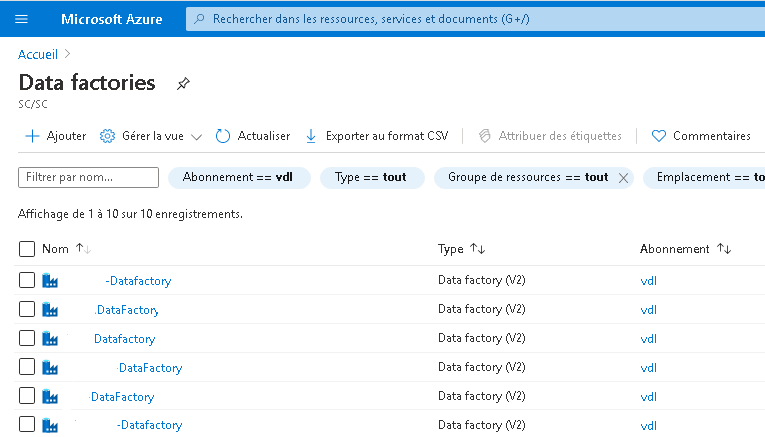

### Auteur

Cliquez sur **Author & Monitor**.

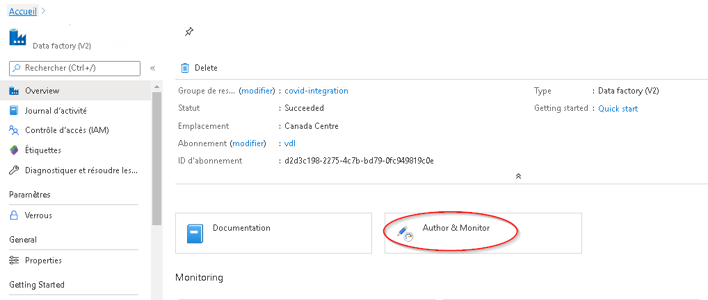

Dans Data Factory, vous avez la capacité de créer et de déployer des ressources.
 

Voir le document [Création visuelle dans Azure Data Factory](https://docs.microsoft.com/fr-ca/azure/data-factory/author-visually) pour obtenir de plus amples renseignements.
Vous pouvez également utiliser certains des divers assistants fournis sur la page d'**aperçu (Overview) de Data Factory**.

**NOTE :** La configuration de SSIS Integration n'est **PAS** recommandée. Si vous avez des questions, communiquez avec l'équipe de soutien par l'intermédiaire du canal [Slack](https://cae-eac.slack.com).
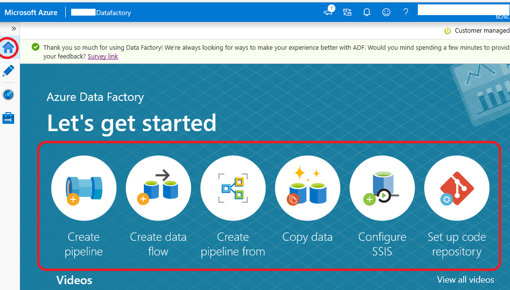 
[les tutoriels de la documentation Azure](https://docs.microsoft.com/fr-ca/azure/data-factory/introduction) pour obtenir plus de détails.

## Accès à Data Lake à partir d'ADF

Une connexion au compte de stockage Data Lake a été préconfigurée pour votre environnement.

1.  Cliquez sur l'**icône de la mallette**.

2.  Cliquez sur **Services liés**.

3.  Le service lié au type **Stockage Azure Data Lake Gen2** est votre compte de stockage *Data Lake*.

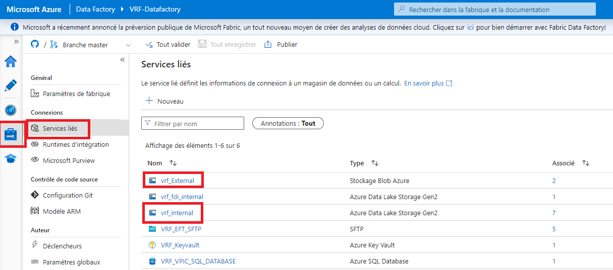

**Note :** On vous a accordé l'accès à des contenants particuliers créés dans le compte de stockage Data Lake pour votre environnement.

## Accès à la Base de données SQL Azure

Certains projets ont une instance de Base de données SQL Azure.

4.  Cliquez sur l'**icône de la mallette**.

5.  Cliquez sur **Services liés**.

6.  Les services liés au type **Base de données SQL Azure** sont vos *bases de données*.

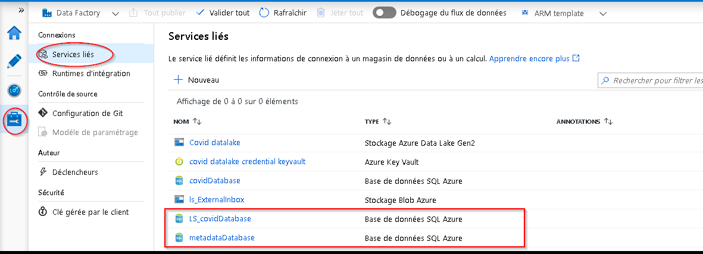

## Enregistrement ou publication de vos ressources dans Data Factory

Azure Data Factory peut être configuré pour enregistrer votre travail dans les emplacements suivants:

 1. Dépôt Git 
 2. Publier directement dans Data Factory

### Git (lorsqu'accessible)

Lorsque Git est activé, vous pouvez voir votre configuration et enregistrer votre travail dans une branche particulière.

1.  Cliquez sur l'**icône de la mallette**.
2.  Cliquez sur **Configuration de Git**.
3.  Vérifiez la configuration de Git qui a été mise en place pour vous.
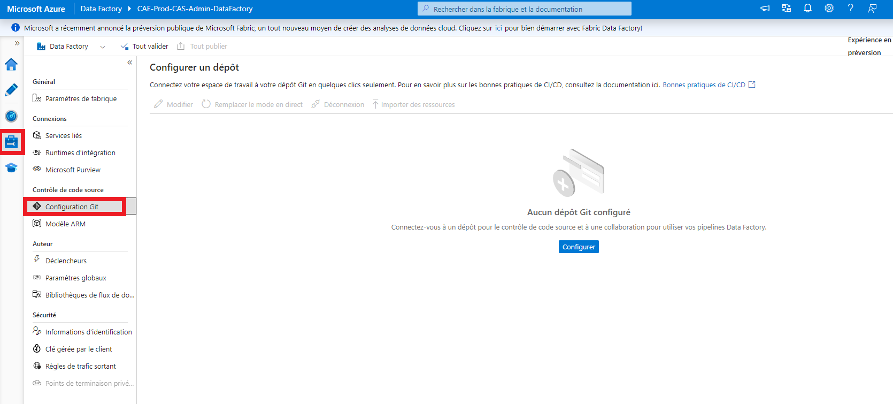

4.  Lorsque vous créez un flux de travail, vous pouvez l'enregistrer dans votre branche. Cliquez sur **+ Nouvelle branche** dans le menu déroulant des branches pour créer une     branche de fonctionnalités. 
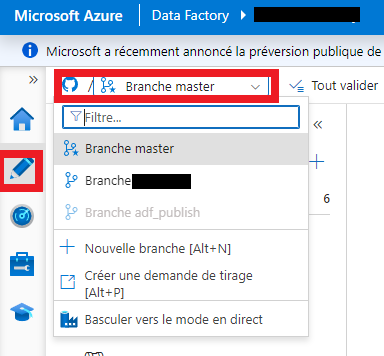 

5.  Lorsque vous serez prêt à fusionner les changements de votre branche de fonctionnalités dans votre branche de collaboration (master), cliquez sur le menu déroulant des branches et sélectionnez **Créer la demande de tirage (pull request)**. Cette action vous dirigera vers Azure DevOps Git, où vous pourrez créer des demandes de tirage, procéder à des revues du code et fusionner les modifications dans votre branche de collaboration (master) dès que la demande aura été approuvée.

6.  Après avoir fusionné les modifications dans la branche de collaboration (master), cliquez sur **Publier** pour publier les changements de votre code de la branche dans Azure Data Factory. Si vous obtenez un message d'erreur au moment de la publication, communiquez avec l'équipe de soutien par l'intermédiaire du canal [Slack](https://cae-eac.slack.com).

### Service Data Factory

Lorsque Data Factory n'est pas intégré au contrôle source, vos flux de travail sont stockés directement dans le service Data Factory. Vous ne pouvez pas enregistrer les changements partiels, vous pouvez seulement utiliser l'option **Tout publier**, ce qui écrase l'état actuel de Data Factory avec vos changements qui deviennent alors visibles à tous.

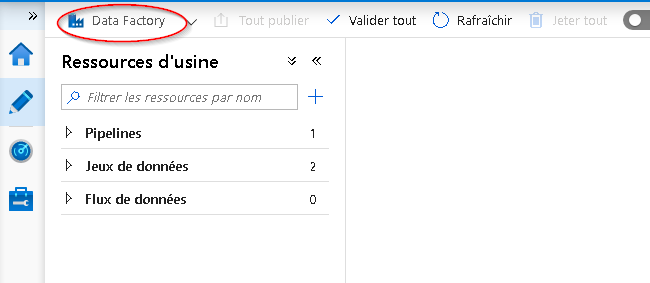

## Ingestion et transformation des données avec ADF

-   [Assistant de copie de données](https://docs.microsoft.com/fr-ca/azure/data-factory/quickstart-create-data-factory-copy-data-tool#start-the-copy-data-tool)

-   [Mappage de flux de données -- Processus ETC axé sur l'interface utilisateur graphique](https://docs.microsoft.com/fr-ca/azure/data-factory/tutorial-data-flow#create-a-pipeline-with-a-data-flow-activity)

## Runtimes d'intégration
### canadaCentralIR-4nodesDataFlow
Ceci est partagé par tous les utilisateurs et fonctionne tout le temps.
#### Peut accéder:
* Lac de données interne
* Compte de stockage externe
* Sources de données externes (Internet)
#### Ne peut pas accéder:
* Serveur SQL
### selfHostedCovidIaaSVnet
A accès au réseau virtuel interne.
*Nom du serveur:* _dfHostedIR01_
#### Peut accéder:
* Lac de données interne
* Serveur SQL
#### Ne peut pas accéder:
* Compte de stockage externe
* Sources de données externes (Internet)

## Exemple : Comment se connecter aux données de John Hopkins

1.  Il y a un exemple de flux de travail qui montre la façon d'ingérer des données à partir de GitHub à l'aide d'un pipeline de Data Factory.

 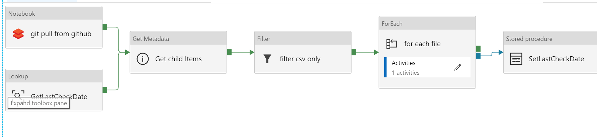

2.  Les données peuvent être filtrées depuis Data Factory.

 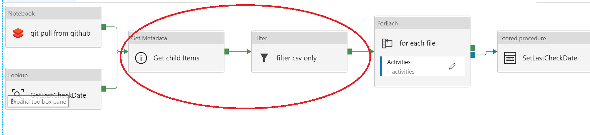

3.  Il est aussi possible d'extraire des données de GitHub au moyen d'un code dans un notebook de Databricks.

 

## Documentation Microsoft

-  [Présentation d'Azure Data Factory --  Azure Data Factory](https://docs.microsoft.com/fr-fr/azure/data-factory/introduction)

- [Créer une fabrique de données Azure à l'aide de l'interface utilisateur d'Azure Data Factory --  Azure Data Factory](https://docs.microsoft.com/fr-fr/azure/data-factory/quickstart-create-data-factory-portal)

- [Copier des données avec l'outil d'Azure Copier des données --  Azure Data Factory](https://docs.microsoft.com/fr-ca/azure/data-factory/quickstart-create-data-factory-copy-data-tool)

- [Créer un flux de données de mappage --  Azure Data Factory](https://docs.microsoft.com/fr-fr/azure/data-factory/data-flow-create)

- [Fonctions d'expression dans le flux de données de mappage --Azure Data Factory](https://docs.microsoft.com/fr-fr/azure/data-factory/data-flow-expression-functions)

- [Mode de débogage du mappage de flux de données -- Azure Data Factory](https://docs.microsoft.com/fr-fr/azure/data-factory/concepts-data-flow-debug-mode)

- [Supervision visuelle du flux de données de mappage -- Azure Data Factory](https://docs.microsoft.com/fr-fr/azure/data-factory/concepts-data-flow-monitoring)
Vidéo YouTube (en anglais seulement)
- [Ingest, prepare & transform using Azure Databricks & Data Factory Azure Friday](https://www.youtube.com/watch?v=CZQOxPY7UuA)

- [Azure Friday Visually build pipelines for Azure Data Factory V2](https://www.youtube.com/watch?v=uS8xyqHql5I&t=4s)

- [How to prepare data using wrangling data flows in Azure Data Factory Azure Friday](https://www.youtube.com/watch?v=LKenBZYZaLA)

- [How to develop and debug with Azure Data Factory Azure Friday](https://www.youtube.com/watch?v=9tg5Rsoi5ic)

- [Building Data Flows in  Azure Data Factory](https://www.youtube.com/watch?v=kcsRrWT0hjU)

# Changer la langue d'affichage
Voir la page [Langue](Langue.md) pour savoir comment changer la langue d'affichage.
