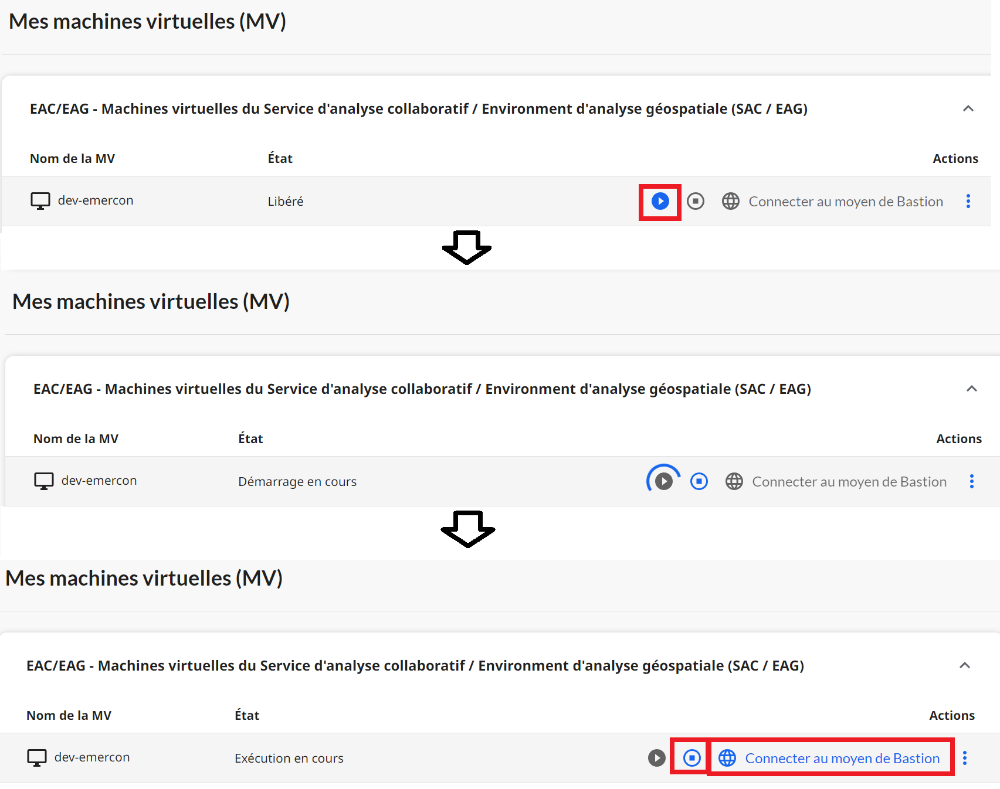

# Machine Virtuelle

Avant d'accéder à votre machine virtuelle, vous devez vous connecter au [portail du service d'analyse des données](ExtPortail.md) 

1. Vous pourrez voir les machines auxquelles vous avex accès en bas du guichet des SAD. A partir du portail, vous serez en mesure d'effectuer les trois actions suivantes:

- Démarrer la machine virtuelle
- Arrêter la machine virtuelle
- Vous connecter à la machine virtuelle

   Chaque action effectuée modifiera l'état de la machine virtuelle.
         

2. **Démarrer la machine virtuelle:** Quand la machine virtuelle est à l'arrêt, le bouton démarrer est selectionnable. Vous pouvez alors la démarrer et son statut passera à *Démarrage en cours*. le bouton démarrer n'est alors plus sélectionnable.
Cela peut prendre quelques minutes à la machine pour être en mode *Exécution en cours*. 
Le bouton de connexion au navigateur est alors sélectionnable.
     

3. **Se connecter à la machine virtuelle:** Une fois la machine démarrée, le bouton de connexion au navigateur est sélectionnable. Il faut cliquer sur ce bouton pour pouvoir se connecter; 
     
    
4.  Une nouvelle page s'affichera, et il vous sera demandé d'entrer vos nom d'utilisateur et mot de passe fournis par Statistique Canada. Cliquez après cela sur le bouton **Login**.

    

## Bonnes pratiques
1. Les machines virtuelles entraînent des coûts uniquement quand elles sont en marche.\
   Pour éviter les dépenses inutiles, vous devez arrêter votre machine virtuelle lorsque vous ne l'utilisez pas.
2. Tout les soirs, les machines sont mises à l'arrêt à 19H heure de l'EST.
3. Il est déconseillé de de communiquer son mot de passe à qui que ce soit.

## Questions fréquemment posées (FAQ)
1. Je ne vois aucune machine virtuelle?\
    Veuillez utiliser le bouton d'aide à partir du portail des SAD pour [nous contacter](ContactezNous.md) afin d'obtenir une machine virtuelle.
2. J'ai oublié mon mot de passe du compte ext.statcan.ca?\
    Veuillez utiliser le bouton d'aide à partir du portail des SAD pour [nous contacter](ContactezNous.md) et soumettre une demande d'assistance.
3. J'ai oublié mon nom d'utilisateur et mon mot de passe pour accéder à ma machine virtuelle?\
    Veuillez utiliser le bouton d'aide à partir du portail des SAD pour [nous contacter](ContactezNous.md) et soumettre une demande d'assistance.
