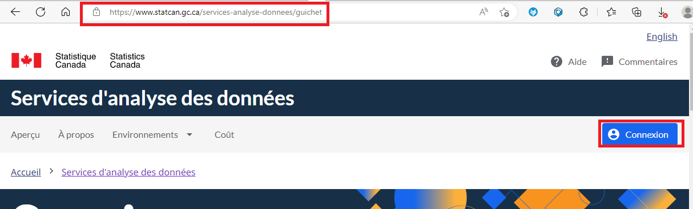
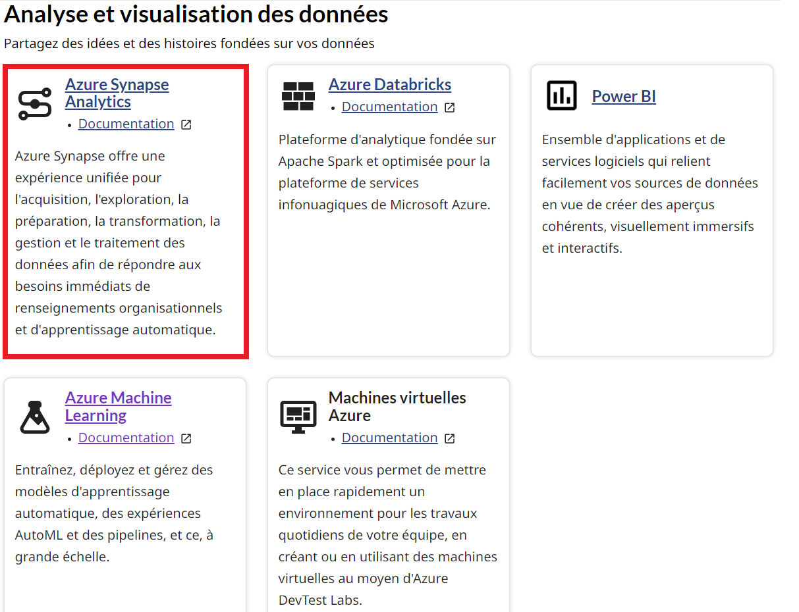
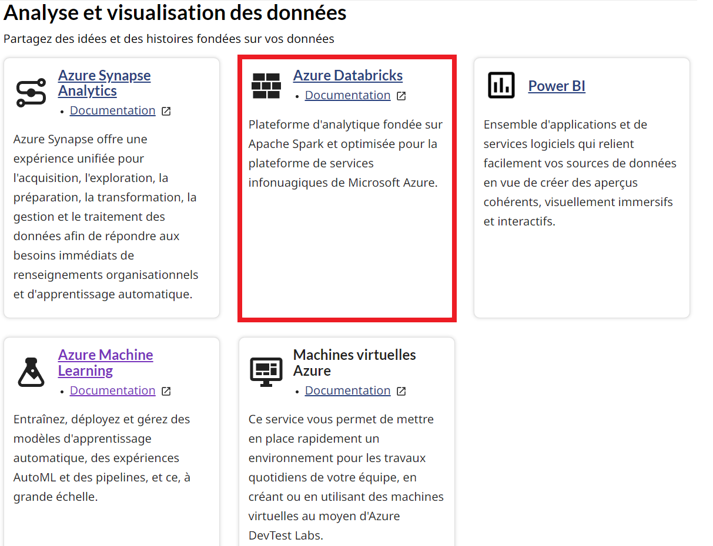
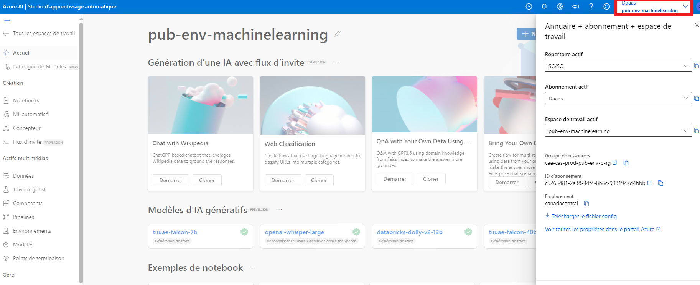

# Portail des Services d'analyse de données(SAD)
## Se connecter   
1. en tant qu'utilisateur externe, vous aurez besoin d'un compte utilisateur externe: **firstname.lastname@ext.statcan.ca** pour pouvoir accéder à votre machine virtuelle ainsi qu'aux ressources nécessaires.
Veuillez [nous contacter](ContactezNous.md) pour demander un compte utilisateur.

2. A partir de votre navigateur, accédez au lien suivant
    - [https://www.statcan.gc.ca/data-analytics-services](https://www.statcan.gc.ca/data-analytics-services)

3. Cliquez sur le bouton de connexion.   

    

Note: En vous connectant la première fois, il vous sera demandé de modifier votre mot de passe.

3. Une fois connecté, vous serez dans la page du guichet des services d'analyse de données (SAD).
Vous pouvez accéder à cette page en cliquant sur la flêche située à côté du nom d'utilisateur et en sélectionnant Guichet des SAD.   

    

## Accéder aux Machines Virtuelles
Utilisez la page [Machines Virtuelles](ExtMachinesVirtuelles.md) pour avoir les instructions nécessaires pour se connecter à votre machine virtuelle.

## Accédez aux services
Pour accéder aux services, vous devez vous assurer que vous êtes:

1. Connecté au portail du Service d'analyse des données (SAD).
2. Connecté à votre machine virtuelle [Virtual Machines](ExtMachinesVirtuelles.md)

Note: Tout les services listé ci-après ne seront accessibles que de votre machine virtuelle.

### Azure Synapse
1. A partir de votre machine virtuelle, vous pouvez vous connecter au portail du service d'analyse des données (SAD) pour accéder au lien pour Azure Synapse.

   

2. A partir de votre machine virtuelle, vous pouvez accéder au lien suivant: https://web.azuresynapse.net/, vous connecter avec votre compte utilisateur et selectionner l'espace de travail Synapse qui vous est accessible.  
 
   

### Stockage Azure Blob
Veuillez consulter la page [Storage](ExtStorage.md) pour plus d'informations sur comment accéder aux stockage.

### Azure Data Lakes
Veuillez consulter la page [Storage](ExtStorage.md) pour plus d'informations sur comment accéder aux stockage.

### Azure SQL Database
Veuillez consulter la page [SQL Server](SQLServer.md) pour plus d'information sur comment accéder au Server SQL.

### Azure Data Factory
Les services de Data Factory sont disponible à partir de Azure Synapse pour les utilisateurs externes.

### Azure Databricks
1. A partir de votre machine virtuelle, vous pouvez vous connecter au portail du service d'analyse des données (SAD) pour accéder au lien pour Azure Databricks.

   
   
2. A partir de votre machine virtuelle, vous pouvez accéder au lien suivant: https://canadacentral.azuredatabricks.net/, vous connecter avec votre compte utilisateur et selectionner l'espace de travail Databricks qui vous est accessible. 

    

### Microsoft Power BI
Documentation Coming Soon!
 
### Azure Machine Learning
1.  A partir de votre machine virtuelle, vous pouvez vous connecter au portail du service d'analyse des données (SAD) pour accéder au lien pour Azure Databricks.

   
   
2. A partir de votre machine virtuelle, vous pouvez accéder au lien suivant: https://ml.azure.com/, vous connecter avec votre compte utilisateur et selectionner l'espace de travail Databricks qui vous est accessible. 

    

### Machines Virtuelles Azure
Utilisez le [Portail](ExtLogin.md) pour accéder à votre [Machine Virtuelle](ExtMachinesVirtuelles.md)

## QUestions fréquemment posées
1. Comment puis-je obtenir un compte ou un accès?
    Veuillez [nous contacter](ContactezNous.md) et indiquez que vous désirez obtenir des accès

2. Comment puis-je changer mon mot de passe?
    Veuillez utiliser le bouton d'aide à partir du portail des SAD pour [nous contacter](ContactezNous.md) et soumettez une requête indiquant que vous voulez changer votre mot de passe.
       