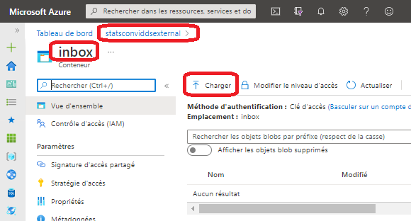
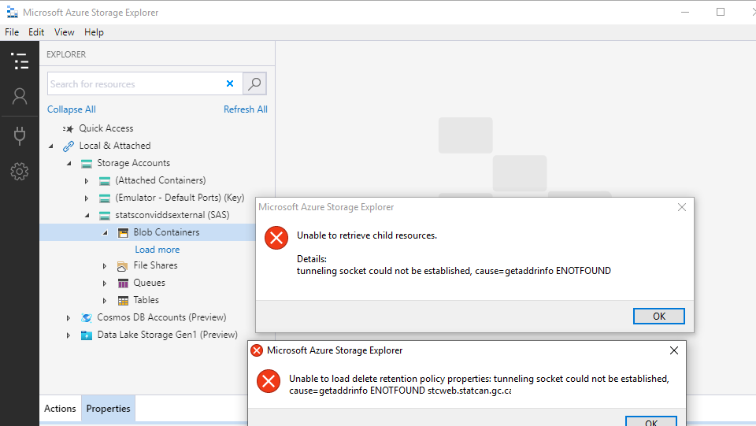
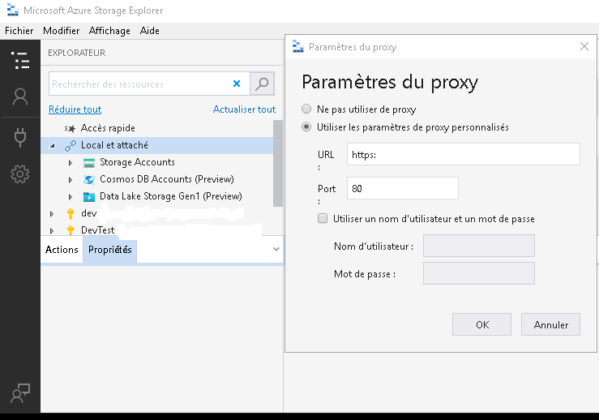
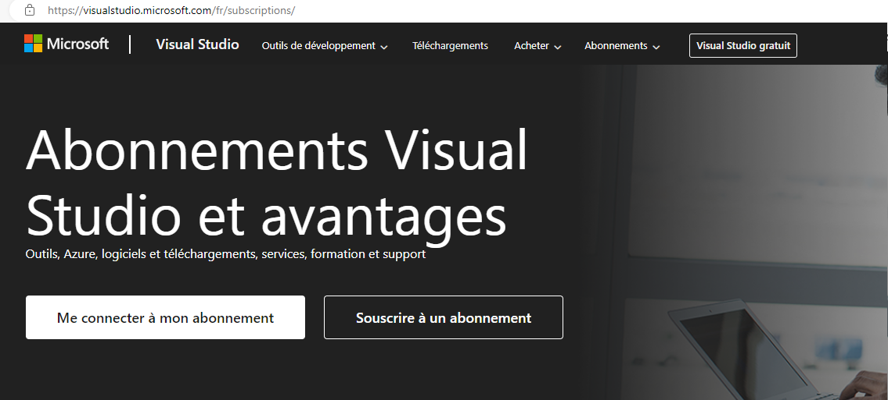
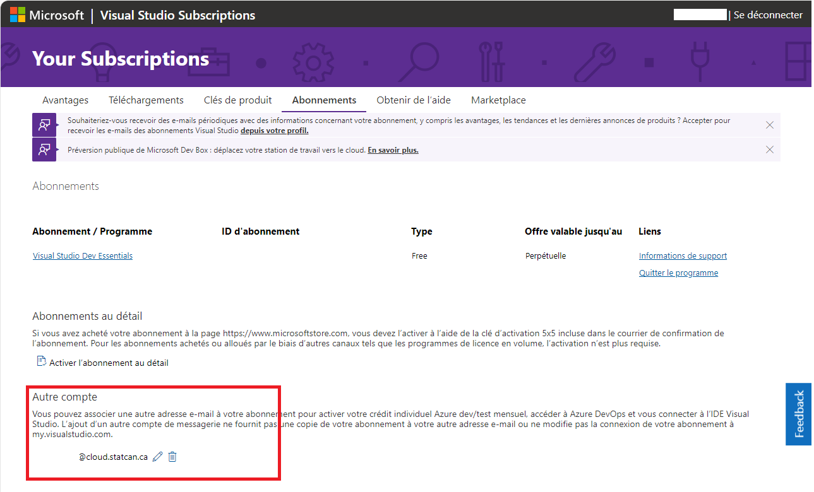
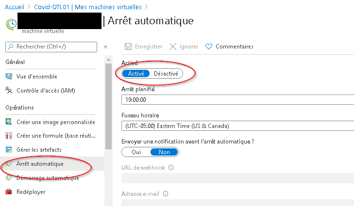
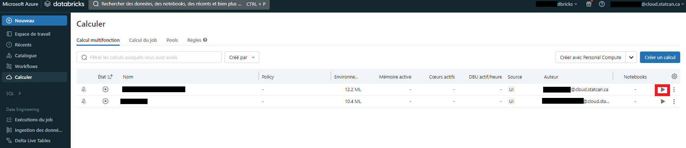
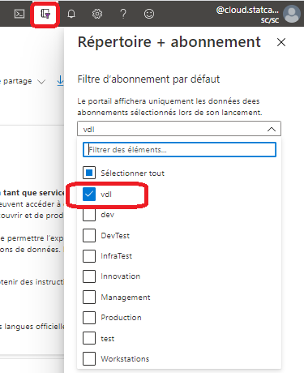

# FAQ

## Ingestion de données

### Comment puis-je ingérer des données (y compris des fichiers volumineux) dans la plateforme?

#### Compte de stockage externe
Les fichiers peuvent être téléversés dans dans le conteneur **inbox** ou **to-vers-int** d'un compte de stockage externe, comme indiqué dans l'[ Explorateur de stockage Azure ] (AzureStorage.md). Ces fichiers seront alors automatiquement transférés dans un compte de stockage interne (Data Lake) et rendus accessibles à partir des services autorisés.
    

*Remarque:* Les comptes de stockage externe ont la convention de dénomination **stats*project-acronym*external**.

#### Service de transfert électronique de fichiers (TEF)
Les employés de Statistique Canada peuvent utiliser le [TEF](https://www75.statcan.gc.ca/eft-tef) pour transférer des fichiers de / vers les réseaux sur site (Rés. A ou B) vers / depuis l'environnement infonuagique Azure. Veuillez communiquer avec l'équipe de soutien par l'intermédiaire du canal https://cae-eac.slack.com pour plus d'information sur ce processus.

#### Outils de plateforme

Des outils de plateforme comme Databricks ou Data Factory peuvent être utilisés pour ingérer des données provenant de sources dedonnées publiques.

## Explorateur de stockage

### Comment puis-je configurer les paramètres du proxy de l'Explorateur de stockage Azure sur un VDI du réseau B?

*Pour les employés de Statistique Canada seulement* 
1. La configuration des paramètres du proxy est nécessaire, si vous recevez le message d'erreur suivant :

2. Dans l'Explorateur de stockage Azure, allez à **Modifier**
3. **Paramètres du proxy**. Entrez les paramètres du proxy nécessaires et cliquez sur **OK**.

### Comment puis-je demander un nouveau jeton SAP (requis pour l'Explorateur de stockage Azure sur un VDI du réseau B)?

*Pour les employés de Statistique Canada seulement*

Pour demander un jeton SAP temporaire, veuillez communiquer avec l'équipe de soutien par l'intermédiaire du canal https://cae-eac.slack.com.

### Pourquoi est-ce que j'obtiens un message d'erreur lorsque j'accède au compte de stockage interne Data Lake?

Le compte de stockage interne Data Lake n'est accessible qu'à partir d'une machine virtuelle dans l'Environnement d'analyse collaboratif
(EAC). Il n'est pas accessible à partir de votre ordinateur personnel, ni de votre ordinateur portable de travail, ni du VDI du réseau B, ni d'une autre machine virtuelle sur nuage.

## Contrôle de code source

### Comment puis-je relier mon compte Visual Studio à mon compte infonuagique de StatCan?

1.  Connectez-vous à votre compte Visual Studio sur le site https://visualstudio.microsoft.com/fr/subscriptions/ en
    utilisant l'adresse électronique de votre organisation. Pour les employés de StatCan, il s'agit de votre adresse électronique qui se termine par « canada.ca ».

 

2.  Ajoutez votre compte infonuagique comme compte secondaire. Vous pourrez ainsi utiliser vos licences pour Visual Studio et Azure DevOps dans l'EAC.

**Pour les employés de Statistique Canada :** Si vous n'avez pas d'abonnement Visual Studio, veuillez communiquer avec votre superviseur. S'il décide que vous avez besoin d'un abonnement, il pourra alors soumettre une demande de soutien en votre nom auprès de la Gestion des biens logiciels de StatCan pour vous obtenir une licence.

## Machines virtuelles

### Que dois-je faire si j'ai oublié le mot de passe de ma machine virtuelle?

Si vous oubliez le mot de passe de votre machine virtuelle, veuillez communiquer avec l'équipe de soutien par l'intermédiaire du canal https://cae-eac.slack.com pour réinitialiser votre mot de passe.

Vous pouvez également supprimer votre machine virtuelle, puis en créer une autre. Ce faisant, vous perdrez malheureusement les données et les logiciels sur votre ancienne machine.

### Que dois-je faire si je dois exécuter un travail de longue durée sur ma machine virtuelle?

Les machines sont arrêtées tous les jours à 19 h (HNE), afin de réduire les frais d'exploitation. Pour exécuter un travail de longue durée, il est recommandé d'utiliser Databricks ou Data Factory.

**AVERTISSEMENT :** Il n'est **pas** recommandé de désactiver l'arrêt automatique, car cela pourrait entraîner des frais importants.

Pour désactiver l'arrêt automatique :

1. Accédez à votre machine virtuelle dans le portail Azure.
2. Désactivez l'arrêt automatique.

### Comment puis-je apporter des changements à ma machine virtuelle?

Si la machine virtuelle que vous utilisez actuellement ne répond pas à vos besoins, veuillez communiquer avec l'équipe de soutien par l'intermédiaire du canal https://cae-eac.slack.com.

## Databricks

### Pourquoi suis-je incapable d'exécuter le code à partir de mon notebook dans Databricks?

Vous devez d'abord démarrer un cluster dans Databricks qui a déjà été créé pour vous :
1. Cliquez sur Clusters.

2. Naviguez vers votre cluster et cliquez sur le bouton **Démarrer** (icône de la flèche).

## Tableau de bord
### Comment changer mon abonnement pour voir mes ressources?
1. Dans le portail Azure, cliquez sur l'icône **Répertoire + abonnement**.

2. Sélectionnez l'abonnement **vdl**.

## Autre
### Comment puis-je me connecter au compte de stockage interne Data Lake avec Power BI Desktop?

Prérequis :

1.  Une machine virtuelle dans l'Environnement d'analyse collaborative (EAC).
2.  Power BI Desktop. (Offert par défaut dans les images de machine virtuelle Data Science Virtual Machine.)

Étapes :

1.  Connectez-vous à votre machine virtuelle dans l'EAC.
2.  Lancez Power BI Desktop.
3.  Suivez les étapes dans [Analysez des données dans Azure Data Lake Storage Gen2 avec Power BI - Créer un rapport dans Power BI Desktop (document anglais)](https://docs.microsoft.com/fr-ca/power-query/connectors/datalakestorage#create-a-report-in-power-bi-desktop). S.v.p. envoyez un message slack à https://cae-eac.slack.com si vous ne connaissez pas l'URL du Azure Data Lake Storage Gen2.

### Comment puis-je ajouter une question à la FAQ?

Veuillez faire parvenir votre suggestion de question par l'intermédiaire du canal https://cae-eac.slack.com.

# Changer la langue d'affichage
Voir la page [Langue](Langue.md) pour savoir comment changer la langue d'affichage.
