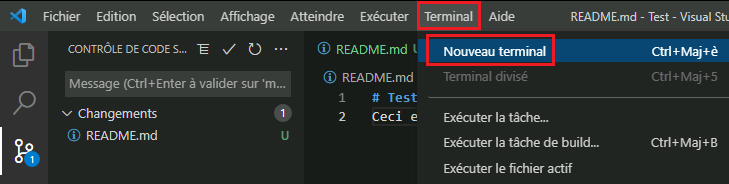
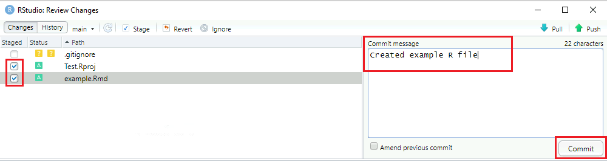

GitHub.com est une plateforme en ligne utilisée à des fins de collaboration ainsi que pour assurer le suivi des modifications et des versions pour divers types de projets.

Ce document montre la façon de commencer à utiliser Git avec divers services Azure dont l’intégration Git est déjà configurée. Voir [GitHub - Configuration](/GitHubConfiguration) pour obtenir des instructions sur la façon de configurer ce système.

**Important : ne stockez pas de données classées Protégé B sur GitHub.**

## Création d’un compte GitHub

Des renseignements sur la création d’un compte GitHub (ou sur l’utilisation de votre compte existant) se trouvent à l’adresse Des renseignements sur la création d’un compte GitHub (ou sur l’utilisation de votre compte existant) se trouvent à l’adresse [https://digital.statcan.gc.ca/drafts/guides-platforms-github](https://digital.statcan.gc.ca/drafts/guides-platforms-github).

## Azure Data Factory

Si l’intégration Git est configurée pour votre Data Factory, chaque fois que vous **enregistrez** ou que vous **publiez** des modifications, celles-ci seront automatiquement synchronisées avec le dépôt GitHub.

Pour changer la division dans laquelle vous travaillez (la division de collaboration par défaut est **main** [principale]), cliquez sur la flèche orientée vers le bas, à côté du nom de la division, en haut à gauche de l’écran. À partir de là, vous pouvez sélectionner une autre division ou en créer une nouvelle. 

## Databricks

### Configuration d’un jeton d’accès personnel

Avant de pouvoir travailler avec les dépôts GitHub dans Databricks, vous devez d’abord configurer un jeton d’accès personnel (ce qui permet à Databricks d’accéder à votre compte GitHub).

1. Dans Databricks, ouvrez **User Settings** (paramètres d’utilisateur), puis cliquez sur l’onglet **Git integration** (intégration de Git). 

    

2. Sous **Git provider** (fournisseur Git), sélectionnez GitHub. Entrez votre nom d’utilisateur GitHub.

3. À partir de votre compte GitHub, [suivez les instructions pour créer un jeton d’accès personnel](https://docs.github.com/en/github/authenticating-to-github/keeping-your-account-and-data-secure/creating-a-personal-access-token), en vous assurant que la case de permission repo (dépôt) est cochée. Si vous avez fixé une date d’expiration, vous devrez répéter ce processus pour créer un nouveau jeton une fois la date fixée passée. 

    

4. Copiez le jeton et collez-le dans Databricks. Cliquez sur **Save** (enregistrer).

### Création et modification de divisions

Une pratique exemplaire consiste à effectuer tous vos travaux dans votre propre branche **division** (et non pas dans la division principale), puis à fusionner vos modifications avec la division principale une fois que vous êtes prêt à publier vos travaux.

1. Pour créer une nouvelle division ou modifier une division existante, cliquez sur l’onglet **Repos** (dépôts). À partir de là, cliquez sur le dossier contenant le dépôt GitHub pour l’ouvrir. Cliquez sur la flèche orientée vers le bas, à côté du nom de la division, puis cliquez sur **Git...**. 

    

2. Cliquez sur la flèche orientée vers le bas pour trouver une division existante, ou cliquez sur le signe « plus » pour en créer une nouvelle. Votre division doit inclure votre nom. 

    

3. Une fois votre branche créée, recherchez-la dans le menu déroulant et cliquez dessus pour y basculer. Cliquez sur **fermer**. Tout votre travail sera désormais enregistré dans cette branche, à moins que vous ne le changiez à nouveau plus tard.

### Création, déplacement et clonage de blocs-notes

- Pour créer un nouveau bloc-notes dans le référentiel, dans le menu déroulant à côté du nom de votre branche, survolez **Créer**, puis cliquez sur **Bloc-notes**. Vous pouvez également créer des dossiers de cette façon.

    

- Pour cloner un bloc-notes existant de votre espace de travail, naviguez jusqu’au bloc-notes (dans l’onglet **Workspace** [espace de travail]), cliquez sur la flèche orientée vers le bas, à côté du nom du bloc-notes, puis cliquez sur **Clone** (cloner) pour créer une copie du bloc-notes dans le dépôt. Pour déplacer le bloc-notes de l’espace de travail au dépôt, sélectionnez **Move** (déplacer). Trouvez le dépôt dans le menu contextuel et naviguez jusqu’au dossier dans lequel vous souhaitez cloner ou déplacer le bloc-notes. Cliquez sur **Clone/Select** (cloner/sélectionner).

### Validation et acheminement des modifications

1. Dans l’onglet **Repos** (dépôts), cliquez sur le dossier contenant le dépôt GitHub pour l’ouvrir. Cliquez sur la flèche orientée vers le bas, à côté du nom de la division, puis cliquez sur **Git...**.

2. Assurez-vous que toutes les modifications que vous souhaitez apporter sont cochées. Saisissez un bref résumé décrivant les modifications apportées, puis cliquez sur **Commit & Push** (valider et acheminer). 

    

## Azure Synapse

Voir **Azure Data Factory** plus haut.

## Visual Studio Code

### Comment cloner un dépôt

1. Cliquez sur l’onglet **Source Control** (contrôle de la source). Vous pouvez alors soit ouvrir un dossier contenant un dépôt Git si vous en avez déjà un sur votre machine virtuelle (MV) en nuage, soit cloner un dépôt à partir de l’adresse d’une page Web (URL). 

    

2. Pour cloner un dépôt, cliquez sur **Clone Repository** (cloner le dépôt). Copiez l’adresse URL du dépôt depuis GitHub (par exemple, https://github.com/nom d’utilisateur/nom du dépôt), collez-la dans la boîte de texte et cliquez sur **Clone from URL** (cloner à partir de l’URL). 

    

3. Choisissez un dossier sur votre MV en nuage où le dépôt Git sera stocké localement. Vous serez peut-être invité à vous connecter à votre compte GitHub.

4. Une fois le dépôt cloné sur votre machine, vous pouvez ouvrir le dossier local dans Visual Studio Code.

### Comment valider des modifications

1. Avant de pouvoir valider des modifications, vous devez configurer votre nom d’utilisateur et votre adresse électronique. Ouvrez une fenêtre de terminal (cliquez sur **Terminal**, puis sur **New Terminal** [nouveau terminal] dans la barre de menus). Dans le terminal, tapez ce qui suit :
    ```
    git config user.name "First Last"
    git config user.email "prénom.nom@canada.ca"
    ``` 

    

2. Lorsque vous êtes prêt à publier vos modifications sur GitHub, tapez un message de validation dans l’onglet **Source control** (contrôle de la source), puis cliquez sur la coche. 

    

3. Cliquez sur le bouton du menu de contrôle de la source, puis sur **Push** (acheminer). Vous obtiendrez un message d’erreur si votre copie locale du dépôt n’est pas à jour par rapport à la version stockée sur GitHub. Dans ce cas, cliquez sur **Pull**, puis **Push** (récupérer, puis acheminer) pour fusionner vos modifications. 

    

## R Studio

**Remarque**: les instructions sont les mêmes, que vous utilisiez la version de bureau de R-Studio à partir d’une MV en nuage ou la version Web via Databricks.

### Configuration

1. Dans le menu **File** (fichier), cliquez sur **New Project...** (nouveau projet), puis sélectionnez **Version Control**(contrôle de version). 

    

2. Sélectionnez **Git**. Saisissez l’adresse URL du dépôt GitHub que vous souhaitez cloner. Choisissez un dossier où seront stockés les fichiers locaux, puis cliquez sur **Create project** (créer le projet). 

    

3. Si vous êtes invité à vous connecter à votre compte GitHub, saisissez votre nom d’utilisateur GitHub et un [jeton d’accès personnel](https://docs.github.com/en/github/authenticating-to-github/keeping-your-account-and-data-secure/creating-a-personal-access-token) comme mot de passe.

### Comment valider des modifications

1. Lorsque vous êtes prêt à publier vos modifications sur GitHub, cliquez sur l’onglet **Git**. Ensuite, cliquez sur **Commit** (valider). 

    

2. Cliquez sur la case à cocher pour chacune des modifications que vous souhaitez valider. Saisissez un message de validation décrivant brièvement vos modifications, puis cliquez sur **Commit** (valider). Une fenêtre contextuelle s’affichera pour confirmer que votre validation a fonctionné. Cliquez sur **Close** (fermer). 

    

3. Cliquez sur le bouton **Push** (acheminer) pour télécharger vos modifications sur GitHub. Une fenêtre contextuelle s’affichera pour confirmer que l’acheminement a fonctionné. Vous obtiendrez un message d’erreur si votre copie locale du dépôt n’est pas à jour par rapport à la version stockée sur GitHub. Dans ce cas, cliquez sur **Pull**, puis **Push** (récupérer, puis acheminer) pour fusionner vos modifications.

## FAQ

**J’obtiens une erreur lorsque j’essaie d’acheminer les modifications. Pourquoi?**

Cela peut signifier que votre copie locale du dépôt n’est pas à jour par rapport à la copie stockée sur GitHub. Essayez d’abord de cliquer sur **pull** (récupérer), puis d’acheminer vos modifications. Une pratique exemplaire consiste à toujours exécuter une commande de récupération avant de commencer à travailler avec un dépôt afin de s’assurer que vous travaillez sur la dernière version, et qu’une seule personne peut modifier le même fichier en même temps.

**Comment revenir à une validation antérieure?**

Cette opération doit être effectuée à partir de Visual Studio (VS) Code (accessible par une machine virtuelle en nuage), quel que soit l’endroit où vous utilisez principalement Git.

1. Dans VS Code, suivez les étapes pour cloner un dépôt si vous ne l’avez pas déjà fait.
2.	Ouvrez un terminal (cliquez sur **Terminal**, puis **New Terminal** [terminal, puis nouveau terminal]).
3. Dans la fenêtre du terminal, tapez git revert HEAD~n --no-edit et appuyez sur Entrée (remplacez n par le nombre de validations que vous souhaitez rétablir, en commençant par 0). Remarque : vous pouvez trouver l’historique de vos validations sur GitHub en cliquant sur x commits (x validations) en haut à droite de votre dépôt.
4. S’il y a des conflits de fusion, cliquez sur **Accept incoming change** (accepter la modification entrante), puis validez et acheminez les modifications comme d’habitude (voir les instructions détaillées sur la façon de le faire dans VS Code).
