GitHub.com est une plateforme en ligne utilisée à des fins de collaboration ainsi que pour assurer le suivi des modifications et des versions pour divers types de projets

**Important : Ne stockez pas de données classées Protégé B sur GitHub.com**

## Création d’un compte GitHub

Des renseignements sur la création d’un compte GitHub (ou sur l’utilisation de votre compte existant) se trouvent à l’adresse: [https://digital.statcan.gc.ca/drafts/guides-platforms-github](https://digital.statcan.gc.ca/drafts/guides-platforms-github).

## Azure Data Factory

1. Dans l’onglet **Manage** (gérer), cliquez sur **Git configuration** (configuration de Git).

    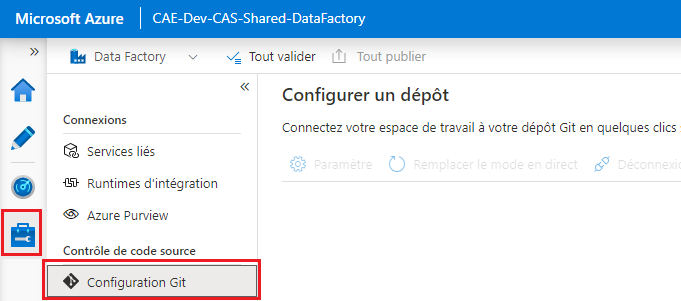

2. Cliquez sur **Configure** (configurer). Sous **Repository type** (type de dépôt), sélectionnez **GitHub**, puis entrez le nom d’utilisateur de votre compte GitHub. Cliquez sur **Continue** (continuer). 

    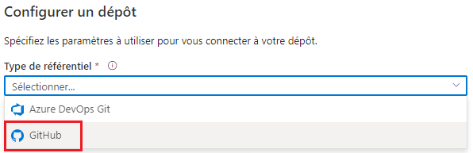

3. Une fenêtre contextuelle s’affiche. Cliquez sur **Authorize Azure Data Factory** (autoriser Azure Data Factory), puis saisissez le mot de passe de votre compte GitHub.

4. Configurez un dépôt. Vous pouvez soit sélectionner un dépôt dont vous êtes propriétaire, soit saisir un lien vers un dépôt. Précisez tout paramètre supplémentaire, puis cliquez sur **Apply** (appliquer). 

    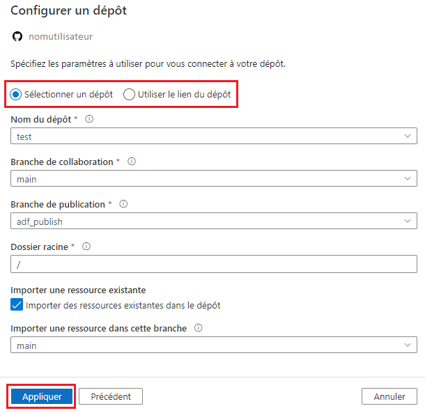

5. Définissez votre division de travail. Vous pouvez soit créer une nouvelle division, soit utiliser une division existante. Cliquez ensuite sur **Save** (enregistrer).

**Pour supprimer l’intégration GitHub**, cliquez sur **Disconnect** (déconnecter) à l’écran **Git configuration** (configuration de Git). Entrez le nom de l’usine de données, puis cliquez de nouveau sur **Disconnect** (déconnecter) pour confirmer.  

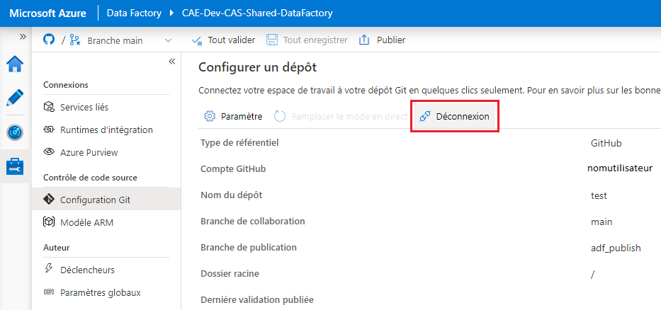

## Azure Databricks

### Configuration de l’intégration de Git
 
1. Ouvrez **User Settings** (paramètres d’utilisateur), puis cliquez sur l’onglet **Git integration** (intégration de Git). 

    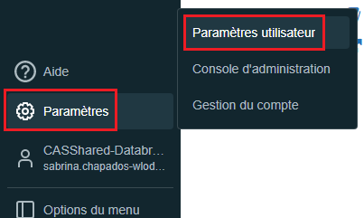

2. Sous **Git provider** (fournisseur Git), sélectionnez GitHub. Entrez votre nom d’utilisateur GitHub.

3. À partir de votre compte GitHub, [suivez les instructions pour créer un jeton d’accès personnel](https://docs.github.com/en/github/authenticating-to-github/keeping-your-account-and-data-secure/creating-a-personal-access-token), ensuring that the **repo** permission is checked.

    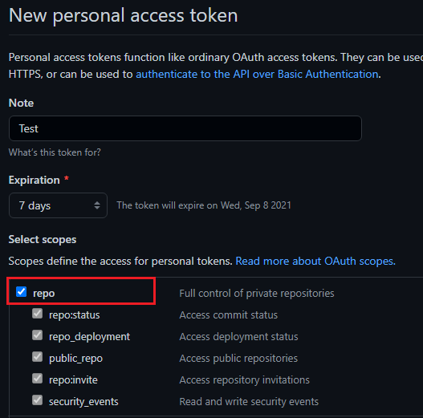

4. Copiez le jeton et collez-le dans **Databricks**. Cliquez sur **Save** (enregistrer).

### Ajout d’un dépôt Git

1. Dans l’onglet **Repos** (dépôts), cliquez sur **Add Repo** (ajouter un dépôt). 

    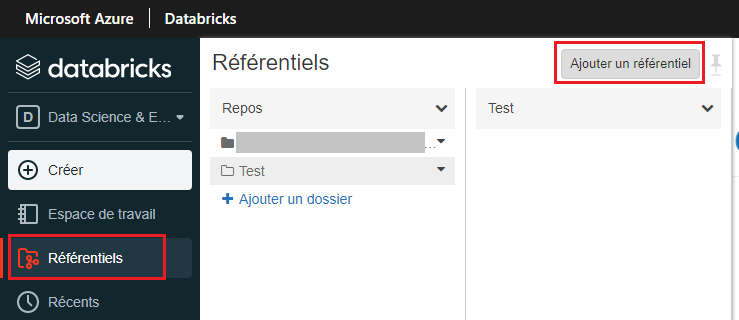

2. Sélectionnez **Clone remote Git repo** (cloner un dépôt Git à distance), entrez l’adresse (URL) de la page Web de votre dépôt GitHub. Le fournisseur Git et le nom du dépôt devraient s’afficher automatiquement. Cliquez sur **Create** (créer).

## Machines virtuelles de l’environnement d’analyse collaborative

### Visual Studio Code

Pour apprendre à utiliser GitHub avec Visual Studio Code, consultez la documentation  [GitHub - Getting Started](/GitHubGettingStarted).

### R-Studio

1. Dans le menu **File** (fichier), cliquez sur **New Project...** (nouveau projet), puis sélectionnez **Version Control** (contrôle de version). 

    

2. Sélectionnez **Git**. Saisissez l’URL du dépôt GitHub que vous souhaitez cloner, choisissez un dossier sur votre machine virtuelle (MV) où seront enregistrés les fichiers locaux, puis cliquez sur **Create Project** (créer un projet). 

    

## Azure Machine Learning

1. Créez une instance de calcul, puis ouvrez un terminal. 

    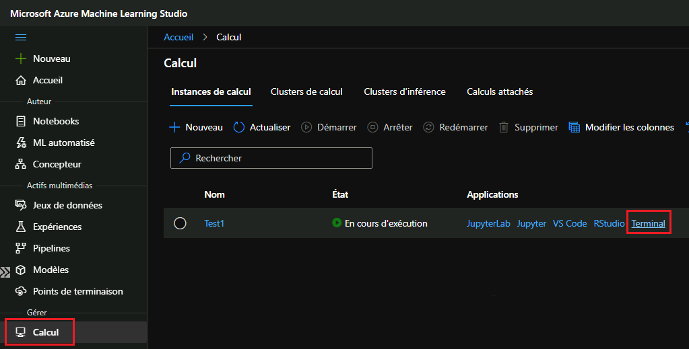

2. Dans la **fenêtre du terminal**, entrez ce qui suit (remplacez l’exemple de courriel par le vôtre) : `ssh-keygen -t rsa -b 4096 -C "prénom.nom@canada.ca"`

3. Appuyez sur **Enter** (entrer) jusqu’à ce que votre clé soit générée. 

    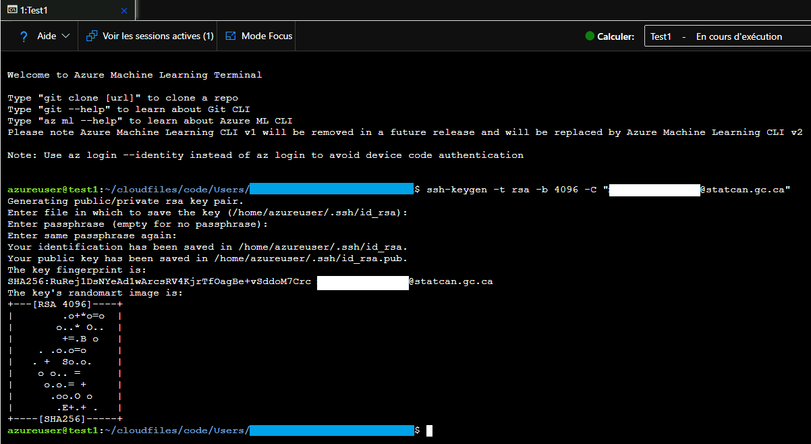

4. Entrez dans le terminal : cat ~/.ssh/id_rsa.pub. Sélectionnez l’extrant et copiez-le dans le presse-papiers. 

    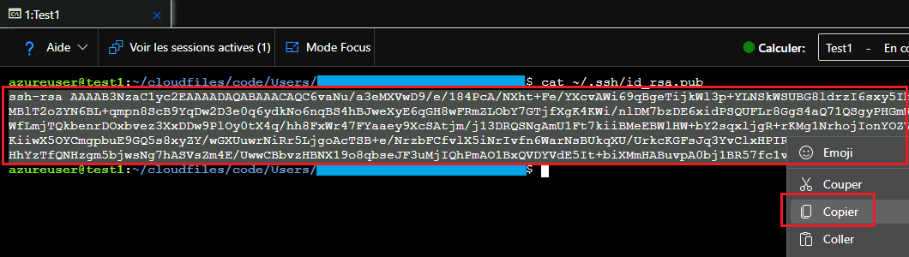

5. Allez dans les paramètres de votre compte GitHub (sur GitHub.com), cliquez sur **SSH and GPG keys** (clés SSH et GPG), puis sur **New SSH key** (nouvelle clé SSH). Collez la clé que vous venez de copier, puis cliquez sur **Add SSH key** (ajouter une clé SSH). 

    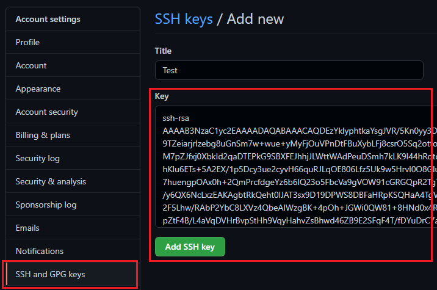

6. Dans la fenêtre du terminal, tapez : git clone [url] (remplacez **[url]** par l’url SSH de votre dépôt GitHub, par exemple, git@github.com:nom d’utilisateur/nom du dépôt.git).

7. Lorsque vous y êtes invité, tapez yes (oui).

### Microsoft Documentation
- [Intégration de Git pour Azure Machine Learning](https://docs.microsoft.com/fr-ca/azure/machine-learning/concept-train-model-git-integration)

## Azure Synapse

1. Dans l’onglet **Manage** (gérer), cliquez sur **Git configuration** (configuration de Git). 

    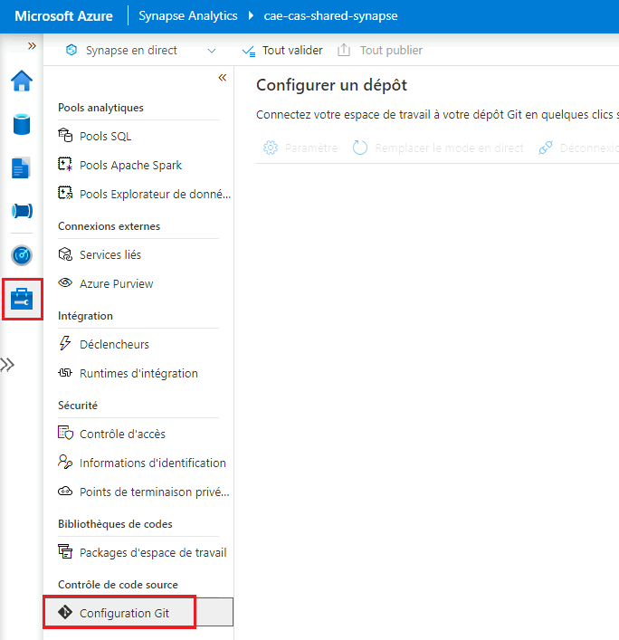

2.	Cliquez sur **Configure** (configurer). Sous **Repository type** (type de dépôt), sélectionnez **GitHub**, puis entrez le nom d’utilisateur de votre compte GitHub. Cliquez sur **Continue** (continuer).

3.	Une fenêtre contextuelle s’affiche. Entrez les renseignements de connexion de votre compte GitHub, puis cliquez sur **Authorize Azure Synapse** (autoriser Azure Synapse).

4.	Configurez un dépôt. Vous pouvez soit sélectionner un dépôt dont vous êtes propriétaire, soit saisir un lien vers un dépôt. Précisez tout paramètre supplémentaire, puis cliquez sur **Apply** (appliquer).

5.	Définissez votre division de travail. Vous pouvez soit créer une nouvelle division, soit utiliser une division existante. Cliquez ensuite sur **Save** (enregistrer).

**Pour supprimer l’intégration de GitHub** : à l’écran de configuration de Git, cliquez sur **Disconnect** (déconnecter). Entrez le nom de l’espace de travail, puis cliquez de nouveau sur **Disconnect** (déconnecter) pour confirmer.
